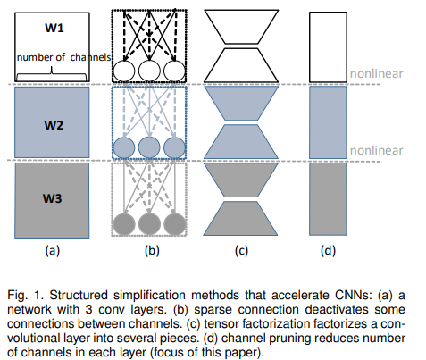
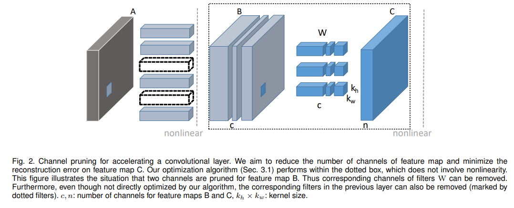
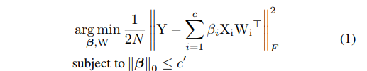
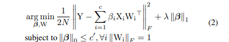
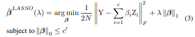
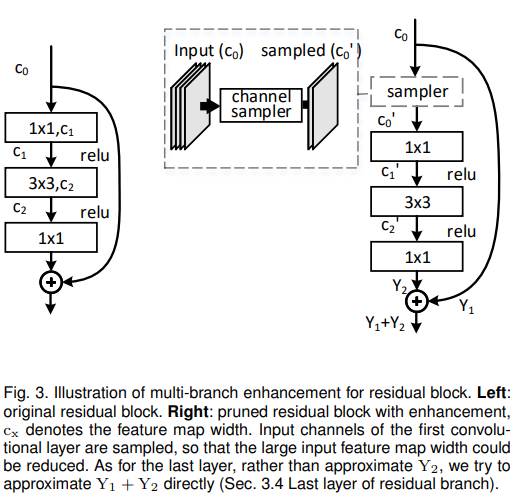
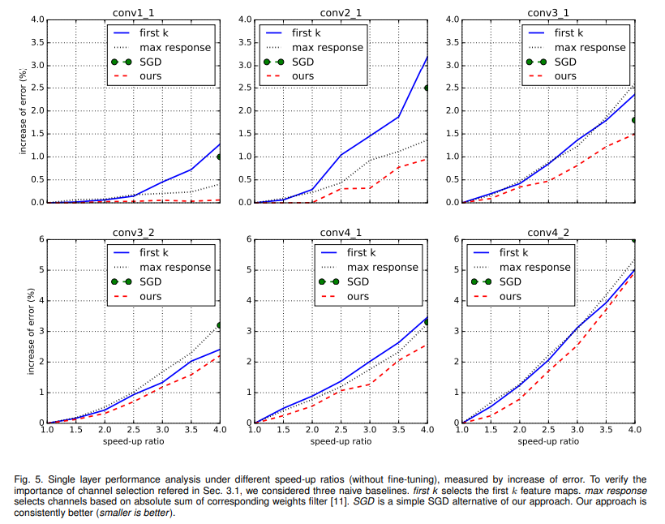
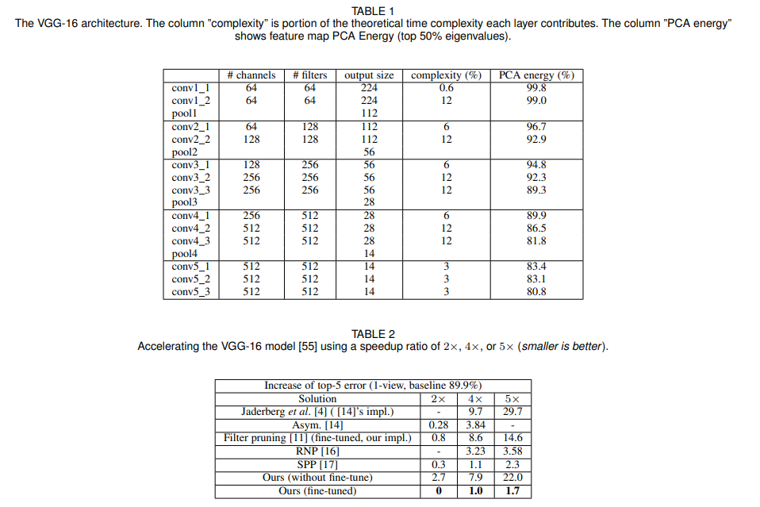
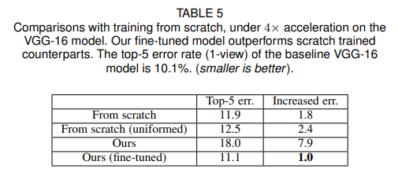
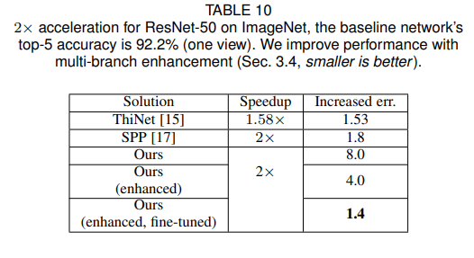

# Pruning Very Deep Neural Network Channels for Efficient Inference

- 論文: https://arxiv.org/abs/2211.08339

（まとめ @masahiro6510）

- 著者
    - Yihui He
    - Xiangyu Zhang
    - Jian Sun

- 所属
    - 西安交通大学

- 発行年
    - 2017年8月21日

## どんなもの？
* CNNの学習済みモデルが与えられた時に、各層にLASSO回帰に基づくチャンネル選択と最小二乗法による重み修正を適用して、モデルを軽量化する。
* VGG-16で5倍の高速化で0.3%しか精度が下がらなかった。
* Resnet、Xceptionなどの残差ブロックのあるネットワークで2倍高速化してもそれぞれ1.4%、1.0%しか精度が下がらなかった

## 先行研究と比べてどこがすごい？
  
* 軽量化手法は(b)スパース化、(c)テンソル分解、(d)チャンネル削減の３パターンがある。
* (b)は理論的には高い精度が期待できるが、不規則な形状なので実装上不利。
* (c)はチャンネル削減が出来ないので、Googlenet、Resnet、Xceptionなどの1×1畳み込み層の分解が困難。余分な計算オーバーヘッドが発生。
* (d)のチャンネル削除はCPU、GPUの両方で効率よく処理できるが、チャンネルを削除すると次の層の入力が劇的に変化する可能性があるため難易度が高い。
* Resnetなどの枝分かれのあるネットワークでチャンネル削除出来るようにした。
* ImageNet、CIFAR-10、PASCAL VOC 2007でVGG, Resnet両方で同じ高速化率で既往研究より高い精度になった。

## 技術や手法の肝は？
  
* 定式化  
Xが入力、Yが出力、Wが重み、&beta;、c'が保持されるチャンネル数がチャンネル削除のための係数。
保持されるチャンネル数がc'以下になるという制約条件下で、チャンネル削除前後のフロベニウスノルムが最小になる&beta;、Wを求める。  
  
実際は簡単にするために、Lasso回帰を考える。  

* 1層CNNのチャネル削除  
2段階に分けて(2)式を解く。  
まずは学習済みモデルの重みWを固定してLasso回帰により&beta;を求める。  
  
次に(3)式で求めた&beta;を所与のものとして重みを更新する。  
 

* 多層CNNのチャネル削除     
  
各層毎に(2)式を適用すると多層CNNでもチャンネル削除出来る。(2)式では最終出力Yとの誤差を求めていたが、多層では削除対象層の出力Y'との誤差を求める。
      
* 残差ブロックのあるネットワークのチャネル削除  
  
Resnetなどのネットワークでは残差ブロックの扱いを考える。
1. 図3の最終層のY1+Y2
Y1、Y2はチャンネル削除前の元の出力、Y1'、Y2'はチャンネル削除後の出力。
Y2は式(1)同様に近似できるが、Y1はパラメータフリーなので出来ない。最終層の最適化目標はY2からY1-Y1'+Y2に変更する。

2. 最初の枝分かれ  
最初の畳込みの前に式(1)でチャンネル削除をして、そこから次の畳込みのための新しい入力とする。skipする部分はチャンネル削除前のものを使う。

* finetune
学習データで近似モデルをend to endでfinetuneすることでより精度を高められる。この時、学習率を十分に小さくしないと上手くいかない。

## どうやって有効だと検証した？
* 1層CNNの場合  

横軸が高速化率、縦軸が誤差の増加（低いほどよいモデル）。
first kが最初のk個のチャンネルを選択したもの、max responseが絶対重み和が大きいチャンネルを採用したもの、SGDが本手法で重みはそのままで(2)式をSGDで解いてチャンネル削除だけしたもの、oursが提案手法。

* 多層CNNの場合(VGG16)   

表1のPCA energyを見ると、浅い層の方が大きく、無駄なチャンネルが多いことが分かる。そこで、浅い層（conv1_x~conv3_x）と深い層（conv4_x）のチャンネル保存比率を1:1.5にした。conv5_xは計算量への影響が少ないので削除しない。  
表2より、提案手法(finetuneあり)では他の手法と比較すると、あまり精度低下せずに高速化出来た。  
  
表5では、提案手法でチャンネル削除してfine tuneしたものと、それと同じアーキテクチャのモデルを最初から学習した場合の精度を示す。新しく学習するよりfine tuneした方が精度良かった。

* resnetの場合  
  
高速化前の精度が92.2%。表10は既往手法と提案手法で高速化した時に元の精度からどれくらい精度低下したかを示したもの。SPPでは2倍速にした時に1.8%の低下だったが、提案手法では1.4%の低下に収まった。

* Xceptionの場合  
  
高速化前の精度が92.8%。表11はFilter pruning、提案手法それぞれのfinetuneありなしで2倍の高速化をした時に精度がどれだけ下がったかを示したもの(小さいほどよい)。提案手法(finetuneあり)では1%の精度低下で済んだ。  
ResnetやXceptionはVGG16よりも無駄なパラメータが少ないので、VGG16程劇的な変化はなかった。

## 議論はある？
* この論文の手法ではc'（どの層でどのくらい重みを削除するかを決めるパラメータ）の決め方が定まっていなかったようなので、その辺りは課題としてありそう。実際にこの論文の後で、この著者が強化学習で高速化率を良い感じにする論文書いる。

## 次に読むべき論文は？
* 同じ著者がこの論文の手法を改善した論文：https://arxiv.org/abs/1802.03494

