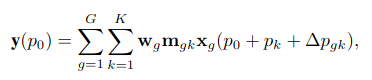
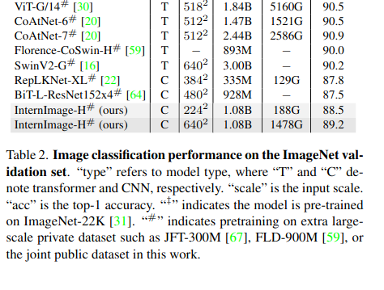

InternImage: Exploring Large-Scale Vision Foundation Models with Deformable Convolutions
====
Wenhai Wang, Jifeng Dai, Zhe Chen, Zhenhang Huang, Zhiqi Li, Xizhou Zhu, Xiaowei Hu, Tong Lu, Lewei Lu, Hongsheng Li, Xiaogang Wang, Yu Qiao

(Shanghai AI Laboratory, Tsinghua University, Nanjing University, SenseTime Research, The Chinese University of Hong Kong)

https://arxiv.org/abs/2211.05778v2

@cohama

# どんなもの？

- Vision Transformer 系の巨大モデルが流行っているが、それと同等の巨大モデルを CNN ベースで構築する試み
- Transformer の構造で Attension の計算を Deformable Convolution を応用したモジュールに置き換え
- このモデルをバックボーンにしたネットワークでセグメンテーション (ADE20K) と物体検出 (COCO) で SOTA。

# 先行研究と比べて何がすごい？

- ViT 系のモデルは Multi Head Self Attension (MHSA) により遠くのピクセルの情報を適応的に集めてくることができる反面、パッチ数の2乗に比例した計算時間、メモリが必要
- 近年は MHSA の代わりに大きなカーネルサイズの CNN を使う研究もあるが大規模なモデルでは ViT 系のモデルとはまだギャップがある

# 技術や手法の肝は？

(特に本文中では言及されていないが) MetaFormer の一種。MHSA 部分が Deformable Convolution v3 (DCNv3) に置き換わっている。

## DCNv3

簡単に言うと Deformable Convolution v2 を Multi Head にしたもの

G はグループ数、K はカーネルの数 (3x3 の場合 K=9)。

w はいわゆる CNN の重み (CxC のテンソル)、m は gk ごとの重みを表すスカラー値。

従来の DCNv2 では m を決めるのに (K個の) sigmoid 関数を使っていたが、これだと全てのカーネルについて0になることがあり学習が安定しない。
K チャネルの softmax とすることで m の合計を1にすることによって学習を安定化させる。

## モデルのスケーリング

大規模なモデルを構築するにあたり、一番軽量のモデルから初めてどのようにスケールアップすべきかについてもEfficientNet と同様の考え方で実験的に定めた。

まず、前提として以下のような Stacking rule を定める。

- stage は全部で4つ
- stage 1, 2, 4 は全て同じブロック数、stage 3 のみ異なる
- stage を減るごとにチャネル数を倍

上記制約の上で30種類程度試し、以下の表の一番上の InternImage-T を決定した。
次に、深さとチャネル数の拡大率 α と β についても実験的に調べた。それに従い InternImage-T を拡大して InternImage-S/B/L/XL/L を定めた。

# どうやって有効だと検証した？

## 画像分類

## 物体検出

## セグメンテーション

## leaderboard

# 議論はある

- 計算効率が良いという触れ込みだが実際には早くないらしい。メモリ効率は良いのかもしれない
- 物体検出 SOTA だが DINO / Mask2Former がすごいだけの可能性もある

# 次に読むべき論文は

- SwinV2: Ze Liu, Han Hu, Yutong Lin, Zhuliang Yao, Zhenda Xie, Yixuan Wei, Jia Ning, Yue Cao, Zheng Zhang, Li Dong, et al. Swin transformer v2: Scaling up capacity and resolution. Adv. Neural Inform. Process. Syst., pages 12009–12019, 2022.
- DCNv2: Xizhou Zhu, Han Hu, Stephen Lin, and Jifeng Dai. Deformable convnets v2: More deformable, better results. In IEEE Conf. Comput. Vis. Pattern Recog., pages 9308–9316, 2019
- replknet: Xiaohan Ding, Xiangyu Zhang, Jungong Han, and Guiguang Ding. Scaling up your kernels to 31x31: Revisiting large kernel design in cnns. In IEEE Conf. Comput. Vis. Pattern Recog., pages 11963–11975, 2022
