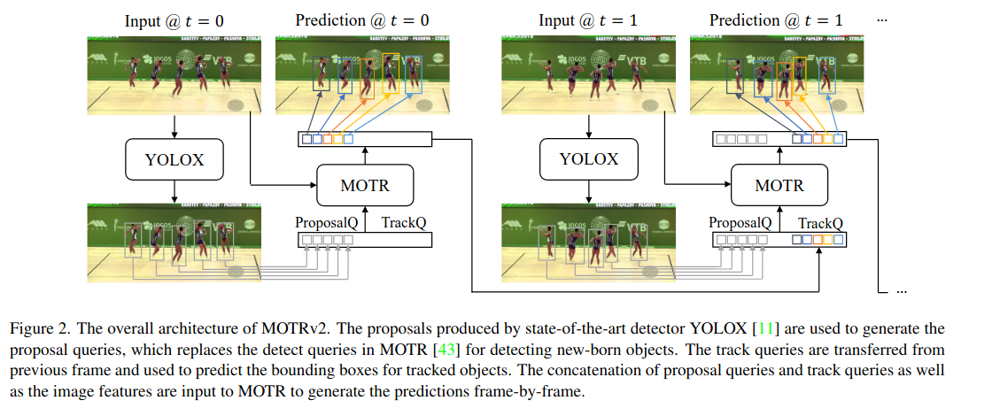
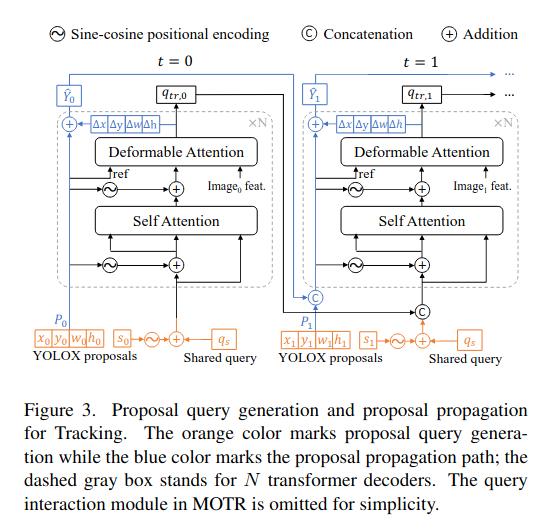
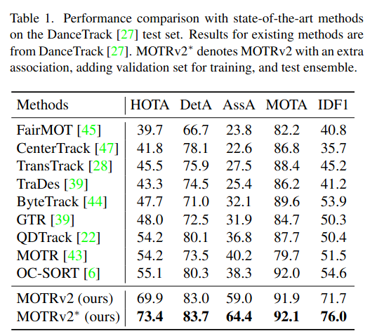
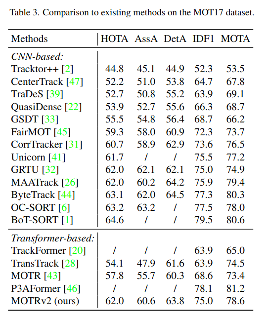
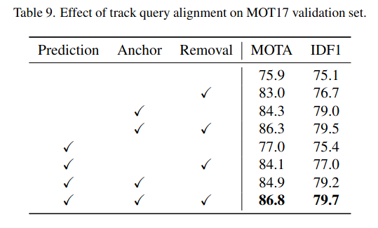

MOTRv2: Bootstrapping End-to-End Multi-Object Tracking by Pretrained Object Detectors
===

Yuang Zhang, Tiancai Wang, Xiangyu Zhang

(MEGVII の人たち)

https://arxiv.org/abs/2211.09791v1

@cohama

## どんなもの?

- 訓練済み物体検出器を組み込んだ End-to-End (?) な Multi Object Tracking
- Transformer ベースのトラッキング。前フレームの追跡結果と現在フレームの YOLOX による検出結果をクエリに用いる。
- DanceTrack で HOTA 73.4 で SOTA

## 先行研究と比べて何がすごい？

- 物体の追跡では物体検出の結果に対して後処理で追跡の処理を行う Tracking-by-Detection が主流。しかしながら DanceTrack のような同じような格好をした人を追跡するようなタスクでは同一オブジェクトの関連付けがうまく行かないことが分かっている
- 近年は MOTR を始め Transformer ベースで物体の関連付けを行うものが出てきた。Transformer で関連付けを行うので DanceTrack のようなタスクにも強いが、一方でそもそもの検出の精度がそこまで高くならないという問題があった
- MOTR をベースに Tracking-by-Detection の考え方を導入して両者のいいとこ取りをした

## 技術や手法の肝は？

1. t=0 の画像について訓練済みの YOLOX で物体検出を行う
2. その結果 (x, y, 幅, 高さ, 確信度) を MOTR (Transformer の Decoder 的なモジュール) に入力する
3. Decoder の結果、元の検出クエリのオフセット (Δx, Δy ...) と次のフレームの入力に使うためのクエリが出力される。
4. 次の時刻では前フレームの追跡結果、現在フレームの検出結果がクエリになる

## どうやって有効だと検証した？

### DanceTrack の結果

他の手法を上回ってぶっちぎりで1位

### MOT17

こちらは ByteTrack 等に負けている。
MOT17 はデータセットが比較的小さいので Transformer ベースの手法だと学習しきれていないのではという考察。

### Task Query Alignment

実は Track Query や検出結果を YOLOX の結果そのものに置き換えたほうが精度が良い。

- Prediction: 最終的な枠の出力を YOLOX のものに置き換える
- Anchor: Task Query の枠を YOLOX のものに置き換える
- Removal: YOLOX の出力とマッチしない MOTR の枠を消す

## 議論はある?

- 大量にデータが必要。少量データでは過学習してしまう。例えば MOT17 では二人の歩行者がすれ違うときに片方の枠が他方にくっついてしまう現象が見られた。この現象はデータ量の多い DanceTrack や BDD100K では起きない。
- そもそも YOLOX 検出器を組み込んでいるので遅い

以下私見
- YOLOX を検出に使うので End-to-End というのは言い過ぎ感。とはいえ通常の Tracking-by-Detection とは異なるのも分かる。
- と思ったが結局 Task Query Alignment で枠の座標については YOLOX の検出結果そのまま使う方が精度いいので結局 Tracking-by-Detection ではという気がする。
- 検出の精度が低いのを YOLOX で補っているが、近年の物体検出の強い手法 (e.g. DINO) とかでは Object365 とか JFM300M とかで事前学習している。Google や Meta が巨大データセット使って訓練すれば YOLOX いらない可能性もあったかもしれない？ (アカデミックな研究でそれはそれでどうなんんだという話もあるが...)

## 次に読むべき論文

- MOTR: Fangao Zeng, Bin Dong, Yuang Zhang, Tiancai Wang, Xiangyu Zhang, and Yichen Wei. Motr: End-to-end multipleobject tracking with transformer. In European Conference on Computer Vision, pages 659–675. Springer, 2022.
- TransTrack: Peize Sun, Yi Jiang, Rufeng Zhang, Enze Xie, Jinkun Cao, Xinting Hu, Tao Kong, Zehuan Yuan, Changhu Wang, and Ping Luo. Transtrack: Multiple-object tracking with transformer. arXiv preprint arXiv: 2012.15460, 2020.
