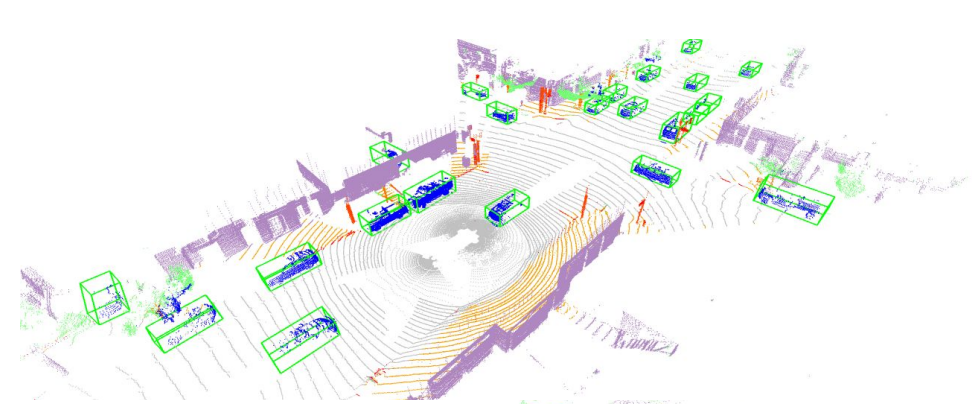
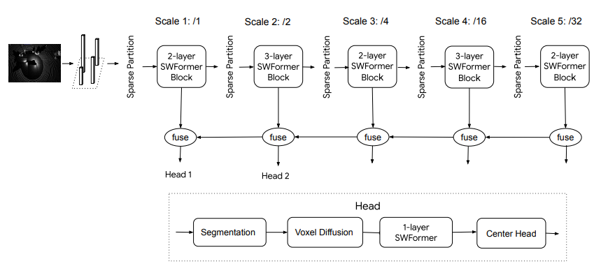
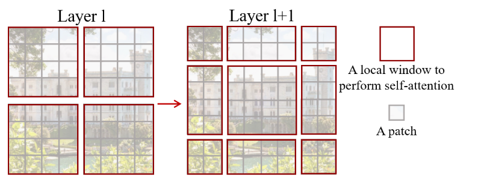
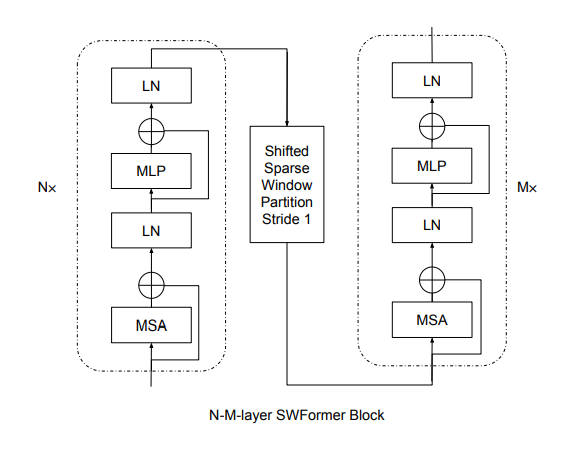
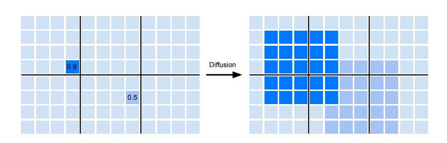
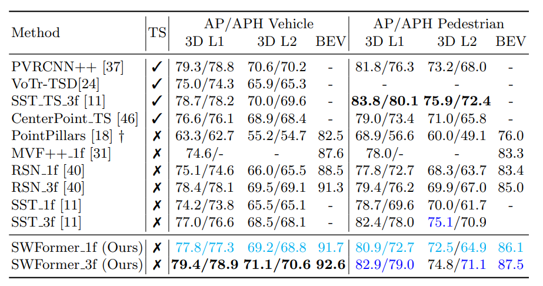
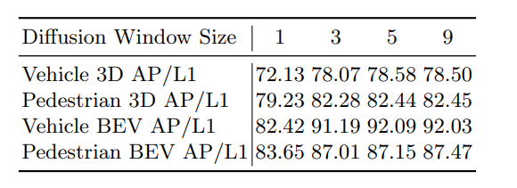
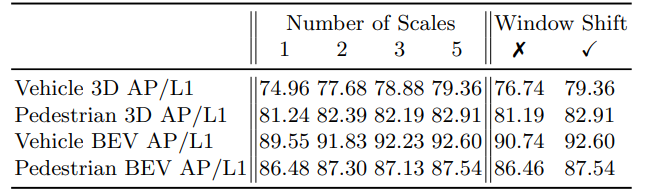

# SWFormer: Sparse Window Transformer for 3D Object Detection in Point Clouds

[https://arxiv.org/abs/2210.07372](https://arxiv.org/abs/2210.07372)
(まとめ @n-kats)

著者
* Pei Sun
* Mingxing Tan
* Weiyue Wang
* Chenxi Liu
* Fei Xia
* Zhaoqi Leng
* Dragomir Anguelov

Waymoの人たち

# どんなもの？

点群から物体検出を行う研究。トランスフォーマーベースの方法でSOTAを達成。

# 先行研究と比べてどこがすごい？

トランスフォーマーベースの手法は他にもあるが、他の良い性能の手法は2段階の処理をする。この手法は、そうではない。

# 技術や手法の肝は？

## メタアーキテクチャ

* 点群から2次元voxelを作る（ピラー方式）（鳥瞰図で考えて、グリッドで切る）
* 5スケールのSWFormerブロックで処理する
* 各スケールで推論をする（Head）
  * Head部分にvoxel diffusion というテクニックを使う

## おさらい（Swin transformer）

ViTだと、画像全体とのattentionを行うが、Swin transformerだと、画像をいくつかに分けてその中（窓）だけでattentionを行う。

また、異なる窓同士で情報をやり取りするために、窓を半分ずらすのを混ぜる。

## SWFormerブロック

Swin transformerのアイデアを鳥瞰図視点の点群に用いる。
つまり、グリッドをいくつかに分けて（sparse window）その中だけでattentionをする。

しかし、点群を鳥瞰図のグリッド上に分けると、点の無いグリッドがある。しかも、sparse windowによってそのようなgridの数が異なる。素朴にするとバッチ処理ができずに効率が悪いが、要素数でグループ化するテクニックを用いて対策する（同じグループで長さを揃える）。

Swin transformer では、窓を半分ずらすテクニックが使えたが、点群だと効率的に計算できない。
なので、各スケールで1回だけこのシフトを行う。

## Voxel Diffusion

まず、2次元voxelに対して、前景かどうかのセグメンテーションをする。その後k×kのmax poolingをする。この確信度と前段で得た特徴量をつなげて、次の処理をする。

# どうやって有効だと検証した？
Waymo Open Dataset で検証。このデータは、
* 1150シーン（train=798/val=202/test=150）
* 約200フレーム/シーン
* 360度、車の周りを撮影
* LiDARは5つ（長距離用1つ、短距離用4つ（75メートル先まで））ありこれを全部使う（カメラは使わない）

## 結果

two-stage（TSにチェックが入っているもの）のものとも同じくらいの精度が出ている。

## Voxel Diffusion の効果

kの値を変えると、大きな差が出る。

## multi-scale, window shift の効果

スケールを増やすと効果がある（特に車）。shiftもあるとよい。

# 議論はある？
## 私見
計算効率のために、window shiftの回数を減らすという発想が面白かった。

# 次に読むべき論文は？
* 前処理のテクニック
  * per-frame voxel features
  * auxiliary frame timestamp offset
* グループ化の元ネタ
