# LGGNet: Learning from Local-Global-Graph Representations for Brain-Computer Interface

[https://arxiv.org/abs/2105.02786v3](https://arxiv.org/abs/2105.02786v3)
(まとめ @n-kats)

著者
* Yi Ding
* Neethu Robinson
* Chengxuan Tong
* Qiuhao Zeng
* Cuntai Guan

# どんなもの？
脳波データ（EEG）をから注目・疲労・感情・好みを推論する研究の新しめの手法LGGNetの論文。

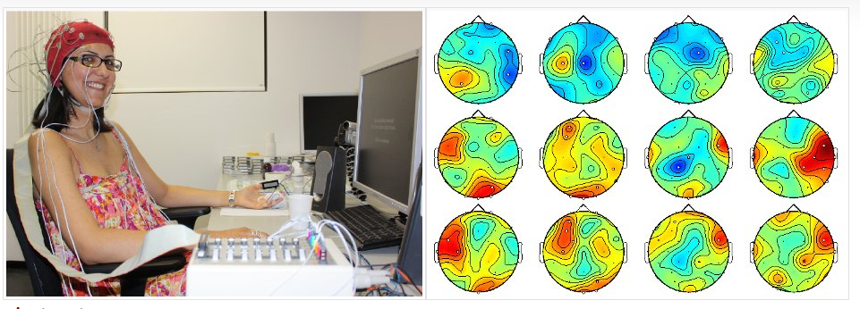

BCI（Brain Computer Interface）の分野の研究。

# 先行研究と比べてどこがすごい？

電極を脳の領域別でグループ化して、領域毎の特徴抽出を行う方法をとってSOTAを達成。

# 技術や手法の肝は？

## メタアーキテクチャ

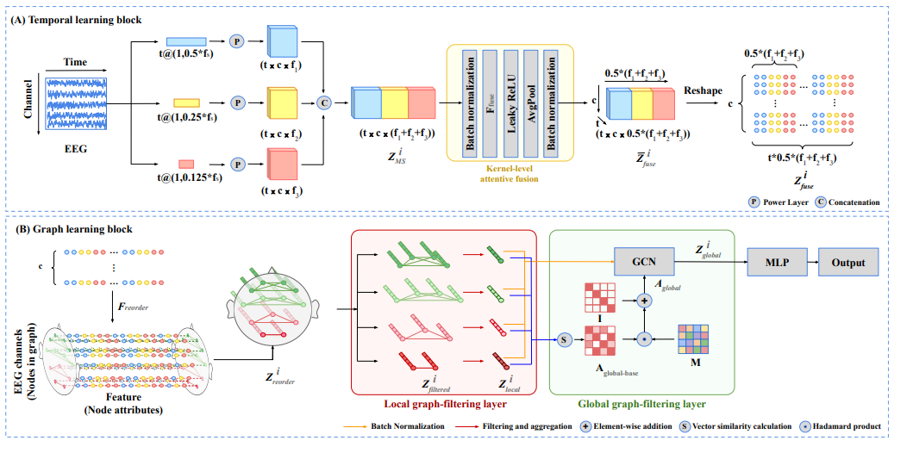

* 電極毎に特徴抽出する（Temporal learning block。上段）
* 電極単位の特徴量を脳の領域単位の特徴量にまとめる（Local graph-filtering layer。下段中央）
* 脳の領域間の関係の強さを意味する行列を作る（ $A_{global}$ ）
* $A_{global}$ を隣接行列だと思ってGCNを適用する（Global graph-filtering layer）。

## Temporal learning block
EEG の各電極から得た時系列データを特徴量に変換する（電極毎に独立）。

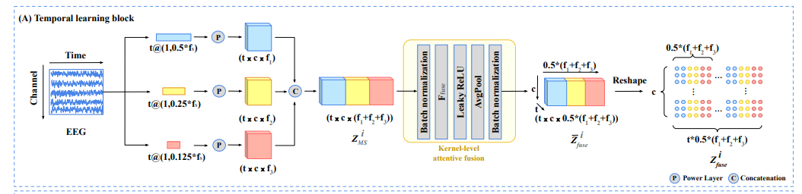

* 複数のカーネルサイズ（0.5秒、0.25秒、0.125秒相当）で1次元の畳み込みをする
* それぞれの結果を結合する（ $Z_{MS}^i$ ）
* BN,pointwise,Leaky relu, avgpool, BN する
* 時系列状の特徴量を時間方向に結合する

### Power Layer
図中のPの箇所（1次元畳み込みの活性化関数）はreluではなく、$f(x)=\log(\text{avgpool}(x^2))$ のように行う。EGGの分野でよく採用されるらしい。

## Local graph-filtering layer
電極単位の特徴量を脳の領域単位の特徴量にまとめる。

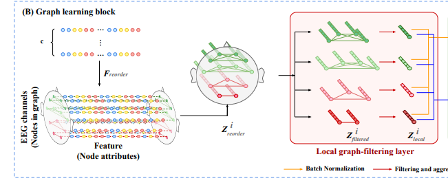

Temporal learning blockの出力（電極単位の特徴量）に重みとバイアスを引いてreluに入れて、電極単位の特徴量を時間のずれを考慮した値にする。

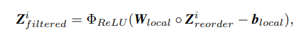

$Z_{filtered}^i$を脳の領域毎に平均する。

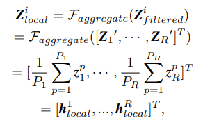

$h_{local}$ が目的の領域単位の特徴量。

## 脳の領域

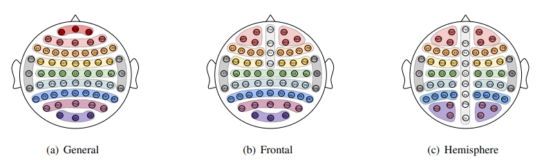

論文では3パターンの領域の分け方を考えていた。
* General: 普通に領域で分ける
* Frontal: 前だけ左右に分ける（前頭葉重視）
* Hemisphere: 全体を左右に分ける

（こったことをしているが、結局Generalで十分）

＊データによって、この図のすべての位置を使っているわけではない。

## $A_{global}$

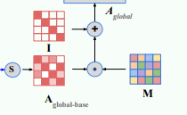

領域単位の特徴量の類似度を使って、領域間の関係の強さを表現する。

まず、単純に内積を取る。

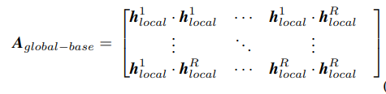

位置だけで決まる関係の強さも考慮するため、学習可能な対象行列Mを持ってきて、

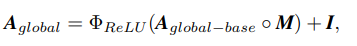

の式で目的の $A_{global}$ を得る。

## Global graph-filtering layer

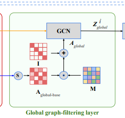

$h_{local}^i$（ $Z_{local}$ ）を頂点の特徴量、$A_{global}$ を隣接行列だと思ってGCNをする。

つまり、次数行列で割って$\tilde{A}_{global}$ を作り、

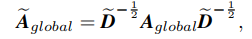

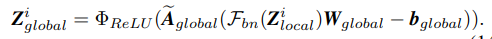

（Zの上の添字のiは多分余計）

# どうやって有効だと検証した？
EEGを使った以下のデータセットで検証
* attention dataset（[https://doc.ml.tu-berlin.de/simultaneous_EEG_NIRS/](https://doc.ml.tu-berlin.de/simultaneous_EEG_NIRS/)）
* fatigue dataset （[https://arxiv.org/abs/1809.06534](https://arxiv.org/abs/1809.06534)）  
  VRの運転環境で90分運転する
* DEAP dataset（感情・好み）（[https://www.eecs.qmul.ac.uk/mmv/datasets/deap/index.html](https://www.eecs.qmul.ac.uk/mmv/datasets/deap/index.html)）  
  1分のmusic video を見て、その時の感情を記録したデータ

## 結果

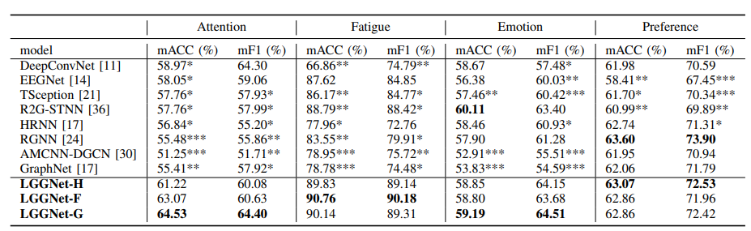

全体的にSOTA相当と分かる。（H,F,Gはhemisphere,frontal,generalの意味）

（実は、nested cross validation をそれぞれの手法で行って評価している）

## 領域で分けた効果

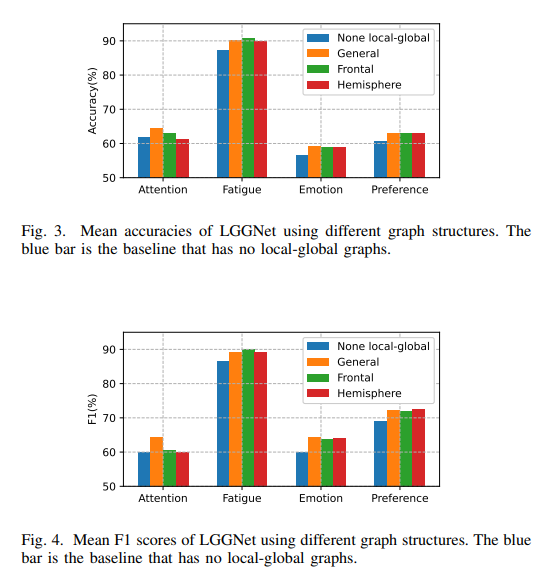

分けなかった場合（青）より改善している。しかし、どの分け方がいいかというと大きな差はない（Generalが無難）

## その他
### Power layer

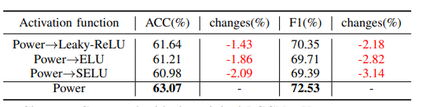

最初の活性化関数を通常の活性化関数を使った場合、性能が落ちる。

### 可視化
AやMの値を見ると、どの領域とが関係があるのかが分かる。

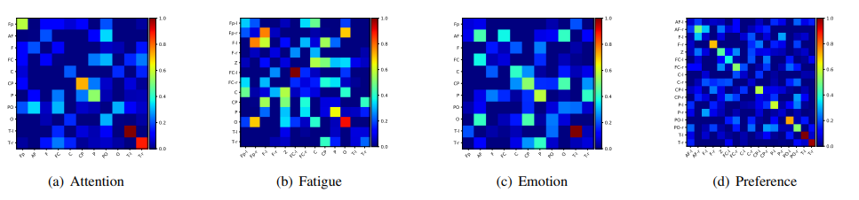

# 議論はある？
脳の知見を用いて精度改善ができた。

# 次に読むべき論文は？
* TSception ・・・ この手法のベースになっていると思われる。
