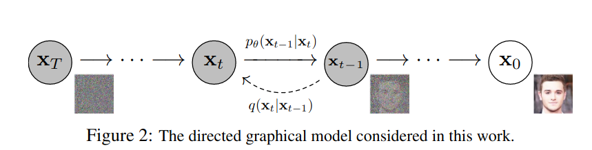
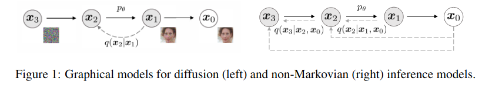
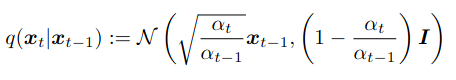
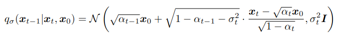
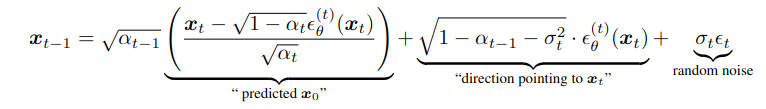
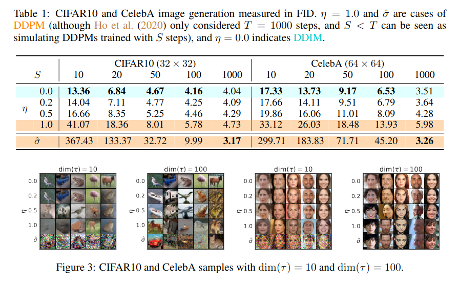
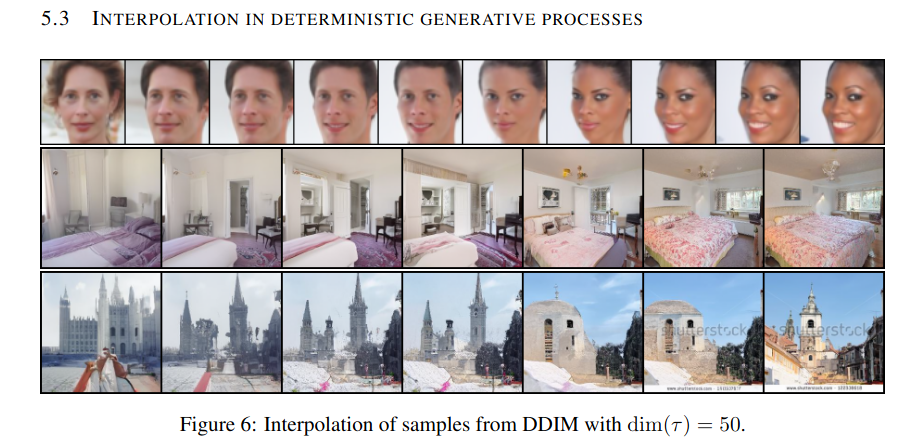

Denoising Diffusion Implicit Models
===

Jiaming Song, Chenlin Meng & Stefano Ermon

(Stanford University の人たち)

https://arxiv.org/abs/2010.02502

@cohama

## どんなもの?

- Diffusion Model (DDPM) の改良手法の1つ
- DDPM における画像の生成 (逆拡散過程) を高速に行う
- 非マルコフ拡散過程でモデル化することによりその拡散過程は10〜50倍高速にする

## 先行研究と比べて何がすごい？

オリジナルの Denoising Diffusion probabilistic Model (DDPM) と比べて

- サンプルの生成が非常に高速になった。10〜100倍
- ある潜在変数から決定的に画像を生成できる (DDPM は確率的な過程なのでランダムな画像しか生成できない)
- 2つの画像から意味的に補間された画像を生成することができる
- DDPM と同じ損失関数なので DDPM の学習済みモデルを使いまわせる

## 技術や手法の肝は？

(時間がなくて読めませんでした。)

### 背景: DDPM

- 元の画像に対してノイズを加えていく過程を考える。
- ある xt からすこしだけノイズを除去した画像 xt-1 を推論するモデルを学習する
- 純粋なノイズから初めて T 回ノイズを除去すると最終的にきれいな画像が得られる。

### DDIM のお気持ち

- DDPM で xt-1 にノイズを付与する場合の分布 q
  - 
- DDIM の場合
  - 

この確率分布を使うと xt-1 のデノイズ処理は以下のようになる。

ここでの εt 〜 N(0,1) ノイズ部分だが σt = 0 のときに決定的になる

### 高速な生成

DDPM での生成はノイズから T 回 (だいたい1,000くらい) のデノイズ処理を行う必要がある。
DDIM では数回分のステップを一気に実行することで S 回 (だいたい 10 くらい) のデノイズ処理で済む。

## どうやって有効だと検証した？

### DDPM との FID スコアの比較

### 画像の意味的な補間

## 議論はある?

## 次に読むべき論文

- DDPM: Denoising Diffusion Probabilistic Models (https://arxiv.org/abs/2006.11239)
- Keras の DDIM チュートリアル (https://keras.io/examples/generative/ddim/)
