# Toolformer: Language Models Can Teach Themselves to Use Tools

[https://arxiv.org/abs/2302.04761](https://arxiv.org/abs/2302.04761)
(まとめ @n-kats)

著者
* Timo Schick
* Jane Dwivedi-Yu
* Roberto Dessì
* Roberta Raileanu
* Maria Lomeli
* Luke Zettlemoyer
* Nicola Cancedda
* Thomas Scialom

Meta AI Research の人たち

# どんなもの？
chatGPTとその亜種が流行っている。これらは言語モデルを使ったサービス。
しかし、言語モデルそのままなので、なんとなくそれっぽい文章を返してくれるだけ。

Toolformerは、外部のツールを組み合わせてより正しい回答できる。

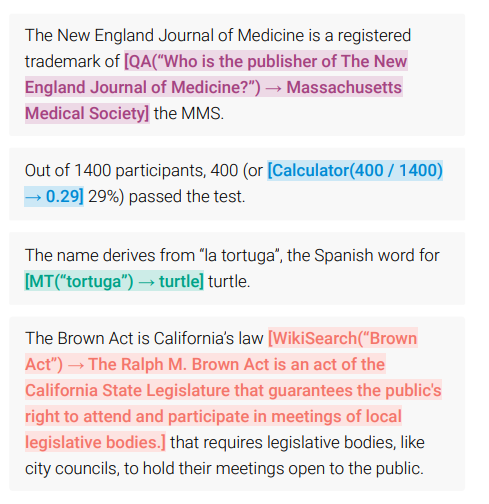

# 先行研究と比べてどこがすごい？
外部ツールが使えると、
* 今日は何日ですか？ → カレンダーを見る → 正しい答え
* ○○ + ×× は？ → 電卓を使う → 正しい答え

のように、単純な言語モデルができない・苦手なタスクを回答できるようになる。

他にも、Question Answering/wikipedia検索/翻訳 などの使い方が紹介されている。

また、外部ツールを使ってデータセットを拡張し、自己教師学習で訓練する。
アノテーションが不要なだけでなく、既存データの知識を保てる利点がある。

# 技術や手法の肝は？

## データセット拡張の概要

学習時は、
* （Sample）もとのデータセットの入力テキストで外部ツールが使えそうな部分を探す
* （Execute）外部ツールを使う
* （Filter）外部ツールが妥当そうな結果を返したものだけ残す
* \<API\> {API名} ({API入力}) → {API出力} \</API\> という形式でテキストを変更する
* 通常の言語モデルと同様に学習する

推論時は、
* 文章を生成する手順で回答を行う
* 外部ツールが使えるタイミング（→を基準に）で外部ツールを使う

## Sample
### 外部ツールが使いやすい形式に変換するプロンプト
このように、質問内容を変形するプロンプトをタスク（外部ツール）毎に用意する（P(x)）。

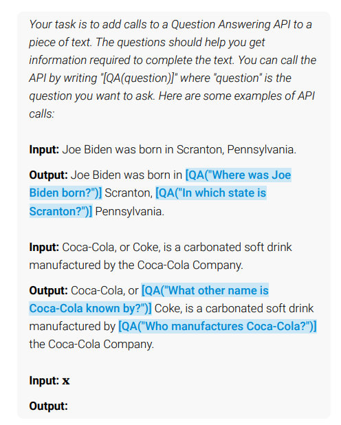

### 外部ツールを使う位置の特定
・・・\<API\> ・・・ のようなテキストを学習するわけだが、後に\<API\>が来そうなところが「外部ツールが使えそうなところ」といえる。つまり、

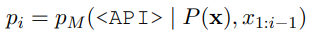

の高いところを選ぶ。

## Filter
外部ツールを使って意味がある部分を抽出する。

外部ツールの結果が有効かを情報量の変化で調べる。

外部情報（z）を付与したテキストの損失関数を次のように重み付きで考える（zの情報量と関係する）。重みはハイパーパラメータ。

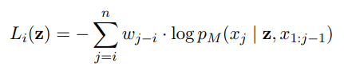

外部ツールから来た情報を与えた場合 $L^+$ と何も与えない場合・外部ツールで何も取得できなかった場合$L^-$に差があるときに外部ツールが有効といえる。

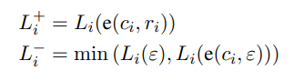
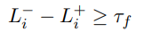

ただし、

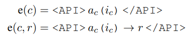

εは空のテキスト。

差が大きい＝外部ツールの結果がテキスト生成の生成確率が上がる＝外部ツールが有用

# どうやって有効だと検証した？
CCNetデータセット（の一部）とGPT-Jを学習に利用。
ただし、CCNet全部と使うと大変なので、ヒューリスティックな方法（数字が3文字以上あったら、電卓を使う用にするなど）

* GPT-J・・・GPT-3（175B）に対して6.7Bのパラメータで少ないがこちらの方が賢い
* GPT-J+CC・・・CCNetでファインチューニングしたもの
* Toolformer
* Toolformer（disabled）・・・Toolformerと同じモデルが、外部ツールを使わず生成した文字列をそのまま返す場合

## 知識(LAMA)

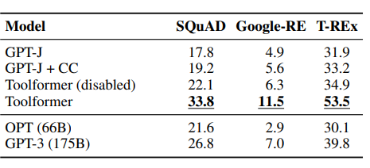

大幅に賢くなっていることがわかる。Toolformer（disabled）でも改善がみられるが、外部ツールを使うことで大きな差が出る。

## Math

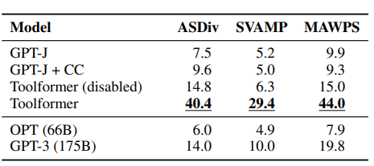

QAと同じような傾向である。より効果が高いように見える

## QA

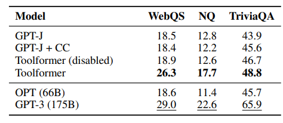

wikipedia検索を使ってQAを補助した場合。これまでと違い、GPT-3に及ばなかった。

wikipedia検索という補助方法が不十分だったことが原因か？

## 多言語QA

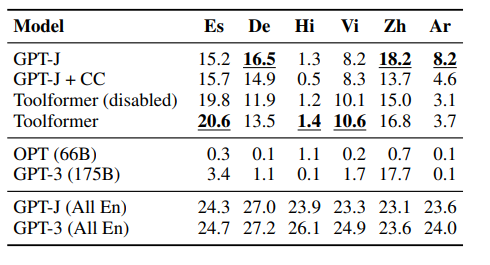

CCNetの言語分布が適当でなく、Toolformerによる改善が見られなかった。

## 時間系知識
"Cristiano Ronaldo plays for ...", "How many days ago was August 14, 2020?" のような時間関係の質問のケース。

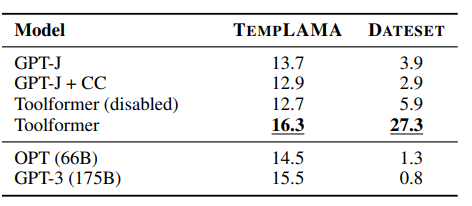

# 議論はある？
* 複数のツールをつなげて使う使い方はできない
* interactiveなツールは活用できない
* ツールを使うかどうかの判断に、特定の文言があるかどうかが重要になっている（言い換えに弱い）

## 私見
呪文のプロンプトを用意してツールに投げる方法が面白く、ツールをうまく使えると大きく改善が見られる。
しかし、ツールの使い方やデータセットに寄る部分が大きい。

# 次に読むべき論文は？
* GPT-2・・・ in-context learningというアプローチの元ネタらしい
* GPT-j
