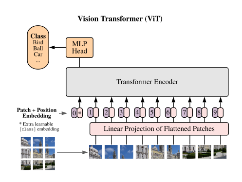
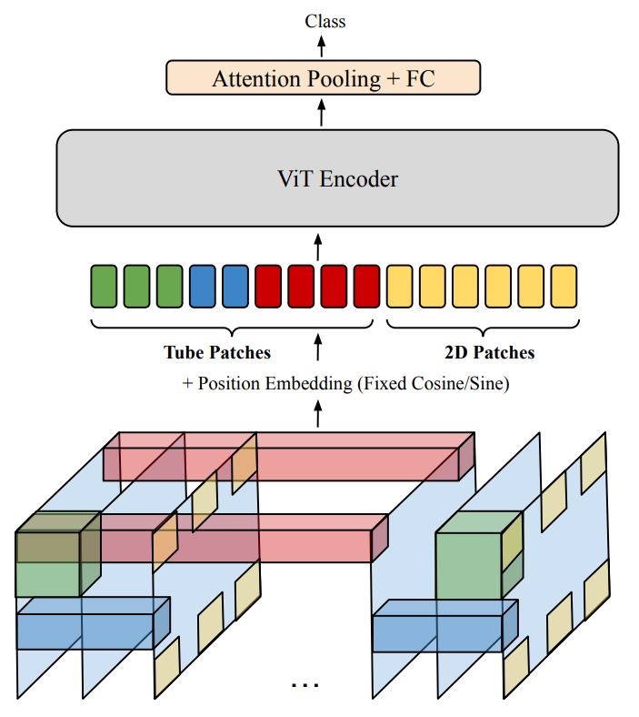
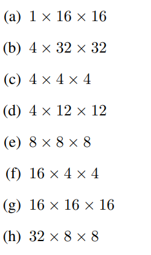
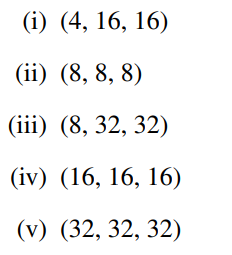
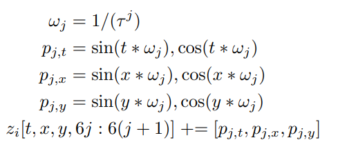
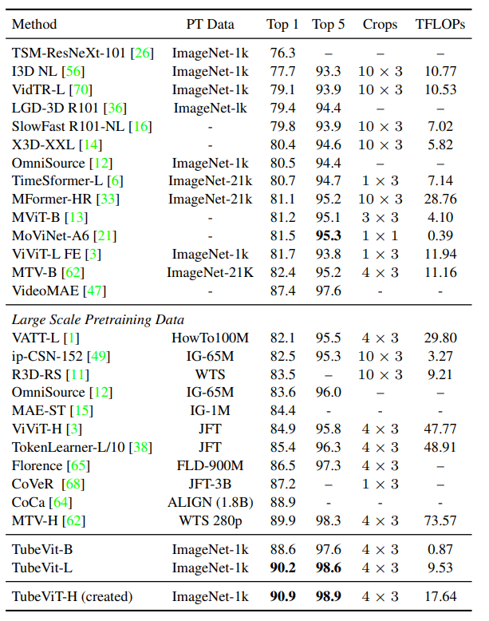
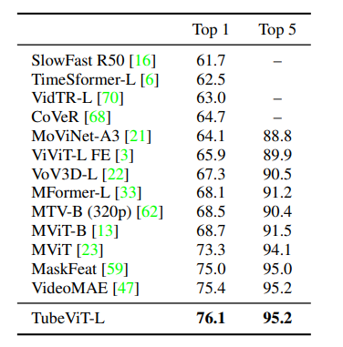
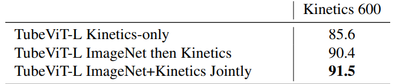

# Rethinking Video ViTs: Sparse Video Tubes for Joint Image and Video Learning

[https://arxiv.org/abs/2212.03229](https://arxiv.org/abs/2212.03229)

(まとめ @n-kats)

著者
* AJ Piergiovanni
* Weicheng Kuo
* Anelia Angelova

Google関係者？

# どんなもの？
動画から行動分類するモデルのSoTAの手法（ImageNet以外の他データを使わない設定だと1番）。

# 先行研究と比べてどこがすごい？
トランスフォーマーベースの手法。

* 画像分類のモデルを流用しやすいように設計
* 計算量を抑えるために、フレームのサンプリングを工夫

# 技術や手法の肝は？
## おさらい（ViT）

画像をパッチに分けて、（線形変換して）トランスフォーマーに入力（+位置埋め込み）。パッチとは別にタスク用のトークンがある。

## メタアーキテクチャ

* 動画をパッチに分ける（いい感じに） 
* 位置埋め込みを加えて、ViTのエンコーダーに入力する

## パッチの分け方
### ポイント（スパースにサンプリング）
動画は似たような映像が続くので、密にサンプリングしても無駄が多い。

* 16フレームに1回とかの低頻度で画像のパッチをとってこればいい。
* とはいえ、短時間の細かい動きの特徴もある。Tube patchを使う。

Tube patch とは、動画からとったパッチ（時間軸方向もある）。
これもスパースにサンプリングする。

例:

サイズ

ストライド

これらを組み合わせて使う。

ちなみに、画像サンプリングを荒くすることで、トークンの数がかなり抑えれれる。
例えば、32x224x224のクリップの場合、
* TubeViT: 392
* TimeSFormer: 6k
* ViViT: 1-2k

## 位置埋め込み
位置埋め込みは、「座標から計算で出す派」と「学習で獲得する派」がある。
今回の場合、同じ位置だけど、tubeの設定が違うパッチがあり、それを関係付けしやすいように、座標から計算で出す。

具体的には、以下のようにsin/cosを使う

## ファインチューニング
ネットワーク構造からわかるように、ViTのエンコーダーの重みがそのまま使える。

でかい設定の場合、Image-To-Video scaling upというテクを提案して使っている。これは、

1. 小さいモデル設定で、画像・動画で訓練する
1. 大きいViTの訓練済みの重みを持ってくる
1. tubeの線形化の箇所は、小さいモデルの方から、他の部分は大きいViTから重みを持ってくる（tubeの時間軸をチャンネルに潰してチャンネル数を揃える）

これを初期値にして大きいモデル設定で訓練する。

# どうやって有効だと検証した？
Kineticsやsomething-something v2 で好成績を挙げている。

## Kinetics 400

## something-something v2

## image netのpretrainの効果

大きな効果があることがわかる。jointlyに訓練すると更によい。

# 議論はある？
## 私見
シンプルな方法で、精度が出ていてよい。（ただし、Image-To-Video scaling upは除く）
今回ViTでしているが、他のvision transformer や分類以外のタスクではどうなのか（どうすればいいのか）が気になる。

# 次に読むべき論文は？
* MVD（今SSv2のトップ（別データ利用））
