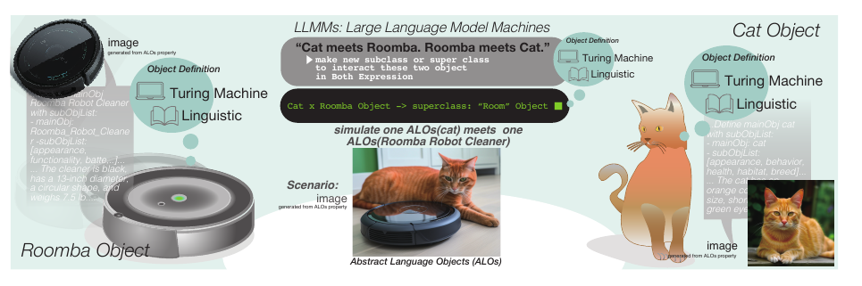
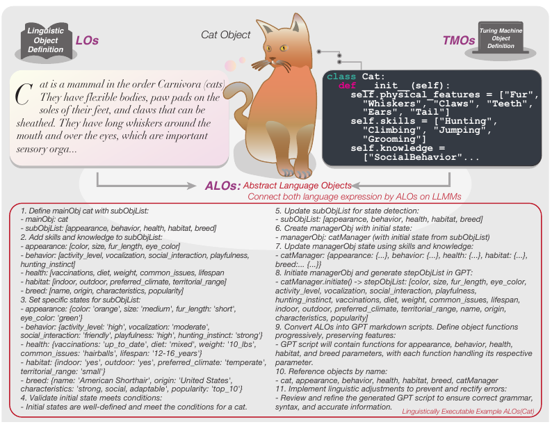
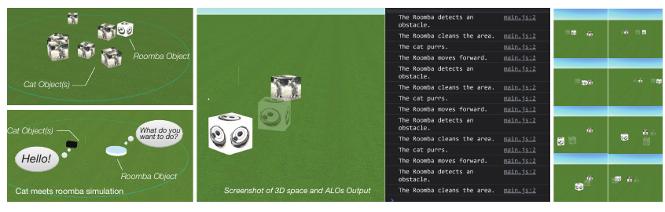
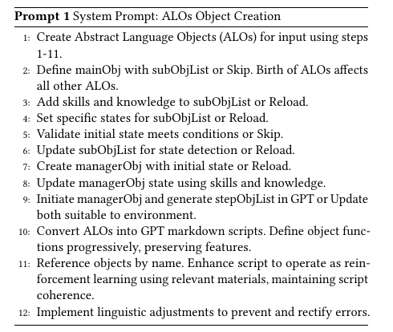
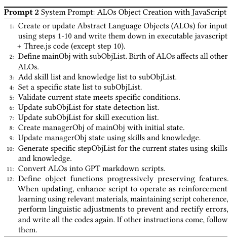
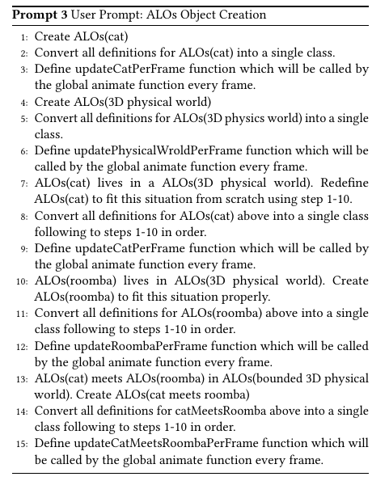
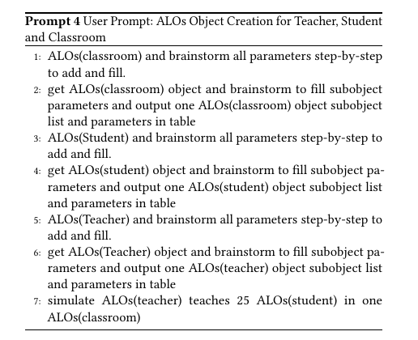
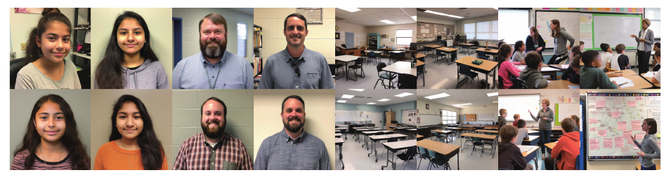

# Towards Digital Nature: Bridging the Gap between Turing Machine Objects and Linguistic Objects in LLMMs for Universal Interaction of Object-Oriented Descriptions

[https://arxiv.org/abs/2304.04498](https://arxiv.org/abs/2304.04498)

(まとめ @n-kats)

著者
* Yoichi Ochiai
* Naruya Kondo
* Tatsuki Fushimi

落合先生がchatGPTを使って2日で書いたという論文

# どんなもの？
いろんな種類のものがそれぞれ固有の複雑なインターラクションを持っている。これをプログラマーが一つ一つ設定するのは辛い。
ALOという表現を介して、LLMを使って自動で生成させてみたところ、上手く行ったという研究。

https://codesandbox.io/s/alos-simulator-mk0k2t

ルンバは一定の動きをしているが、猫は警戒しているのかじゃれているのか謎の動きをする（たまにリロードが必要）

# 先行研究と比べてどこがすごい？

HCI(human computer integrface)への興味から来ている研究で、HCI 関係では、生成モデルをHCIに応用する話や、執筆・webデザイン・モバイルUI・ロボット等へLLMを使う話題が最近研究されている。

このような状態でLLMへをHCIに応用して、より優れた体験ができるようになるのが期待されている。そのような応用パターンを新たに提案している。

# 技術や手法の肝は？
あっけない表現をすれば、適当なプロンプトを用意して、chatGPT/GPT-4にコードを生成させる。

## ALO(Abstract Language Objects)
概念（例えば猫など）をALOという表現形式で定義する。

ALOには、そのものがどういうことができるのか（skill）、どういう状態があるのか（色とか）が定義されている。
状態の例や、制約が定まっていたりする。

* mainObj(猫など) subObjList(skill/knowledge)
* validate/update
* managerObj,stepObjetList

ALOで表現された動作をプログラムに変換すると、以下の図のように行動が実装できる（メインプログラムは人が作って、猫やルンバ等はGPTが書く）。

## メタアーキテクチャ
ALO生成は、GPT-4のAPIに次のプロンプトを使って行う（出力先によって少し変更してやる）。

# どうやって有効だと検証した？
## 猫・ルンバ
three.jsという3D用のライブラリを使ったプログラムへ変換する。

エラーがあったら、簡単なものは手で直し、大規模なものは、一部コメントアウトして修正してもらう。

どういうシーン（ALO）を作るのかは次のようなプロンプトを入力して行う。

## 教室

教室のシーンのプロンプトは次の通り。

これをMidjourneyV5用に変換して画像化すると次のようになる。

（論文にMidjourneyV5用のシステムpromptが無いような・・・）

# 議論はある？
* ALOで表現できない（していない）動作は作成できないという弱点がある。
* トークンの長さ制限

## 私見
deepL＋chatGPT/GPT-4で書いた論文と聞いて読んだが、ALOの説明とかもう少し詳しく書いてほしいなという部分があった。Midjourney用に変換する箇所もpromptが載せたりていないように見える。
説明漏れとかがないように、下書きや確認で注意しないといけないのかも。

# 次に読むべき論文は？
* https://arxiv.org/abs/2204.01691 ・・・関係研究で紹介されていた、言語モデルをロボットに応用する話。

