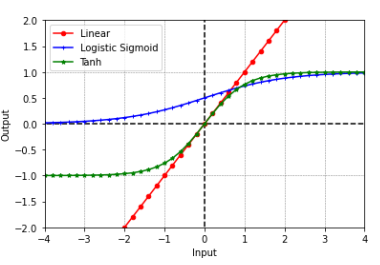
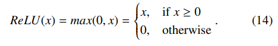
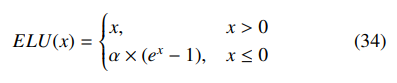
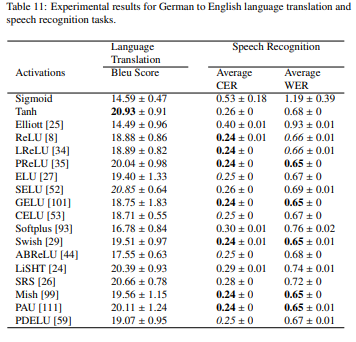

# Activation Functions in Deep Learning: A Comprehensive Survey and Benchmark
論文：<https://arxiv.org/abs/2109.14545>

v1が2021年9月, 最新版(v3)が2022年6月

（まとめ @masahiro6510）

著者：Shiv Ram Dubey, Satish Kumar Singh, Bidyut Baran Chaudhuri

(Googleの人たち)
## **どんなもの？**
- ディープラーニングによく使われる活性化関数の性能比較。
- 活性化関数をタイプごとに分類して、それぞれのメリット・デメリット、代表例の紹介もある。
- 画像認識、言語翻訳、音声認識など様々なデータに対して分析した。
- どの活性化関数が適しているかは、モデルやタスクによって変わる。どういう時にどの活性化関数を使うとよいかも書いている。
## **先行研究と比較**
- 様々な種類の活性化関数、データを用いて網羅的に分析した。
- 活性化関数の網羅性と、様々なデータに対して性能分析をしたことが売り。
## **技術や手法のキモは？**
- 活性化関数の役割
- 活性化関数のタイプ

  
- 表1：勾配の減少、非線形性の制限、最適化の難しさ、学習パラメータ、計算効率の悪さの有無の観点で主要なAFの利点・欠点をまとめた。tanhはexpが何度もあり効率悪いが、sigmoid関数を利用して、1つの指数で計算出来る

  
- 活性化関数の進化 
  - ロジスティックシグモイド関数

    

     
    - 最初に使われていた活性化関数。
    - 欠点 
      - 計算量多い
      - 勾配消失（あるパラメータに対する目的関数（loss）の勾配がゼロに非常に近くなり、パラメータが殆ど更新されなくなること）が発生しやすい
      - Outputの中心が0でないため収束しにくい
  - tanh型

    
     

    - ロジスティックシグモイドの勾配消失問題、計算量の多さはtanhにもある
    - 出力の中心が0にならない問題は解決された
    - ロジスティックシグモイド、tanhには改良版もある（省略）
  - Relu型

    

     
    - 計算量少ない
    - 勾配消失問題を改善
    - シンプルかつ高性能なのでよく使われる（例えばAlexNet）
    - 欠点 
      - 負の値を利用しない
      - 限られた非線形性
      - 出力が∞になり得るなどの欠点がある
    - 欠点の対策をした亜種が色々ある
  - 指数型

    

    

     
    - ロジスティックシグモイドとtanhの欠点は大きな正負の入力に対して、出力が飽和すること（図1参照）
    - Relu系の問題は負の値の利用が不十分でグラデーションが消失してしまうこと
    - ELUベースのAFは指数関数を用いて、負の値を利用する
  - 学習型/適応型

    

     
    - 近年人気
    - a, bが学習可能なパラメータ
    - 最近は、学習ベースのAFがある 
      - Adaptive Piecewise Linear(APL), Swishなど
      - それぞれ2つ、1つの学習可能なパラメータを持つ
    - 適切に初期化しないと学習中に発散してしまう
  - その他 
    - Softplus
    - 確率関数
    - 多項式関数
    - カーネル関数
## **どうやって有効だと検証した？**
- 先行研究の調査（Remarksにどの活性化関数が良かったか書いている）
- 
- 実験 
  - 18種類の活性化関数について、画像分類、音声認識、翻訳タスクで精度、速度を比較した。
- 画像分類 
  - 表はAccuracyの平均と標準偏差（各AFで5回実験した）
  - 軽量モデル、重量モデル、残差接続ありなしなどいろいろ
  - CIFAR10

    
  - CIFAR100

    
  - 精度の傾向 
    - Softplus、ELU、CELUはMobilenetに適している
    - ReLU、Mish、PDELUはVGG16、GoogleNet、DenseNetに適している
    - ReLU、LReLU、ELU、GELU、CELU、ABReLU、PDELUは残差接続（ ResNet50, SENet18 and DenseNet121など）があるやつで良い性能
  - ` `Lossの学習曲線 
    - ほとんどのモデルでPAUが収束速い
    - PReLU, GELU and PDELUも良い感じ
    - SRSは訓練が発散（VGG） 
    - 
  - 訓練時間比較 
    - PDReLUは非常に遅い 
    - SRS、Elliottも比較的遅い
    - 
  - **ReLU, ELU, CELU, Softplusは精度と学習時間で良いトレードオフ**
- 翻訳（ドイツ語→英語）、音声認識

   
  - 翻訳 
    - 実験概要 
      - LSTMベースのオートエンコードネットワークからなるベンチマークSeq2Seqモデルを使用
      - モデルとデータセットはKaggleからダウンロード
      - Blueスコアで評価
      - ドロップアウト層の前の特徴埋め込みにAFを使う
    - 結果 
      - **tanh, SELUが強い**
      - **PReLU, LiSHT, SRS and PAUは翻訳にも強い**
  - 音声認識 
    - 実験概要 
      - 時系列データに対する性能を見るのが目的
      - DeepSpeech2ベースのE2Eモデル
      - 文字誤り率（CER）と単語誤り率（WER）で評価
    - **結果：PReLU, GELU,Swish, Mish and PAUが適していた**
- 提言 
  - 学習を高速化するために、平均値をゼロに近づけることと、正負両方の値を使用することが必要
  - 深層学習で重要なのは、データセットの複雑さと一致する複雑さを持つネットワークを見つけること。活性化関数がこのギャップを埋められると良い 
    - モデルが複雑すぎ→過学習
    - 複雑さが足りない→収束が遅くなる
  - ロジスティックシグモイドとtanhはCNNでは避けるべきだが、リカレントニューラルネットワークでは良い
  - ReLUは人気だが、Swish, Mish, PAUなどの最近のAFも、タスクによっては試す価値あり
## **議論はある？**
## **次に読むべき論文は？**
- 適応型の活性化関数は全然知らないので調べたい。 
  - [Learning Activation Functions to Improve Deep Neural Networks](https://arxiv.org/abs/1412.6830)
- まとめでおすすめされてたやつ 
  - [Searching for Activation Functions](https://arxiv.org/abs/1710.05941)
  - [Mish: A Self Regularized Non-Monotonic Activation Function](https://arxiv.org/abs/1908.08681)
  - [Padé Activation Units: End-to-end Learning of Flexible Activation Functions in Deep Networks](https://arxiv.org/abs/1907.06732)
