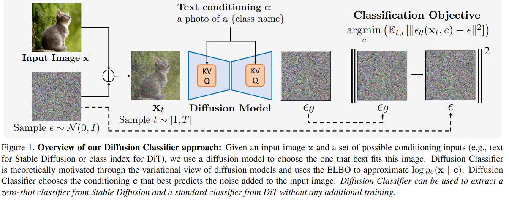
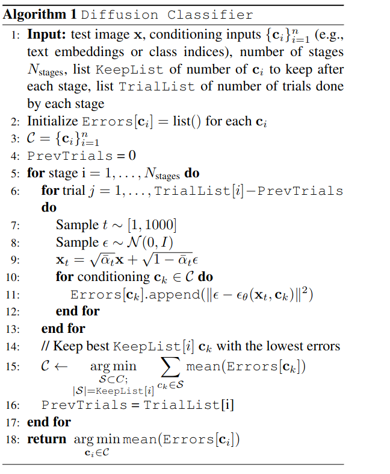
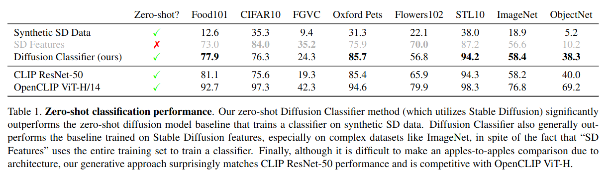
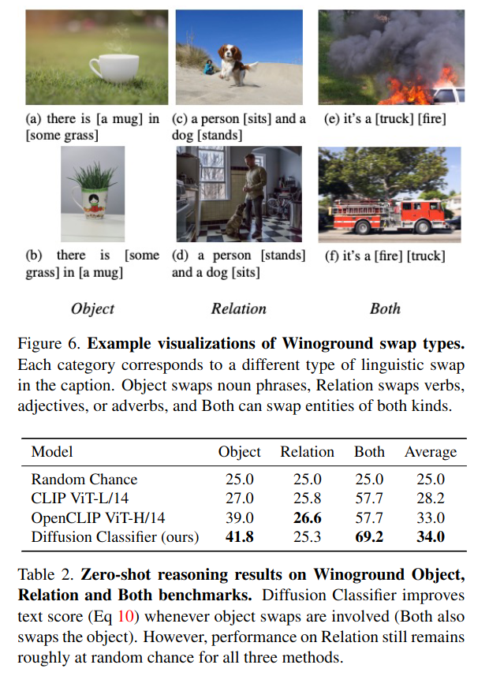

Your Diffusion Model is Secretly a Zero-Shot Classifier
===

Alexander C. Li, Mihir Prabhudesai, Shivam Duggal, Ellis Brown, Deepak Pathak

Carnegie Mellon University の人たち

https://arxiv.org/abs/2303.16203v2

@cohama

## どんなもの?

- Text-to-Image の Diffusion Model はゼロショット分類器として使えることを提案
- 生成モデルによる分類ではじめて SOTA レベルの精度を達成

## 先行研究と比べて何がすごい?

- 機械学習におけるモデルの作り方は主に2種類ある。Discriminative な手法と Generative な手法。前者は通常の分類や回帰などデータの決定境界を学習する手法。
  後者はデータの分布を学習する手法。
- 過去にも Generaive な手法を分類器に応用する研究があったが2段階で訓練したりする手法であった。
- 提案手法は訓練済み Diffusion Model をゼロショットで適用する

## 技術や手法の肝は?

1. 入力画像 x を用意
2. x にノイズを加える
3. すべての c in C について x がクラス c になるようにノイズ除去を行う
4. 最もうまくノイズを予測できた c が分類結果のクラス

愚直にやると遅いが効率化の手法も考案して多少マシにしてある。

既存の Diffusion Model (論文では Stable Diffusion を使用) があれば学習なしに分類器が得られる

## どうやって有効だと検証した？

### 画像分類タスク

- Synthetic SD Data は Stable Diffision で生成した画像で ResNet50 を訓練したもの
- SD Features は Stable Diffision のモデルの後段に分類器をつけて Fine Tune したもの

### 画像キャプション (Winoground Benchmark)

## 議論はある?

- 訓練済み Diffusion Model をそのまま使うので、そもそも Diffusion Model が賢い必要がある。Stable Diffision で使用されているテキスト埋め込みは OpenCLIP 由来のものであるが、これは画像-キャプションの組でのみ学習されており、T5-XXL のような言語だけよりもデータセットとしては小さい。T5-XXL を使えばよりよい分類器が得られるはず (だが公開されていない)
- Stable Diffision は潜在空間上での生成モデル (Latent Diffusion Model) であるが、DALLE 2 のようなピクセル空間の生成モデルとどちらが良いのか

## 次に読むべき論文

- CLIP: Samir Yitzhak Gadre, Mitchell Wortsman, Gabriel Ilharco, Ludwig Schmidt, and Shuran Song. Clip on wheels: Zero-shot object navigation as object localization and exploration. arXiv preprint arXiv:2203.10421, 2022
- Stable Diffusion: Robin Rombach, Andreas Blattmann, Dominik Lorenz, Patrick Esser, and Bj ̈orn Ommer. High-resolution image synthesis with latent diffusion models. In Proceedings of the IEEE/CVF Conference on Computer Vision and Pattern Recognition, pages 10684–10695, 2022
