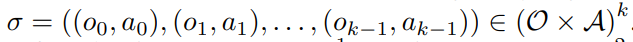
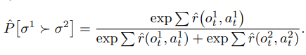
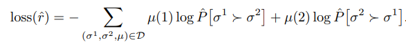
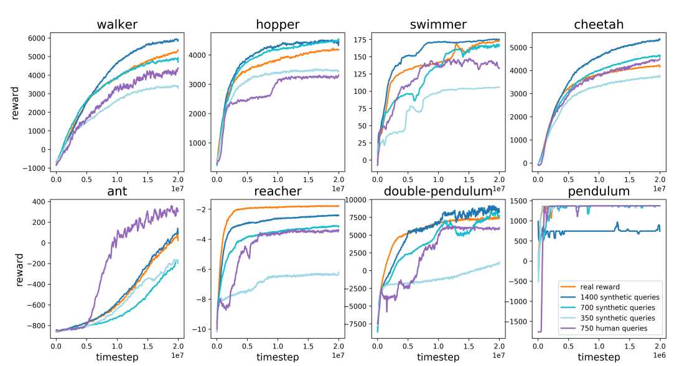
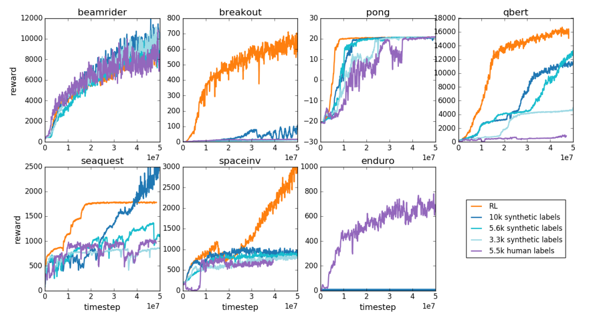

# Deep reinforcement learning from human preferences

[https://arxiv.org/abs/1706.03741](https://arxiv.org/abs/1706.03741)

(まとめ @n-kats)

著者
* Paul Christiano
* Jan Leike
* Tom B. Brown
* Miljan Martic
* Shane Legg
* Dario Amodei

OpenAIとDeepMindの人たちの研究

# どんなもの？
chatGPTで使われているRLHF（reinforcement learning from human feedback）の元ネタ論文。

この論文は言語モデルの話ではなく、よくある強化学習での取り組み（AtariやMuJoCo）。

強化学習の報酬関数が簡単に作れないケースに、人の作った教師をもとに報酬関数を上手く作ってやると、上手く行く場合があると示した研究。

# 先行研究と比べてどこがすごい？
典型的な強化学習では、成功1失敗-1等の報酬を決めておいて、どのように行動したら成功に近いかを判断できるように学習する。

しかし、簡単に報酬が決めれない場合もある。例えば、自然に歩く動作をさせたい場合、「自然に」を関数に落としこむのは難しい。

「自然に」を表現するために、人が例を用意して、模倣させるようなアプローチがあったが、一つ一つのデータ生成のコストが高い。

この問題を解決するための方法を提案した。

LLMの文脈でも、サービスとして望ましい回答をするように学習させたく、似た問題のためこの手法が展開できた。

# 技術や手法の肝は？

## アプローチ
* 報酬が決めれないなら、学習で作ればいいじゃない
* 一連の動作（2秒程度）を2例用意して人間がどっちがいいか判断して教師にする
* エージェントの学習と並列して教師を作成して、最新のエージェントの行動パターンを評価

## おさらい
### 強化学習

強化学習の問題設定は、「エージェントが環境の状態を見て行動をし、その行動により環境の状態が更新される。望む状態を目指す。」というもの。

よくある方法だと、価値関数 $ f: \mathcal{O} \times \mathcal{A} \rightarrow \mathbb{R} $ を学習で作って、状態（ $ \mathcal{O} $ の要素 ）に対して、望ましい行動（ $ \mathcal{A} $ の要素 ）を選択する。

もっと知りたい人は、[本会でのハンズオン資料](https://qiita.com/n_kats_/items/932ca8dccab66f3255ed) を参照。

この論文だと、A3CやTRPOを用いていた。

## 一連の動作の良し悪しと報酬関数の関係
一連の動作は、記号で書くとこうなる。

一連の動作の良し悪しを関数で表現したいが、以下のように時刻毎の報酬関数の和で良し悪しが判定できるような場合に制限する。

## 学習ループ
学習するのは、

* ポリシー（ $\pi: \mathcal{O} \rightarrow \mathcal{A} $ ）
* 報酬関数（ $\hat{r}: \mathcal{O} \times \mathcal{A} \rightarrow \mathbb{R} $ ） 

の2つ。

1. 環境をあたえて、ポリシーを使ってTステップ分の動作を生成
2. Tステップ分の報酬関数の和を最大化するようにポリシーを学習
3. ポリシーから生成したTステップ分の動作のペアを人の手で比較
4. 人の評価に基づき、報酬関数を学習

## 教師付け
動作 $\sigma^1$ と $\sigma^2$ がどちらがいいのかを人の手で評価するが、評価結果は確率 $\mu = (p_1, p_2) $ で表現される。

1. はっきりとどちらかが良ければ良い方の確率を1にする（(1,0) or (0,1)）
1. 同程度と判断したら (0.5, 0.5) にする
1. 比較が難しい場合、データセットに含めない

## 報酬関数の損失関数
### 大枠

報酬関数の和を $\sigma^1$ と $\sigma^2$ とで用意して、softmax でどちらが良いかの確信度にする。

この確信度と教師の確率とのクロスエントロピーを損失にする。

### 学習テク
実は大枠で説明した内容は嘘で、10%の確率でランダムな確率を教師に学習させている。

他にも、
* 報酬関数は複数用意してアンサンブルする
* train loss と val loss が1.1倍から1.5倍になるようにl2正則化を入れる。
* 複数の報酬関数の値が異なるケースを中心にサンプリングする

というテクを入れている。

# どうやって有効だと検証した？
よくある強化学習の設定で、通常の報酬を使うパターンと、報酬を一切与えずにRLHFのみ行う場合を比較（普通の報酬が無くても行けることを示したい）。

RLHF をする場合も、フィードバックの頻度を調整して、同じ時間で学習してどれくらい差がでるのかを分析する。

フィードバックのコストは、
* 対象は1〜2秒の動画
* 評価は3〜5秒で行う
* 5000組でやったとして、5時間半

実際はもっと少ない量で実験している

### MuJoCo

オレンジが通常。紫がRLHF。RLHFでも訓練できているように見える。

700教師だと同じくらい、1400教師だとRLHFが若干良いという結果。

Antの場合は、「ちゃんと立っている」状態をキープするとよく、これがフィードバックで表現できたためと考えられる。

### Atari

MuJoCoと比べると、上手く行っていないように見える。
短い動画だけではゲームの勝ち負けと関係のない部分が多いため、教師があまり有効でないためと考えられる。

# 議論はある？
低コストな簡単な評価で、報酬が定義できない場合でも学習できるようになった。
複雑な現実世界で人がやっていることをAIに真似させるようなことに貢献できるだろう。

# 次に読むべき論文は？
* https://arxiv.org/abs/2203.02155 ・・・InstructGPT