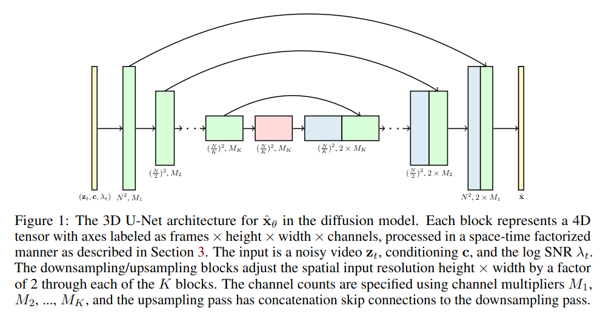
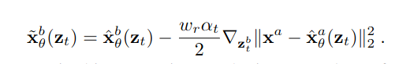
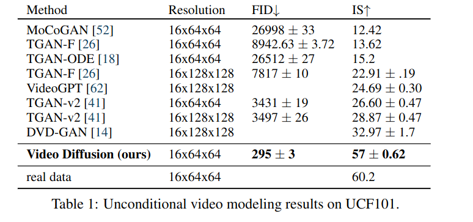
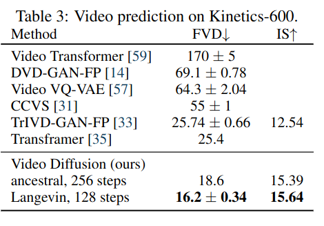
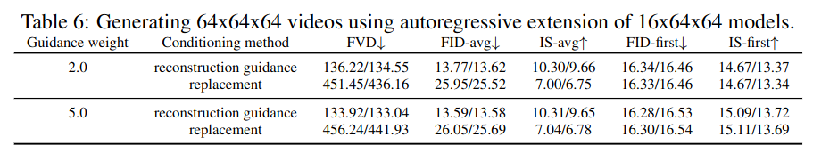

Video Diffusion Models
=====

Jonathan Ho, Tim Salimans, Alexey Gritsenko, William Chan, Mohammad Norouzi, David J. Fleet

Google の人たち

https://arxiv.org/abs/2204.03458

@cohama

## どんなもの

- 拡散モデルを動画生成に応用したもの
- https://video-diffusion.github.io/
- 
- モデル自体は16フレームの画像を生成するのみだが、自己回帰的に推論させたり、フレーム補完させたりすることで長い動画も生成できる
- GAN ベースの手法よりも品質に優れる

## 先行研究と比べて何がすごい?

- 拡散モデルを動画生成に応用した初期の論文 (当時)。それまでは GAN や VAE や Normalizing Flow で生成するのが主流だった。

## 技術や手法の肝は?

### モデル

- 3D (時間 x 高さ x 幅) 版の U-Net
- ただし、3次元の畳み込みはなく空間方向のみの畳み込みと時間方向の Self-Attention を組み合わせている
- このモデルで16フレームの64x64解像度の動画が生成できる
- 時間方向のアテンションをマスクすることで、そのまま画像の生成モデルの訓練も同時にできる (学習データを増やせる)

### Reconstruction-guided sampling

- 最初に生成したフレーム xa からその後に続くフレーム xb を生成したい。普通に考えると条件付きのモデルの学習が必要に思えるが、拡散モデルをうまく使うと特に訓練なしに xb を生成することができる。この手法自体はよく知られているらしい。これは先に生成した xa にフォワードプロセス (つまりノイズをかける) した画像をうまく使う。(replacement sampling というらしい)
- ただし、ビデオ生成ではこの手法はうまく行かなかった。xb 単体の品質は高いものの xa との一貫性がない
- replacement では不足している項があり、それをちゃんと考慮することで品質が上がる

- 第2項は前段の生成済みフレームと、それをさらに最構成したフレームの2乗誤差の勾配。これがより小さくなる方向に補正するイメージと思われる

## どうやって有効だと検証した？

### UFC101

16x64x64 のビデオ。1モデルだけで生成できるので特に条件付が不要なケース

### Kinetics-600

64x64 で最初の5フレームが与えられて、残りの11フレームを生成するタスク。

### ablation: reconstruction-guidening

## 議論はある?

- 懸念が書かれていた。この技術はフェイク、ハラスメント、デマの流布などネガティブな活用が心配されている。そのためモデルが公開されていない。今後の研究でそのような社会的、文化的バイアスを正しく評価するための手法の研究が望まれる

## 次に読むべき論文

- Text2Video-Zero: Text-to-Image Diffusion Models are Zero-Shot Video Generators, https://arxiv.org/abs/2303.13439v1
- Conditional Image-to-Video Generation with Latent Flow Diffusion Models, https://arxiv.org/abs/2303.13744v1
  - おそらく動画生成分野の最先端
- Diffusion probabilistic modeling for video generation, https://arxiv.org/abs/2203.09481
  - ほぼ同時期に発表されたほぼ同じテーマの論文。画像生成を RNN で構成する手法
