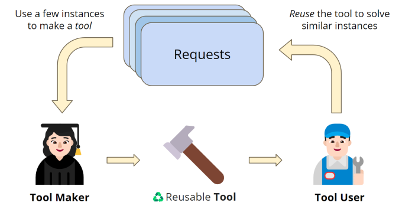
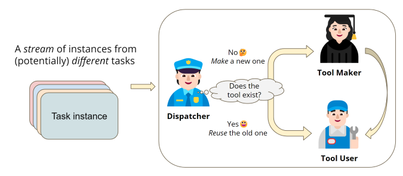
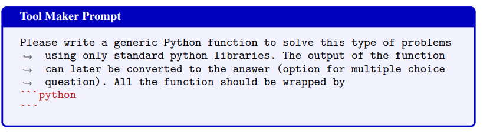
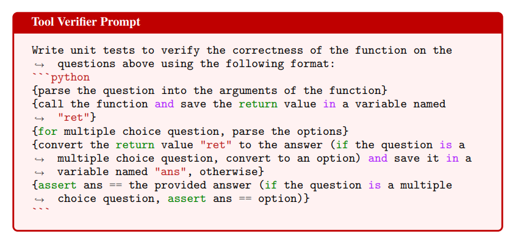
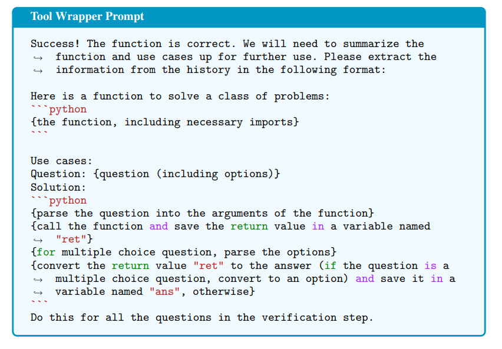
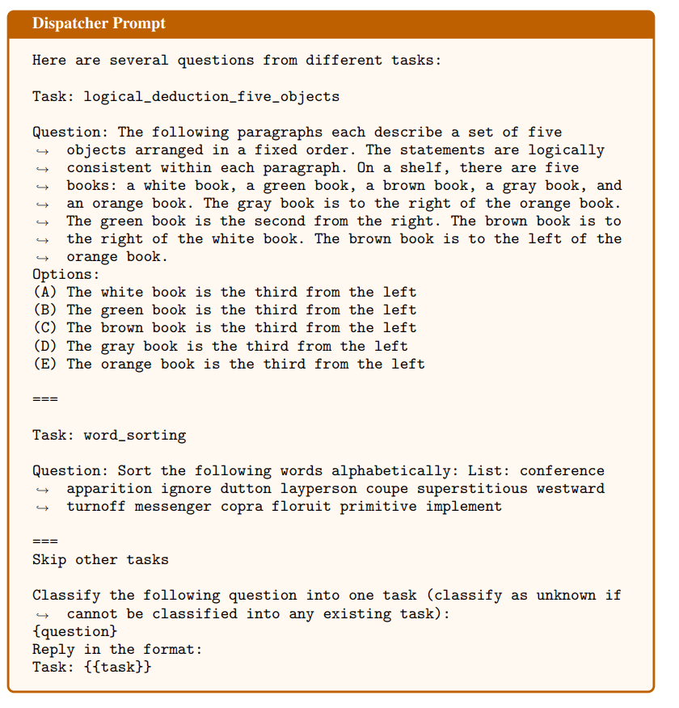
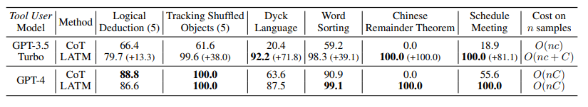

# Large Language Models as Tool Makers

[https://arxiv.org/abs/2305.17126](https://arxiv.org/abs/2305.17126)

(まとめ @n-kats)

著者
* Tianle Cai
* Xuezhi Wang
* Tengyu Ma
* Xinyun Chen
* Denny Zhou

DeepMind（とインターン）の人たちの研究

# どんなもの？
ChatGTP 等のLLM では複雑な計算を間違ったりして、問題を解く能力に課題がある。

発想を変えて、そのような問題を解くためのツールをLLMで作ってしまおうという研究。

# 先行研究と比べてどこがすごい？

以前紹介した、[Toolfomer](https://github.com/mlnagoya/surveys/blob/master/20230216_reports/Toolformer_2302.04761.md) もLLMからツールを使おうというものだったが、予め決められたツールを用意して、それを使うというアプローチだった。

この研究では、そのようなツールを自由に作るアプローチを取っている。

# 技術や手法の肝は？

## アプローチ
* コード生成には Tool Maker と Tool User の2つの要素を設ける
  * Tool Maker は コード生成・単体テスト・使い方生成 を行う 
  * Tool User は ツールの使い方を参考に個別の問題を解く
* dispatcher と呼ぶもので、どのツールを使えばいいか・新しいツールが必要かを判断する





## ToolMaker
コード生成・単体テスト・使い方生成 を行う。これらはプロンプト（とツールを実際に動かして）を用いて達成する。

### コード生成のプロンプト



素朴にコード生成させる。標準ライブラリしか使わないという縛りをかけているのがポイントかも。

### 単体テスト



単純にテストを生成させるだけ。

### 使い方生成




### 例
[https://chat.openai.com/share/3cddd6ba-0e74-4a34-b31f-8cde47768736](https://chat.openai.com/share/3cddd6ba-0e74-4a34-b31f-8cde47768736)

問題文:

```
問 数字を文字列化して、その文字列を反転させた文字列にすることを考えます。この変換の結果で与えられたN個の数字をソートせよ。
例 [4,2,1,3]の場合、答えは[1,2,3,4]
例 [14, 23, 32, 41] の場合、答えは[41,32,23,14]
```

生成したコード:

```
def sort_by_reversed_strings(numbers):
    # 数字を文字列に変換し、その文字列を反転させる
    str_nums = [str(n)[::-1] for n in numbers]

    # 反転した文字列に基づいてソートする
    sorted_indexes = sorted(range(len(str_nums)), key=lambda i: str_nums[i])

    # ソートされたインデックスに基づいて元の数字を並べ替える
    return [numbers[i] for i in sorted_indexes]

```


生成した単体テスト:

```
def test_sort_by_reversed_strings():
    # Test case 1
    numbers = [4, 2, 1, 3]
    ret = sort_by_reversed_strings(numbers)
    ans = ret
    assert ans == [1, 2, 3, 4]

    # Test case 2
    numbers = [14, 23, 32, 41]
    ret = sort_by_reversed_strings(numbers)
    ans = ret
    assert ans == [41, 32, 23, 14]

# Run the test function
test_sort_by_reversed_strings()
```

生成した使い方:

（日本語で質問したから、キーワードの「Use cases」が日本語になってしまった・・・）

> 以下のように、Python関数およびその使用例を整理します。
>
> 以下は、特定のクラスの問題を解決するための関数です：
> 
> ```python
> def sort_by_reversed_strings(numbers):
>     # Convert the numbers to strings and reverse those strings
>     str_nums = [str(n)[::-1] for n in numbers]
> 
>     # Sort based on the reversed strings
>     sorted_indexes = sorted(range(len(str_nums)), key=lambda i: str_nums[i])
> 
>     # Reorder the original numbers based on the sorted indexes
>     return [numbers[i] for i in sorted_indexes]
> ```
> 
> 使用例：
> 
> 質問1: 数字のリスト [4,2,1,3] を文字列化して反転させ、その結果を元にリストをソートする。
> 
> 解答：
> 
> ```python
> numbers = [4, 2, 1, 3]  # parse the question into the arguments of the function
> ret = sort_by_reversed_strings(numbers)  # call the function
> ans = ret  # convert the return value to the answer
> # The result should be [1, 2, 3, 4]
> ```
> 
> 質問2: 数字のリスト [14, 23, 32, 41] を文字列化して反転させ、その結果を元にリストをソートする。
> 
> 解答：
> 
> ```python
> numbers = [14, 23, 32, 41]  # parse the question into the arguments of the function
> ret = sort_by_reversed_strings(numbers)  # call the function
> ans = ret  # convert the return value to the answer
> # The result should be [41, 32, 23, 14]
> ```
> 
> これらの質問は複数選択肢の形式ではないため、選択肢をパースするステップは不要です。また、関数の戻り値は直接的に答えとなります。

## Tool User
生成した使い方をプロンプトにして、実際の問題を解く。
問題を解く場合の方が頻度が高いので、Tool Maker はGPT-4で、Tool UserはGPT-3.5 Turboで、というように使い分けるといい。

## dispatcher
次のようにfew shotのアプローチを取る（最初の長いTask:...の部分もプロンプトの一部）。



ツールの使い方と結合して使う。

# どうやって有効だと検証した？
## CoT（Chain of Thought）と比較



Chinese Remainder Theoremのような整数の問題がCoTだと全然ダメだったが、コードを生成するLATMの方は正しく解ける.。アルゴリズム的に、もしくは全パターン判定する方式で解かないといけない問題だからこの差が出ている。

別の問題でも、自動でCoT(step by stepとかつける)＜ 人の手によるCoT ＜ LATM という結果になっている。


## dispatcher の評価
何個（6個とか4個）かタスクを用意して、それぞれに100個事例を作って、dispatcherが適切なタスクを選べるかを評価。

95% くらいの精度で正しく判定できる。

# 議論はある？
LATM は、人類が他の生物と違って問題毎にいろんな道具を生み出すというのをAIに落とし込んでいる。

人間の生活の中では色んなタスク（時間調整とかメールや電話とか）がある。
そのような場面のデータセットがなくて試せていない状態だが、そういうのにLATMは有効なのでは？

# 次に読むべき論文は？
* https://arxiv.org/abs/2305.10601 ・・・ToT（Tree of Thoughts）というCoTの進化系があるらしい