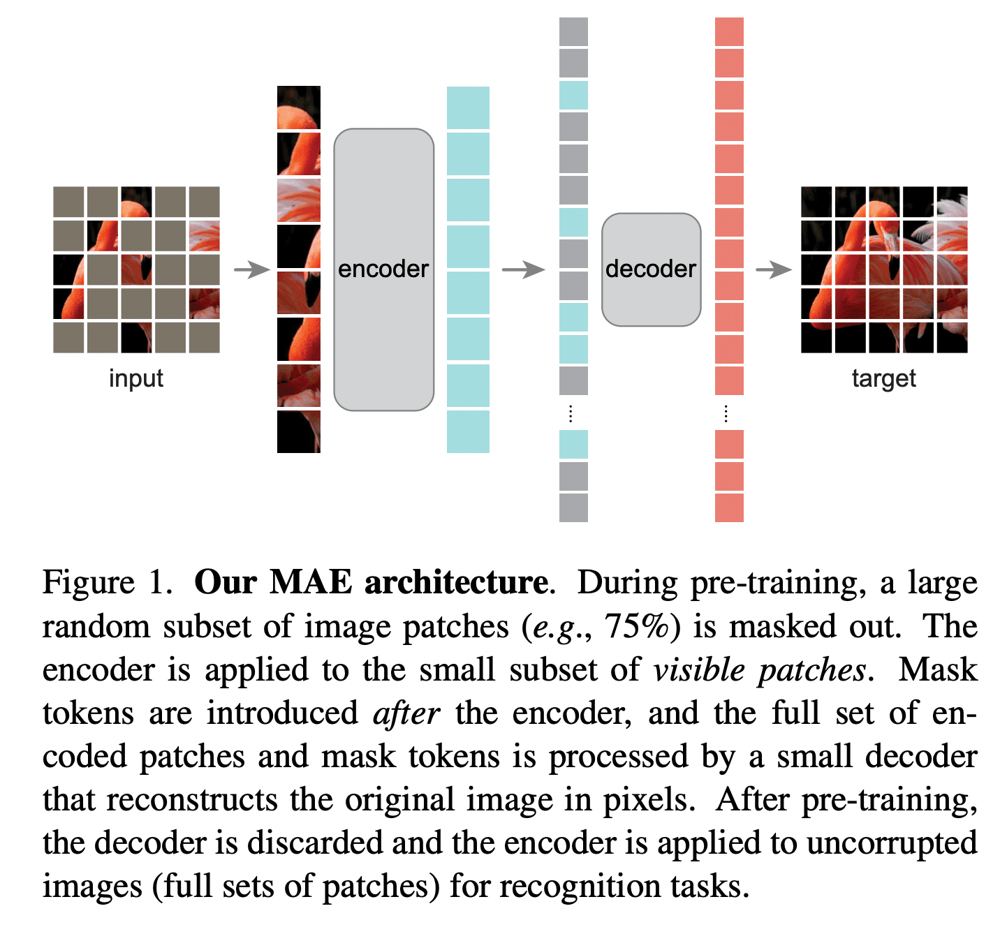
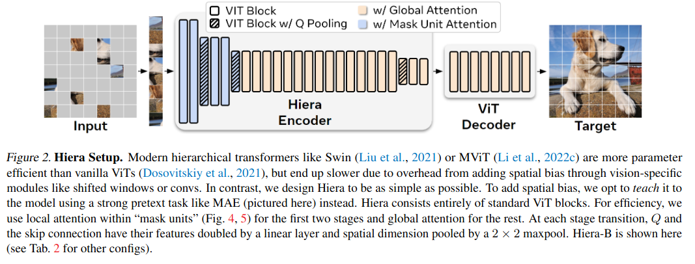
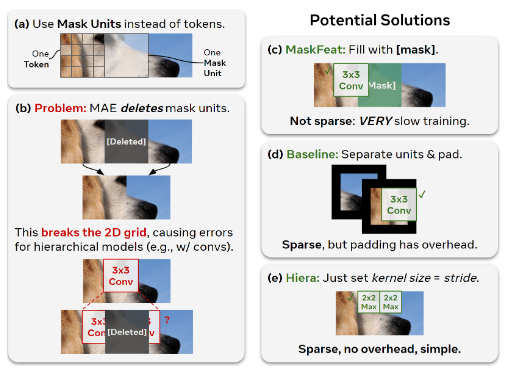
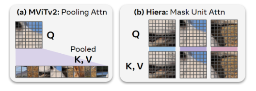
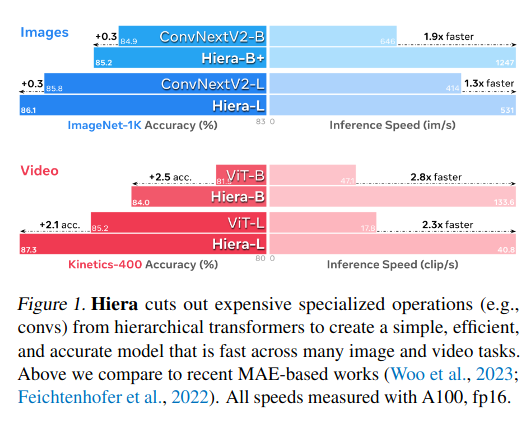
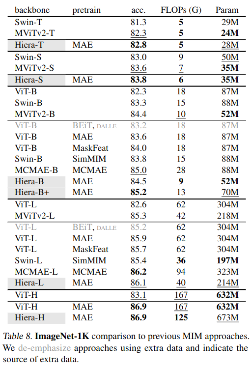
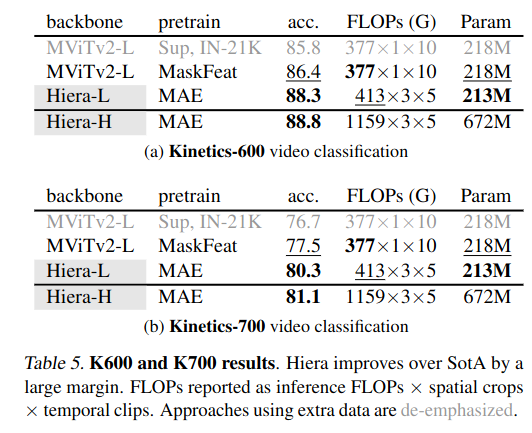
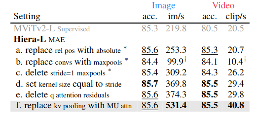
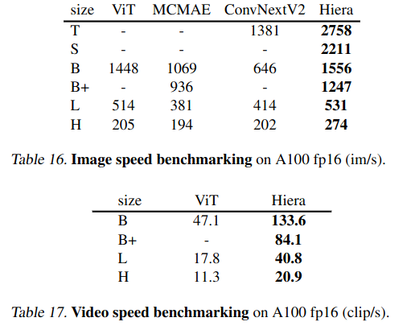
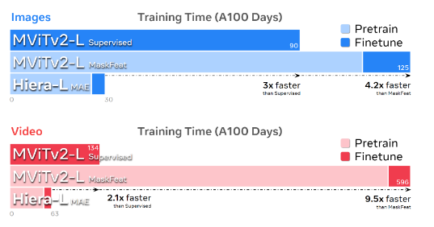

Hiera: A Hierarchical Vision Transformer without the Bells-and-Whistles
=====

Chaitanya Ryali, Yuan-Ting Hu, Daniel Bolya, Chen Wei, Haoqi Fan, Po-Yao Huang, Vaibhav Aggarwal, Arkabandhu Chowdhury, Omid Poursaeed, Judy Hoffman, Jitendra Malik, Yanghao Li, Christoph Feichtenhofer

Meta AI, FAIR
Georgia Tech
Johns Hopkins University
の人たち

@cohama

## どんなもの

- ViT 亜種。空間的な演算をほとんど含まないシンプルなモデル Hiera を提案
- 画像や動画認識のタスクにおいて、Swin、MViT、ConvNext 等よりも精度と速度で上回る
- 訓練も速い

## 先行研究と比べて何がすごい?

- SwinTransformer や MViT などの手法がある。これらはバニラの ViT に対してより画像に特化したオペレーション (畳み込みやそれに類する演算、shifted window など) が入っており精度は良いが実際の推論速度はバニラの ViT より遅くなってしまっている
- また、MAE という強力な pretrain 手法があるが畳み込みなどの演算はこれとの相性が良くない
- Hiera はこれらの余分なオペレーションを使わずによりよい精度、速度を実現している

## 技術や手法の肝は?

### 予備知識: MAE (Masked Auto Encoder) による事前学習

- パッチ分割された画像の一部をマスクし、それを復元するように訓練する事前学習手法。
- 欠落したパッチ (トークン) は別の値で埋めるのではなく完全に削除される。これによって高速に学習できるがパッチ間の空間的な情報は失われる。

### Hiera

空間的な操作を畳み込みなどのオペレーションを使わず MAE で学習させる作戦。
MAE で学習しやすいように差ざまざまな工夫を加えている

### Hiera における MAE

- (a): Hiera では他の ViT 亜種と同様階層的な構造を取る。結果として浅い層では1つのパッチの大きさが 4x4 と小さくなってしまう。そこで MAE のマスクの単位はいくつかのトークンをまとめて 64x64 の領域を一気にマスクするようにする。
  - 理由は特に書かれていなかったがパッチが小さいとテクスチャだけ予測すれば解ける簡単な問題になるためと想像
- (b): MAE ではマスクしたパッチを削除するので畳み込みの演算では問題が起きる
- (c): MaskFeat という手法では削除するかわりに適当な値で埋めるようにした。畳み込みに対してはこれで正しいが遅い
- (d): マスクした領域をそれぞれ独立に扱い、パッディングを設ける。これで畳み込みに対して頑健でかつそこまで遅くない
- (e): そもそも畳み込みを pooling にする。stride と kernel sie を合わせることでパッチをまたぐような演算を行わないようにする。シンプルで余計なオーバーヘッドがない。実験的にこれで良いことが分かった。

### Mask Unit Attention

- MViTv2 ではアテンションの計算をサボるために K, V に対して pooling (stride 2 畳み込み) で空間の解像度を落とす工夫を入れていた。これは動画など入力が大きい場合には計算量が大きい
- Hiera では Mask Unit の単位でのみアテンションの計算をする。(要はただのローカルなアテンション)
  - Swin Transformer みたいに隣り合う領域を分けなくていいのか、という心配があるが、モデルの後段でグローバルなアテンションを取るので大丈夫とのこと。

## どうやって有効だと検証した？

### ImageNet1K (画像分類)

MAE は ImageNet1K を使って pretrain

### Kinetics (画像分類)

Kinetics-400 で pretrain

### MViTv2 から余計な演算を削除した時の精度と速度

### 速度

### 訓練時間

## 議論はある?

- Hiera は空間のオペレーションを全て MAE による事前学習に頼っている。MAE がない場合は性能が劣化する
  - 
- (私見) MAE 以外のより良い pretrain 手法を使うとより良くなるか

## 次に読むべき論文

- MAE https://arxiv.org/abs/2111.06377: Masked AutoEncoder
- I-JEPA https://arxiv.org/abs/2301.08243: MAE よりも早くて良い自己教師あり学習
