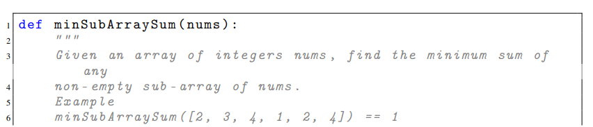
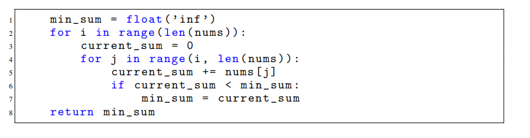
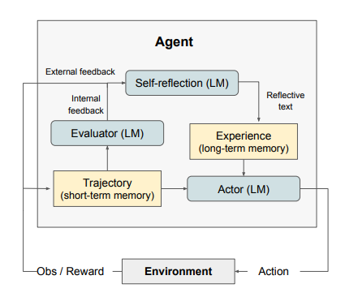
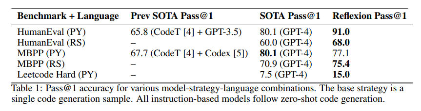
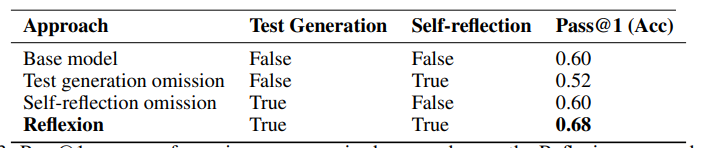
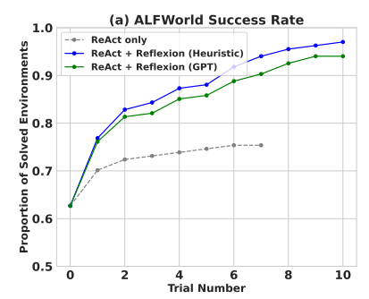
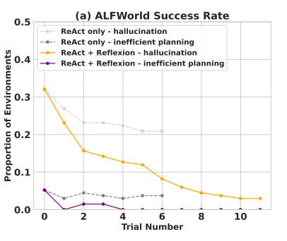
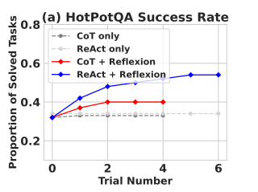

# Reflexion: Language Agents with Verbal Reinforcement Learning

[https://arxiv.org/abs/2303.11366v3](https://arxiv.org/abs/2303.11366v3)

(まとめ @n-kats)

著者
* Noah Shinn
* Federico Cassano
* Beck Labash
* Ashwin Gopinath
* Karthik Narasimhan
* Shunyu Yao

Northeastern・MIT・Princetonの人たち

# どんなもの？
LLMを使ってコード生成等を行う研究。
HumanEvalというデータセットでSOTA（正解率91%）。

# 先行研究と比べてどこがすごい？
根本のアイデアは「AIにも試行錯誤をさせたい」ということ。
しかし、通常の強化学習等のやり方だと、学習データを集めて学習（重みを更新）しないといけなくて、コストが高い。

提案するReflexionという手法は、（人間が反省するように）言葉によるフィードバックを使って試行錯誤の過程を記録する仕組みを実現。

コード生成以外にも判断や推論にも使える手法。

# 技術や手法の肝は？
## 問題設定（HumanEval）
pythonの関数のdocstringから関数の中身を実装する課題。

問題の入力

回答例

正解基準は、単体テストが用意されていて、それにパスすればOK。

こういうのが164問ある

[https://github.com/openai/human-eval](https://github.com/openai/human-eval) に公開されている。

## アプローチ

登場する要素は、
* Actor・・・言語モデルでどのような行動をするかを判断する。CoTやReActの方法で生成。
* Environment・・・環境（プログラムの動作確認する環境等）
* Trajectory・・・軌跡（環境内でのアクションと結果の列）
* Evaluator・・・軌跡を評価する
* Self-reflection・・・軌跡の評価結果を内省する
* Experience・・・内省した結果をためておく場所

疑似コード

$\pi_\theta$ と強化学習っぽく書いているが、単にプロンプトとその入力（モデルと内省結果）と思えばよい。

## Evaluator
軌跡を入力して、報酬スコアを返す。タスク毎に考えて作る。

* 推論タスク・・・exact match gradingで期待した結論と近いものを良いと評価する
* 判断タスク・・・1. ヒューリスティックに作った関数で判断の良し悪しを評価する。2. LLMで評価する
* プログラミングタスク・・・LLMで評価する（単体テストを生成する）

プログラミングタスクの場合、高々6個くらいの単体テストをLLMで生成して評価する。

## プロンプト
https://github.com/noahshinn024/reflexion/blob/f27481d8a363d523ae09ebb5782e661afd9f1abf/programming_runs/generators/py_generate.py

にあるっぽい。

# どうやって有効だと検証した？
## プログラミング（HumanEval/MBPP/Leetcode）
HumanEval 以外に、MBPP（HumanEvalと似た設定）やHumanEvalのrust版やLeetcode（この研究用に作成）で評価。

がっつり性能があがっている。Leetcodeは作ったはいいけど、難易度が高くて今後の課題。
（GPT-4のテクニカルレポートのHumanEvalの結果が67%だった気がするが・・・プロンプトやモデルバージョンの差？）

単純に単体テストをすればいいのではなく、適切にフィードバックしないと精度が上がらないといえる。

## 判断タスク（ALFWorld）
ALFWorldはテキストベースの環境で、エージェントに複数ステップのタスクを実行させる問題。
ALFWorldの環境からは、終わったかどうかしかフィードバックしかこない。なので、自己評価力が試されるタスク。

ループを重ねる毎に結果が良くなっている。

失敗原因を見ると、hallucination起因の問題も無効な行動を生成する失敗も大幅に減っていることがわかる。
（無効な行動はほとんどなくなっている）

## 推論タスク（HotpotQA）
Wikipediaベースのデータセットで、113k組のQAがあり、内容を理解していくつかの資料をもとに推論するタスク（WikipediaのAPIを叩く）。

CoTは相性がわるくて、ReActを使うといい

# 議論はある？
今回の手法では、反省の記憶量に上限を設けただけだが、改良の余地がある。

## 私見
精度関係がGPT-4のバージョンや実行したときの運に左右されそう。
特に、GPT-4の性能が前のリリースで落ちたという噂が気になる。

# 次に読むべき論文は？
* ReAct