Retentive Network: A Successor to Transformer for Large Language Models
=====

Yutao Sun, Li Dong, Shaohan Huang, Shuming Ma, Yuqing Xia, Jilong Xue, Jianyong Wang, Furu Wei

Microsoft Research
Tsinghua University
の人たち

@cohama

## どんなもの

- Transformer に変わる新たな演算である Retension とそれを実装した RetNet を提案。Transformer の後継であると主張
- 性能も劣化なし(場合によっては上回る)に GPU メモリ使用量低減、推論の高速化を達成。
- シーケンス長 N に対して O(1) で推論でき、使用するメモリ使用量も O(N)
  - バニラな Transformer はそれぞれ O(N)、O(N^2)

## 先行研究と比べて何がすごい?

- Transformer は強くて、学習が並列 (シーケンスを逐次に処理しないという意味と思われる) だが遅い。
- Transformer の Attention が遅いのをなんとかするための Linear Transformer がある。高速に推論できるが精度は劣る。
- Retention は精度、並列性、推論速度のすべてを満たす

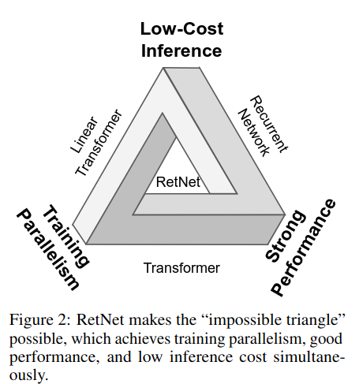

## 技術や手法の肝は?

### Retention

(なんか数式が書いてある)

要は逐次的に系列を予測する (入力 vn から出力 on を逐次的に得る) から逐次的ではなく系列を一気に計算できるような形式に変換しているっぽい...?

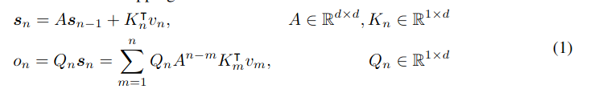
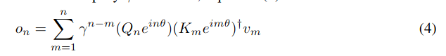

並列バージョンと再帰バージョンの2種類がある。

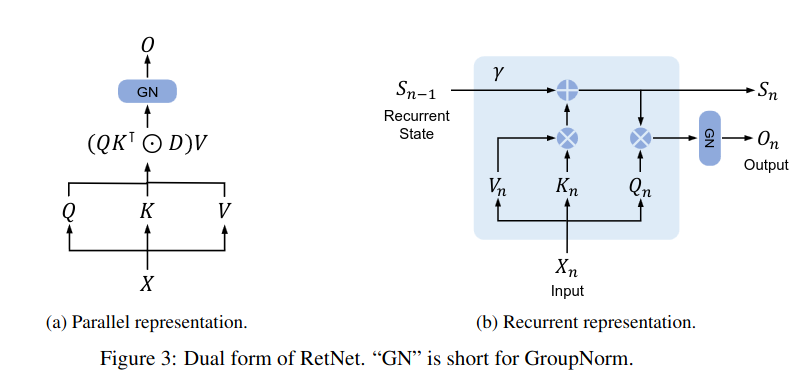

### Parallel Representation of Retention

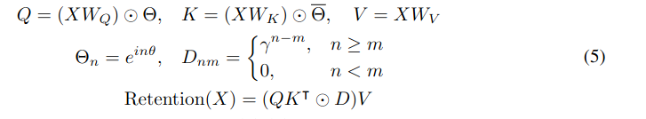

ここの Dnm が三角行列になっているのがポイントかもしれない。
訓練時に系列を一気に計算できるので GPU と相性が良い。

### Recurrent Representation of Retention

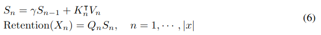

逐次 (再帰) に書き直したバージョン。推論時に有利

### Chunkwise Recurrent Representation of Retention

並列と再帰のハイブリッド。入力をチャンクごとに分け、チャンク内は並列に、チャンク間は再帰にする。

### Gated Multi-Scale Retention

Transformer では Multi-Head Attention を使うことが多いが、それの Retention 版に相当。
γ (三角行列の要素になるパラメータ) をヘッドごとに変えているのがポイント。

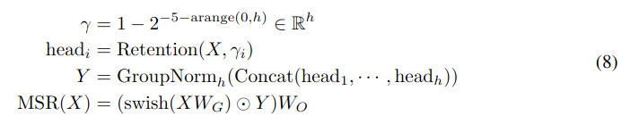

### RetNet

Transformer の MHSA 部分を MSR に変えただけ。LN とか FFN とかがいつもどおり入る。

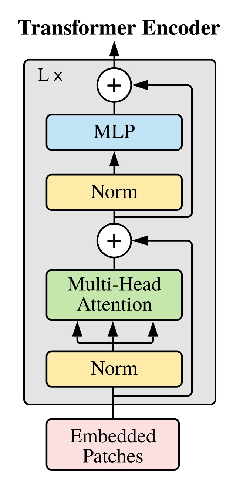

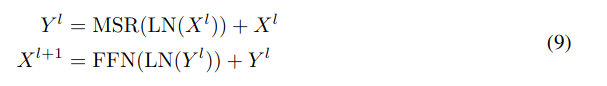

## どうやって有効だと検証した？

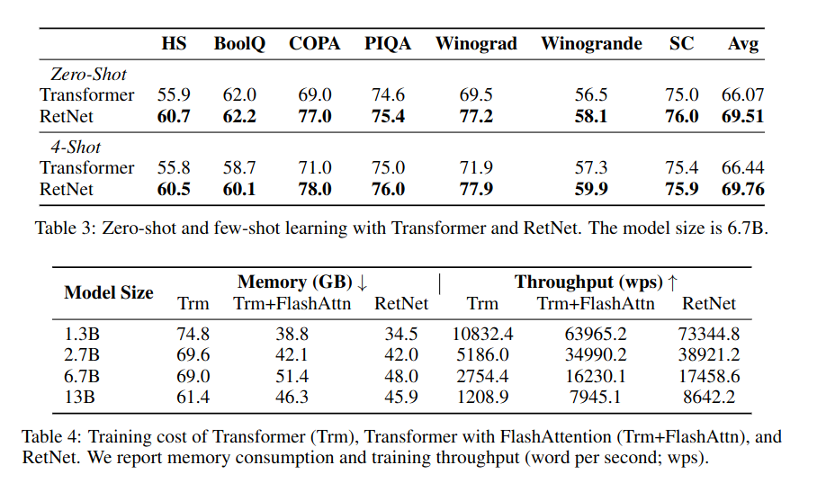

### 推論コスト

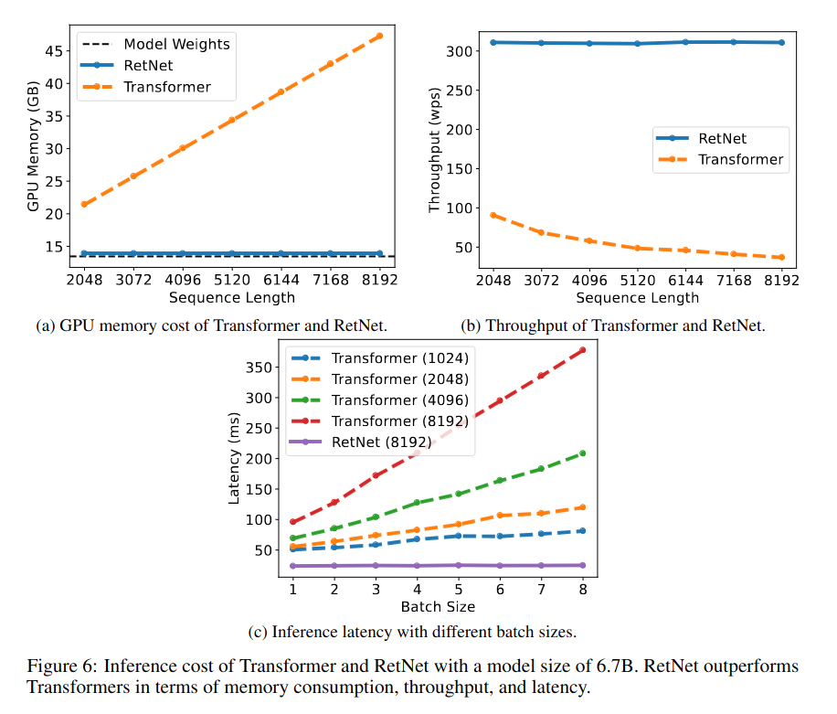

## 議論はある?

- Chunk サイズの設計は割と重要っぽいように思うが実験とかはされてない。理論上はチャンクに分けても分けなくても結果は同じになるはず？
- 画像だとどうなるのかが気になる。自然言語は逐次に入力するので問題ないが画像の場合はそれがおそらく成り立たないような気がする。
- (数式が難しくなんで逐次の形式を並列にできるのか理解できてない...)
- (どうでもいい話) AMD MI200 という GPU で訓練されたらしい

## 次に読むべき論文

- https://arxiv.org/abs/2111.11418: Attention 部分、Pooling でも十分だよという論文
- https://arxiv.org/abs/2201.10801: Attention 部分、Shift でも十分だよという論文。Vision 系ではあるが結局 Attention は本質的には重要ではない
- https://arxiv.org/abs/2205.14135: FlashAttention。Attention の計算を工夫して高速化する
- https://arxiv.org/abs/2307.08691v1: FlashAttention-v2
