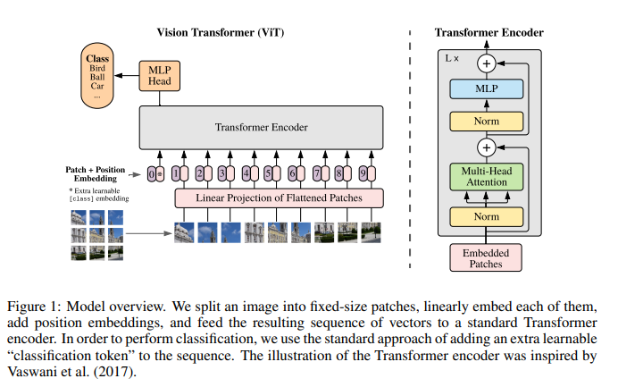
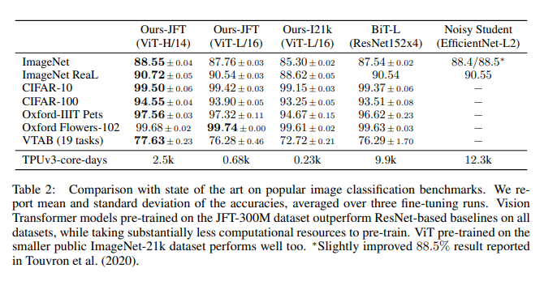

# AN Image IS WORTH 16X16  ORDS: TRANSFORMERS FOR  MAGE RECOGNITION AT SCALE

https://arxiv.org/abs/2010.11929

（まとめ @masahiro6510）

### 出版年月
v1が2020年10月, v2が2021年6月

### 著者
Alexey Dosovitskiy, Lucas Beyer, Alexander Kolesnikov, Dirk Weissenborn, Xiaohua Zhai, Thomas Unterthiner, Mostafa Dehghani, Matthias Minderer,Georg Heigold, Sylvain Gelly, Jakob Uszkoreit, Neil Houlsby

## どんなもの？
- 自然言語処理タスクでデファクトスタンダードになっているTransformerをコンピュータビジョンに応用した。
- CNNへの依存は必要なく、画像パッチのシーケンスに直接適用される純粋な変換器が、画像分類タスク(ImageNet, CIFAR-100, VTAB)で(精度、計算量ともに)非常に良い性能を発揮できた

## 先行研究と比べて何がすごい？
- 画像認識へのTransformerの適用。コンピュータビジョンにself Attentionを用いた先行研究とは異なり、画像をパッチのシーケンスとして解釈し、自然言語処理で使用される標準的なTransformerエンコーダによって処理する。
    - この戦略がシンプルかつスケーラブル(シーケンス長は任意)で、大規模なデータセットでの事前学習と組み合わせることが出来る。
- 多くの画像分類データセットにおいて、事前学習が比較的安価でありながら、最先端技術に匹敵するか、それを上回る性能を発揮した

## 技術や手法の肝は？

- モデル設計はオリジナルのTransformerに可能な限り忠実に従う。
- 画像をパッチに分割→1次元シーケンスに変換→線形射影(学習可能なパラメータあり)によりD次元にする→Transformer→MLP→クラス分類

### Transformer Encoderに入力する前
- 入力画像(H, W, C)→画像をパッチに分割して平坦化(NCP^2)→線形射影(学習可能なパラメータあり)によりD次元に変換→BERT同様に[class]トークンを埋め込み(?)→パッチの位置情報を付加(図1の紫色)
- (画像をパッチに分割して平坦化した後の処理が理解できていないので、これから勉強する)
- パッチ分割して平坦化することで自然言語処理と同じように1次元シーケンスとして扱える

### Transformer Encoder
- Multi-Head AttentionとMLPが交互にある。

#### 標準的なself Attention

- (5): U(Transformer Encoderに入力されるやつ)に学習可能な重みz
- (6): queryとkeyの内積により類似度を計算してsoftmax。どの要素に注目するかを決めるための重みとして使う
- (7): (6)を重みとして、vの重み付き平均を計算する

#### Multi-head Attention

SAを拡張したもの。「ヘッド」と呼ばれるk個のself attentionを並列に実行し、それらの連結させる。
kを変えても計算量とパラメータ数を一定にするため、Dh(式5)は通常D/kに設定される。

### CNNとの比較
- 帰納バイアス(学習データから得られる情報以外に最初からもっている知識または仮説のこと)
    - 局所性: 画像の特定の部分（ピクセルまたはパッチ）がその周囲の近くの部分と強く関連していること（物体やテクスチャは通常、画像の連続した領域に存在するため）
    - 2次元近傍性: 画像が2次元のグリッド（ピクセルの配列）であるということ
    - 並進等価性: 画像が平行移動しても、その内容が変わらないということ。例えば猫が画像の右上にいても左下にいても猫と認識できる

- CNNでは、モデル全体を通して局所性、2次元近傍構造、並進等価性を持つ
- ViTでは、
    - 局所性、並進等価性: MLP層のみが持ち、self Attention層は持たない
    - 2次元近傍性: 限定的に持つ。（1次元の位置インデックスは与えるけど2次元の情報はないから限定的ということ？）

### ハイブリッドアーキテクチャ
- 画像パッチの代わりに、CNNの特徴マップから抽出された入力シーケンスを用いる。

### finetuneと高解像度化
- 大規模データで事前学習を行い、小規模なタスクでfinetuneする。このときにヘッド（出力に近いところ）をタスク固有のものに置き換える。
- 事前学習より高解像度でfinetuneするほうが有益な場合が多い(Touvron etal., 2019; Kolesnikov et al., 2020)
- Transformerはメモリ制約に達するまでシーケンスを長く出来るが、事前に学習した位置埋め込みが意味をなさなくなる可能性がある。
    - 事前に学習した位置埋め込みを、元画像の位置に応じて2次元補間する

## どうやって有効だと検証した？
- ResNet, ViT, それらのハイブリッドで比較して良い結果になった
- 自己教師付き学習によるViTも将来有望そうであることを小規模実験で示した(ここはまだ読めていない)

### 実験に使ったViTのモデルバリエーション

### SOTAとの比較

- 3回finetuneを行った平均と標準偏差と、それぞれの事前学習に要したTPUv3コア日数(すべて同じハードウェアで学習した)
- 精度も計算時間でもViTが他の手法より良かった（しかし、事前学習の効率は、アーキテクチャの選択以外の要素の影響もあることに注意）

### 学習データ要件

小さなデータセットで事前学習した場合は他手法の方が良い精度だが、大きなデータセットで事前学習した場合はViTの方が良い精度

同じ計算量だとViTの方がResnetより良い

## 議論はあるか？
- 検出やセグメンテーションなど他のコンピュータビジョンタスクにViTを適用すること
- 自己教師付き事前学習法の探求。我々の最初の実験では、自己教師付き事前学習による改善が見られたが、自己教師付き事前学習と大規模教師付き事前学習の間にはまだ大きな隔たりがある。
- ViTをさらに拡張することで性能の改善につながる可能性が高い。

## 次に読む論文
[All you need is Attention](https://arxiv.org/abs/1706.03762): Transformerのオリジナル

[https://arxiv.org/abs/2111.09883](https://arxiv.org/abs/2111.09883): ViTを物体検出やセマンティックセグメンテーションなどに適応

[Emerging Properties in Self-Supervised Vision Transformers](https://arxiv.org/abs/2104.14294): Vitで自己教師あり学習

