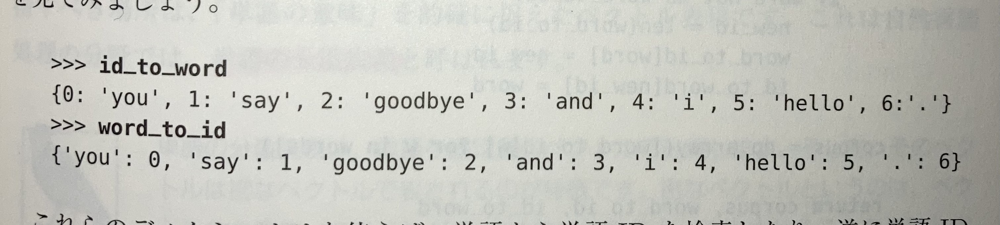
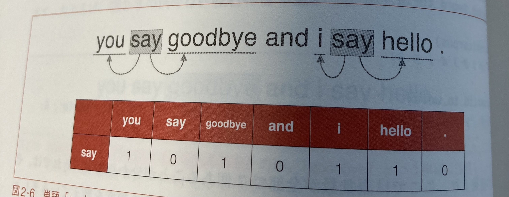
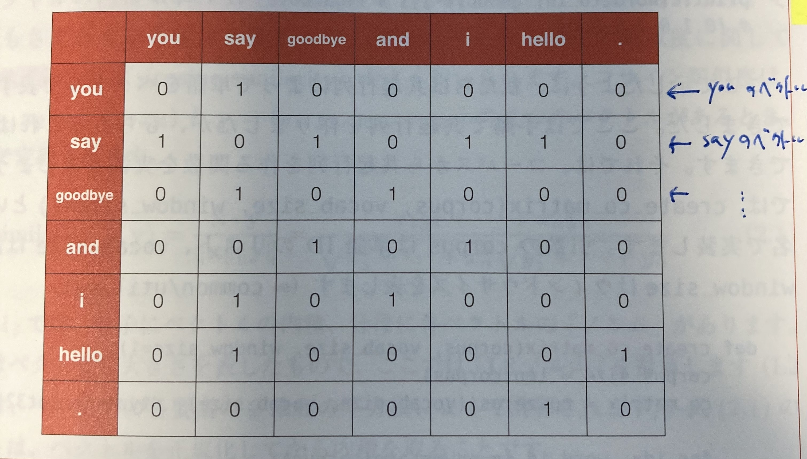
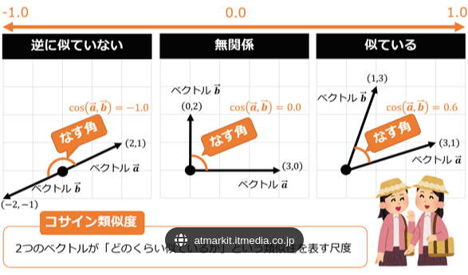
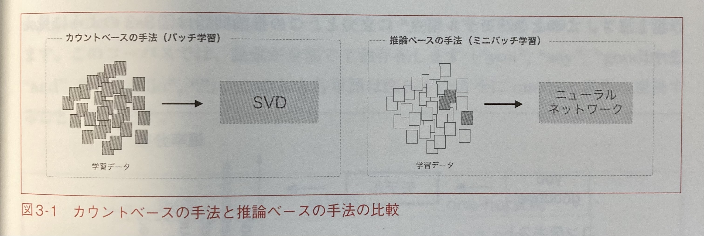
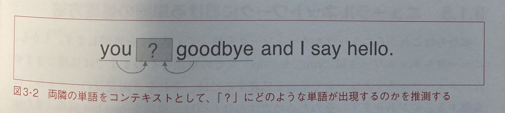
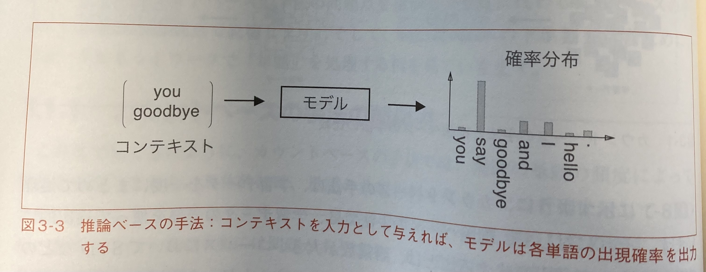
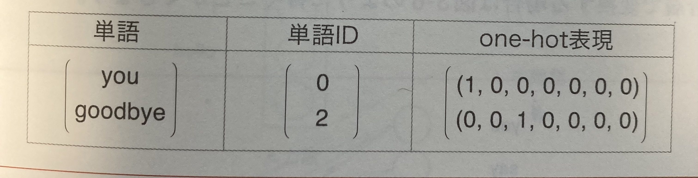
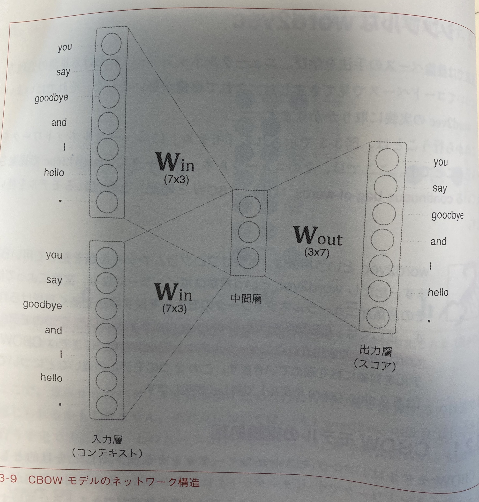
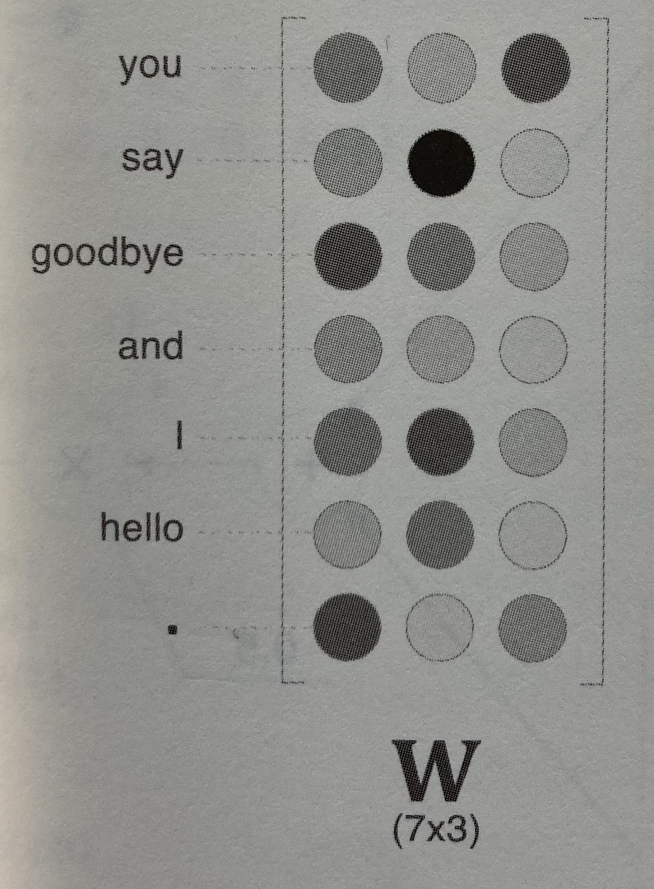

ゼロから作る Deep Learning 2 - 自然言語処理編- を読んだ (1)
===

書籍：[ゼロから作る Deep Learning 2](https://www.oreilly.co.jp/books/9784873118369/)

2018年07月

著者：斎藤 康毅　著

（まとめ @wakodai）

---

## 読んだ動機
- Transformer を理解したく、そのために Attention を理解しようとしたらたどり着いた
- 自然言語処理はベース知識ほぼゼロだったので、基本的なことから知りたかった
- ゼロ Deep 1 がかなり自分的には良かったので 2 の期待値も高かった
- word2vec, RNN, LSTM, GRU, seq2seq, からの Attention と順を追って丁寧に解説してくれているので、Transformer に近づけるはず
- どうせ読むなら研究会で発表することでよいアウトプットにもなると考えた

## 発表形式
- 一度に全部は無理なので、読み進めたところまで発表する

## 自然言語と単語の分散表現
### どんなもの？
- 自然言語処理 (NLP) : 言葉をコンピュータに理解させるための技術 (分野)
- NLP では "単語" の意味を理解させたい = "単語の意味" をうまく捉えた表現方法を見つけたい

### カウントベースの手法 (コーパス)
- コーパスは簡単に言えば "大量のテキストデータ"
- テキストデータにすぎないが、"人の手によって書かれたもの" = 人の知識がふんだんに含まれている
  - Wikipedia, Google News, シェイクスピア, 夏目漱石, ...
- 本書は超簡単なコーパスでやっていく
```
text = 'You say goodbye and I say hello.'
```
- ID と単語の対応表を作る


#### 単語の分散表現
- 色は、赤や緑という表現方法もあれば、RGB 成分を数値で表現することもある = ベクトル表現 RGB=(201, 23, 30)
- ベクトル表現のほうが、色同士の関連性も判断しやすく、定量化もしやすい
- 単語でもやってみよう -> "単語の分散表現"
- 単語の意味は "周囲の単語によって形成される" = **分布仮説**
  - **単語自体に意味はなく(!)**、コンテキストによって単語の意味が形成される
  - 単語をベクトルで表す最近の研究はだいたいこの仮説にもとづいている
  
- 共起行列が作れる
    - この 1 行 1 行が、単語のベクトル表現（分散表現）
  
#### ベクトル間の類似度
- コサイン類似度で求めることができる
    - 2 つのベクトルがどれだけ同じ方向を向いているか。完全に同じ向き=1、逆向き=-1
    
#### カウントベースの欠点
- "the" とかたくさん出てくるやつに共起しやすい
    - -> 相互情報量 (PMI) ：出現回数を考慮（割愛）
- 語彙数が増えると次元数が増える。一方でほとんどの要素 0 (疎な行列)
    - -> 次元削減 (特異値分解)（割愛）

単語をベクトルで表現するということはなんとなくわかった

### 推論ベース (word2vec)
- カウントベースは次元削減するとしてもやはり大規模になると非現実的
- ミニバッチ学習できるといい
  
- 推論問題を繰り返し解いて学習する
  
- コンテキストを入力すると、? に入る単語の出現確率を出力するようなモデルを学習する
  
#### ニューラルネットでの処理方法
- one-hot 表現にする
  
- ネットワーク構造
    - コンテキスト 2 のため入力層が 2 つ (N なら N)
    - 入力層から中間層への変換は、重み Win の全結合
    
- 中間層のニューロンの数を入力層のそれよりも減らすことがポイント
    - これにより、学習の結果得られる Win が次元削減された分散表現そのものになる
        - カウントベースの手法では特異値分解までして得ていた
    
- 入力層 -> 中間層：エンコード
- 中間層 -> 出力層：デコード
- 出力層のスコアを Softmax 関数適用して確率にすれば、あとは損失関数を適用して誤差逆伝播で学習していけば Win, Wout が得られる

## 次回
- RNN 以降の、読み進んだところまで（進み具合によっては Attention）
