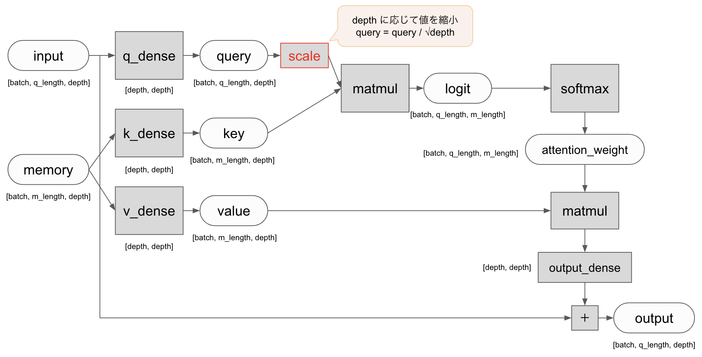
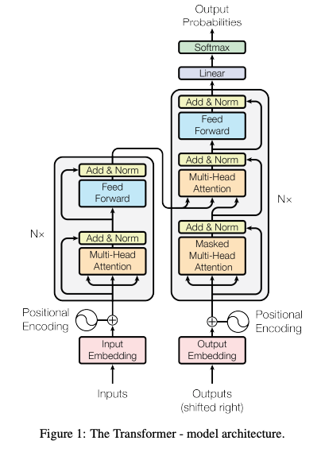
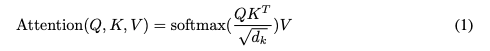
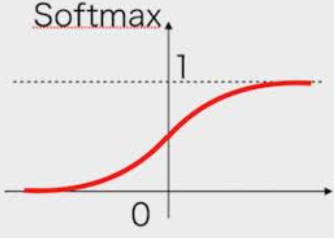
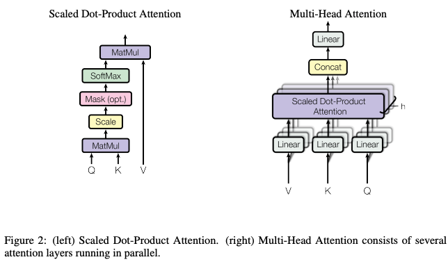
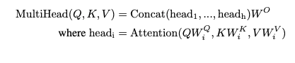
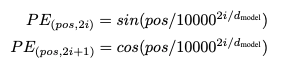
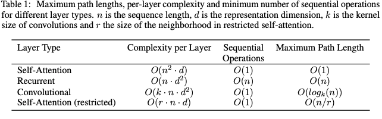
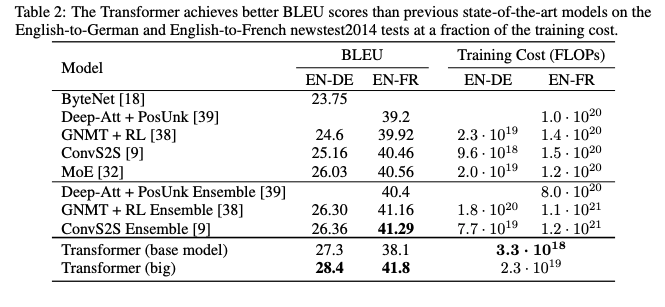
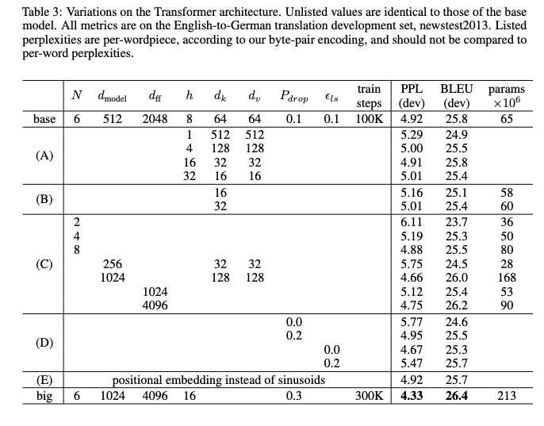

# Attention Is All You Need
https://arxiv.org/abs/1706.03762

（まとめ @masahiro6510）

### 出版年月
2017年6月

### 著者
Ashish Vaswani, Noam Shazeer, Niki Parmar, Jakob Uszkoreit, Llion Jones, Aidan N. Gomez, Lukasz Kaiser, Illia Polosukhin
(Googleの人達)

## どんなもの？
- 当時のシーケンス変換モデル(文字列や時系列などの連続データを変換したデータを別の連続データに変換するモデル)はRNNやCNNをベースにしていた。
- RNNやCNNを完全に排除してAttentionのみに基づく新しいネットワークアーキテクチャ(Transformer)を提案した。このTransformerは、機械翻訳タスクにおいて非常に高い性能を発揮し、他のタスクにも適用可能であることが示された。

## 先行研究と比べてどこがすごい？
RNN層をMulti-head Attentionに置き換えて、Attentionのみに基づくシーケンス変換モデルを提案した。
- 翻訳タスクの場合、TransformerはRNNやCNNに基づくアーキテクチャよりも大幅に高速に学習させることができる。WMT2014英語対ドイツ語翻訳タスクとWMT2014英語対フランス語翻訳タスクの両方でSOTA達成。

## 技術や手法のキモはどこ？
([こちらのqiita記事](https://qiita.com/halhorn/items/c91497522be27bde17ce#%E5%9F%BA%E6%9C%AC%E7%9A%84%E3%81%AA-attention)も参考にしました)

Attentionの大まかな流れ

Transformerモデルのアーキテクチャ

### EncoderとDecoder
- Encorder: Multi-Head Attentionと全結合層で構成されるやつがN(=6)個ある。(fig1の左側)
- Decorder: 2種類のMulti-Head Attentionと全結合層がある。(fig1の右側)

### Attention
以下の3種類がある
- Encorderのself Attention
- Decorderのself Attention
- queryは前のDecorder層から来て、keyとvalueはEncorderの出力からきている

### Scaled Dot-Product Attention

softmaxは入力が大きくなるとサチってしまい勾配が0に近くなってしまう。softmaxの入力はqueryとkeyの内積なので、queryとkeyの次元が大きいほど大きな値になってしまう。これに対処するために、queryの大きさをdepthに従って小さくする。

### Multi-Head Attention

- 普通のAttentionをパラレルに並べる。それぞれのAttentionをheadと呼び、これを複数並べているのでMulti-Head Attention。大きな1つのAttentionより小さな複数のAttentionに分けた方が性能高い。
- q, k, vをそれぞれhead_num個に分割してそれぞれAttentionを計算し、それをconcatする。このMulti-Head Attentionを複数層で処理している。

### Positional Encoding

シーケンス内のトークンの相対位置、絶対位置に関する情報を注入。posが位置、iが次元

### Why self-Attention

## どうやって有効だと検証した？

英語からドイツ語に翻訳
- bigモデルでは当時のSOTAモデルと比べてもBlueスコアが2.0上回った
- baseモデルでも既存モデルの何分の一かのFLOPSで精度が改善した
英語からフランス語に翻訳
- bigモデルで当時のSOTAモデルの1/4のFLOPSでSOTA達成

↑実際のモデル設定。数字を省略しているところはbaseと同じ

## 議論はある？
今後は画像、音声、ビデオなどのタスクにも適応したい。これらに適用する場合は言語と違って大きな入出力を効率的に処理する必要がある。

## 次に読むべき論文は？
[Swin Transformer: Hierarchical Vision Transformer using Shifted Windows](https://arxiv.org/abs/2103.14030)
