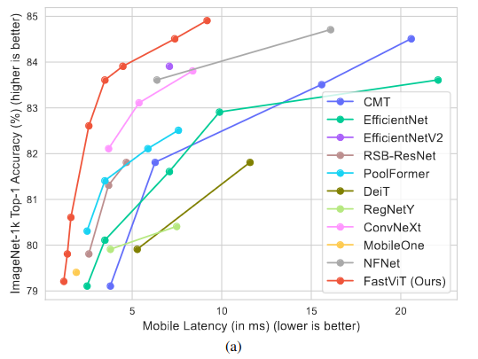
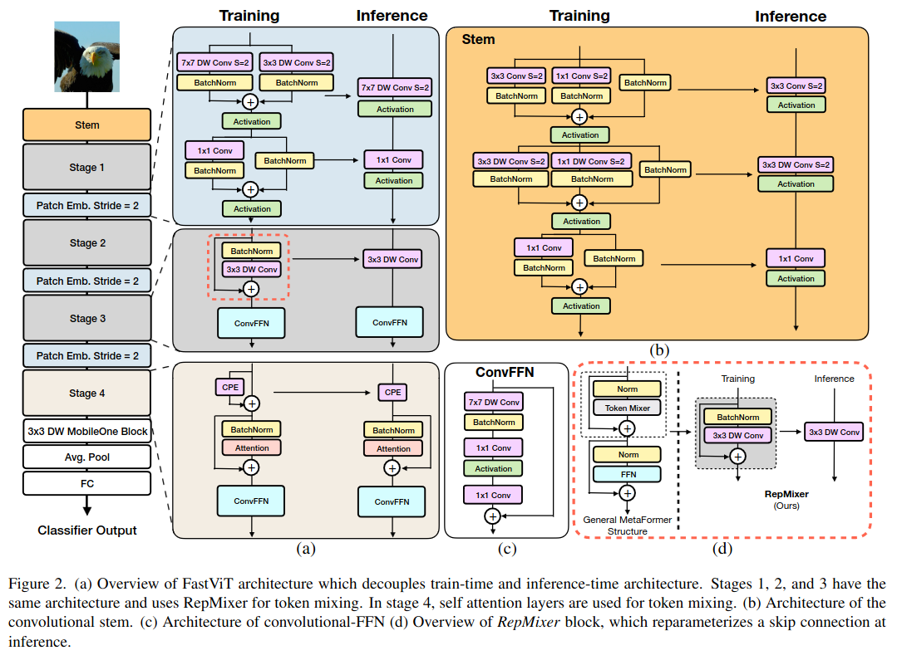
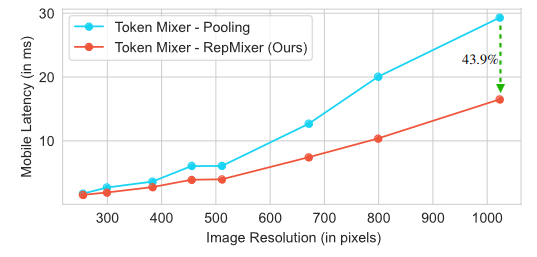
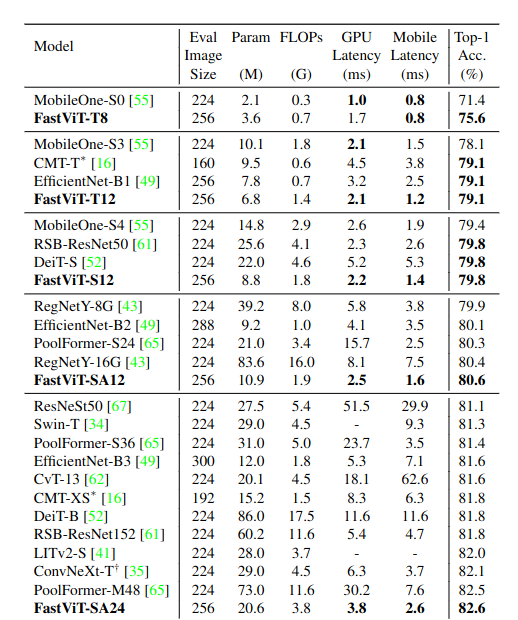
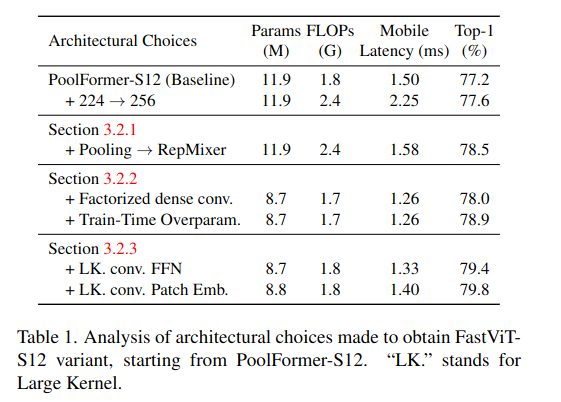

FastViT: A Fast Hybrid Vision Transformer using Structural Reparameterization
=====

Pavan Kumar Anasosalu Vasu, James Gabriel, Jeff Zhu, Oncel Tuzel, Anurag Ranjan

(https://arxiv.org/abs/2303.14189v1)

Apple の人たち

@cohama

## どんなもの

- Vision Transformer と CNN の新たなハイブリッドアーキテクチャである FastViT を提案
- 低いレイテンシと高い精度を両立する
- モバイルデバイス (iPhone) で EfficientNet の5倍、ConvNeXt の2倍のレイテンシを実現



## 先行研究と比べて何がすごい?

- Vision Transformer は画像の分野で一定の成果を収めたアーキテクチャで、これを高速化、省メモリ化するアイデアも多数ある。この論文は特にモバイルデバイス (iPhone) におけるレイテンシに重きをおいたモデル
- アーキテクチャ的には MetaFormer がベース。これを更に低レイテンシにするためにスキップコネクションを排除する。メモリアクセスコストが低減する

## 技術や手法の肝は?



ざっくり概要
- 4段構成のハイブリッド Transformer アーキテクチャ
- stage 1-3 のトークンミキサー (Transformer においてトークン間の情報をやり取りする演算。一般的には Self-Attention) には RepMixer という構造を採用
- 畳み込みはすべて Depthwise + Pointwise に分解したバージョン (Separable Conv) を使う

### RepMixer

Fig.2(d) 参照。

トークンミキサーを

```
Y = DConv(BN(X)) + 1
```

という形にする。推論時には重みをフュージョンすることで

```
Y = DConv'(X)
```

のようにスキップコネクションがない形にできる。これによりメモリの局所性が向上するためレイテンシを低減できる。

PoolFormer のような Pooling + スキップコネクションの形よりもスキップコネクションがない RepMixer の方がレイテンシは低い。特に高解像度で顕著



### Positional Encodings

Depthwise Conv をそのまま conditional positional encoding として使う。このタイプはハイブリッドアーキテクチャではよくみる。


### Linear Train-time Overparameterization

Fig.2 (a), (b)

効率化のために畳み込みはすべて Separable Conv (Depthwise + Pointwise) の形にしている。
ただし、単に分解しただけではモデルのキャパシティ (モデルの表現力の限界値みたいなイメージ) が低下してしまう。
そこで MobileOne という論文で提案された Linear Train-time Overparameterization を導入する。
ただし、すべての畳み込みに採用すると訓練に時間がかかりすぎる。あまり影響がないように一部の畳み込みだけに採用している。

### Large Kernel Convolutions

RepMixer だけでは Receptive Field が狭く、Self-Attention に比べて局所的な表現しか獲得できない。
Receptive Field を稼ぐために FFN に 7x7 の大きなカーネルの Depthwise conv を採用する。

## どうやって有効だと検証した？

### 画像分類




他にもセグメンテーション、物体検出もある。いずれも精度はそこそこよくレイテンシがとても低い

### Ablation



## 議論はある?

- レイテンシの低減というのは応用としてよい着眼だとおもう。ちゃんと実時間も計測されていて良い。
- 実用的には Android (Snapdragon) とかでどうなるかは気になる。前身となる MobileOne の論文では Pixel6 (Google Tensor) での計測もされていてちゃんと効果がある模様

## 次に読むべき論文

- [PoolFormer](https://arxiv.org/abs/2111.11418) Weihao Yu, Mi Luo, Pan Zhou, Chenyang Si, Yichen Zhou, Xinchao Wang, Jiashi Feng, and Shuicheng Yan. Metaformer is actually what you need for vision. In Proceedings of the IEEE/CVF Conference on Computer Vision and Pattern Recognition, pages 10819–10829, 2022. 1
- [ConvMixer](https://arxiv.org/abs/2201.09792) Asher Trockman and J Zico Kolter. Patches are all you need? arXiv preprint arXiv:2201.09792, 2022
- [LIT](https://arxiv.org/abs/2205.13213) Zizheng Pan, Jianfei Cai, and Bohan Zhuang. Fast vision transformers with hilo attention. In Advances in Neural Information Processing Systems (NeurIPS), 2022. 1, 2, 3, 6
- [MobileOne](https://arxiv.org/abs/2206.04040)Pavan Kumar Anasosalu Vasu, James Gabriel, Jeff Zhu, Oncel Tuzel, and Anurag Ranjan. An improved one millisecond mobile backbone. arXiv preprint arXiv:2206.04040, 2022. 1, 2, 3, 4, 6, 11, 12
