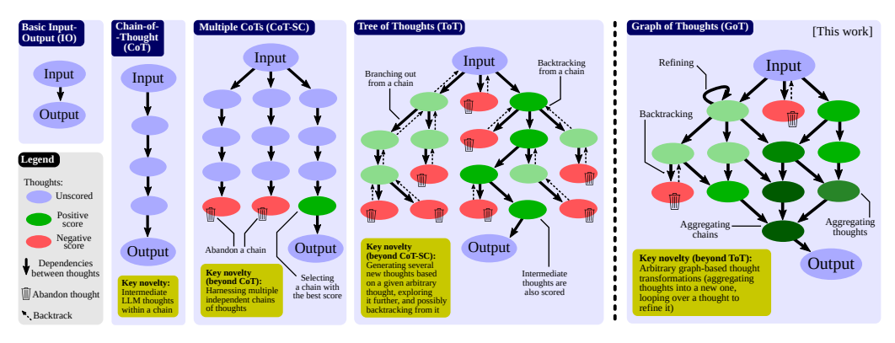
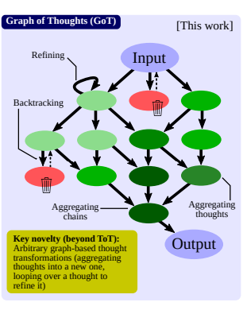
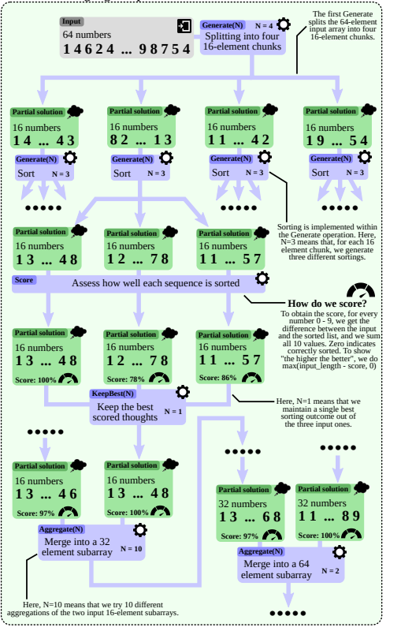
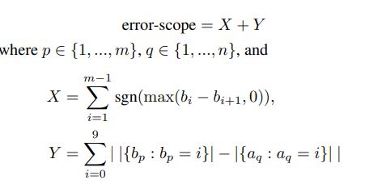
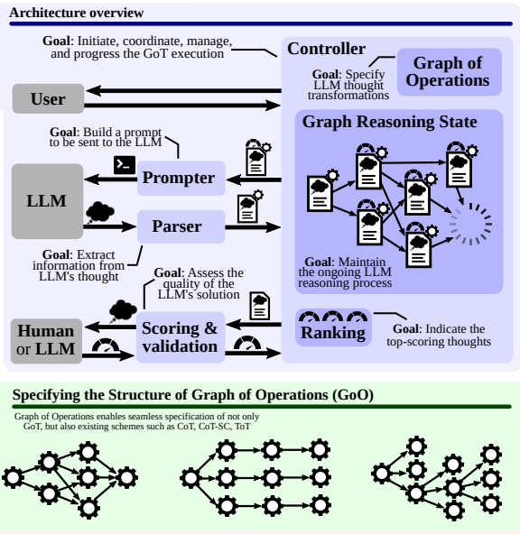
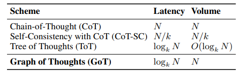
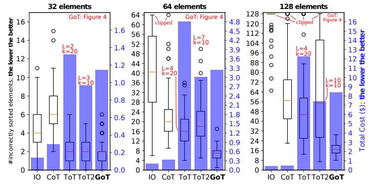
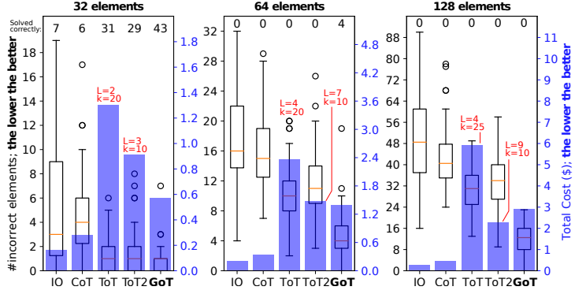

# Graph of Thoughts: Solving Elaborate Problems with Large Language Models

[https://arxiv.org/abs/2308.09687](https://arxiv.org/abs/2308.09687)

(まとめ @n-kats)

著者
* Maciej Besta
* Nils Blach
* Ales Kubicek
* Robert Gerstenberger
* Lukas Gianinazzi
* Joanna Gajda
* Tomasz Lehmann
* Michal Podstawski
* Hubert Niewiadomski
* Piotr Nyczyk
* Torsten Hoefler

チューリッヒ工科大学・CLEDAR・ワルシャワ工科大学（ポーランド）の人たち。

# どんなもの？
LLMの他段階のプロンプトで精度を上げよう系論文の一つ（CoT等の進化系）。

この論文では、プロンプト群にグラフ構造を持たせるフレームワーク（GoT）を提案している。

（類似名称の手法にGraph of Thoughtがあるが、これは学習が必要な手法で異なる）

# 先行研究と比べてどこがすごい？
CoT（Chain of Thought）では、直線上に思考内容を並べて順々にLLMに推論させる。

CoTを複数本やっていいものを選ぶCoT-SCや木構造に思考するToT（Tree of Thoughts）も有名な先行研究。



人間の複雑な思考をLLMで再現しようと取り組まれている。
簡単な実験で効果がありそうなことを検証している。

# 技術や手法の肝は？
## 基本アイデア
* 思考プロセスをグラフで表現する
* 思考が進むにしたがって思考グラフを進化させていく（思考変換: Transformations of Thoughts）
  * 新しい思考の生成
  * 思考の統合
  * 思考の改善
* 頂点に対応する思考を適宜評価し良い思考を選別する



ただし、グラフを完全自動で生成するというよりも、ある程度固定したグラフを思考グラフにする。

## 実例（ソート）
問題・・・64個の0から9の数字を与えて、それをマージソート風にソートせよ

* 4つに分けてそれぞれLLMでソート
* あってそうなもの（スコアが高いもの）を選ぶ
* 2組ずつ統合して再度LLMでソート
* あってそうなもの（スコアが高いもの）を選ぶ
・・・
のように繰り返してソートする（図にすると以下の通り）



### スコアは次のように機械的に計算



* X・・・昇順になっていないところで発生する減点
* Y・・・それぞれの数字の出現数が変化していたら発生する減点

このように必ずしもLLMで評価までやってしまおうってわけではない。

## 実装
[https://github.com/spcl/graph-of-thoughts](https://github.com/spcl/graph-of-thoughts) にコードがある。

```
pip install graph_of_thoughts
```

でもインストールできる。

Prompter/Parser/Scoring・Validation/Controller/GoO・GRS という要素からなる。
（GoO=Graph of Operations, GRS=Graph Reasoning State）



* GoO・・・グラフで表現された思考の工程（固定）
* GRS・・・GoOに対応する思考の状態
* Prompter・・・LLMに入力する部分
* Parser・・・LLMからの結果を解釈する部分
* Scoring・Validation・・・思考が妥当かを確認・評価する部分
* Controller・・・GRSを操作する部分

# どうやって有効だと検証した？
## コスト面のトレードオフ



* N: LLMを使う回数（雑）
* k: 分岐にかかわる数
* Volume: 思考数？
* Latency: グラフの深さ

ToTの場合、思考のフィードバックを木を逆流させて行うためLLM実行回数が増えるが、GoTはそれがない。

## 実験（ソート）
先に挙げたソートの問題の場合、GoTが最もスコアがよい（箱の位置が低い）。青は全体コスト。



## 実験（集合の共通部分）
スコアを次の３つの値の和として実験。
* 過剰に出力した要素の個数
* 足りない要素の個数
* 同じ数字を重複して出力した個数



これもGoTがスコアがよく、ToTより安くできている。

# 議論はある？
文章統合のタスクの実験もあったが、性能は出るが、ToTとあまり変わらない。

タスクを分割して入力が減っているが、プロンプトの共通部分が長いため、そこでのコスト削減ができるのは限られた場合のみ。

## 私見
思考の工程をグラフとして表現するのは前々から思っていたが、同じことを考えて実験しているのをみて楽しい。
グラフの構造自体を自動で作成するようなことはしていないため、そういうことができる方法が出現するのを期待する。

# 次に読むべき論文は？
* [Graph of Thought](https://arxiv.org/abs/2305.16582) ・・・学習ベースで思考グラフをいじっていそう。