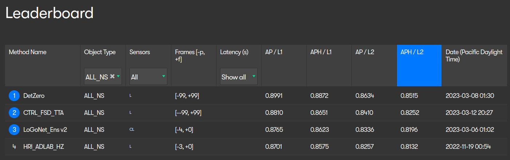
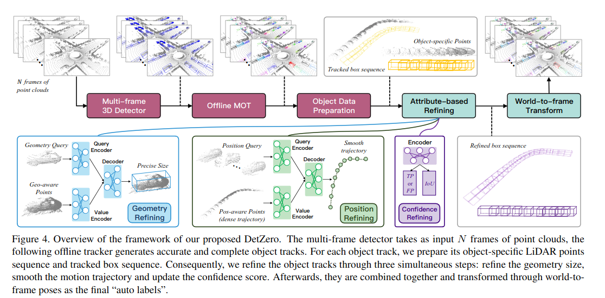
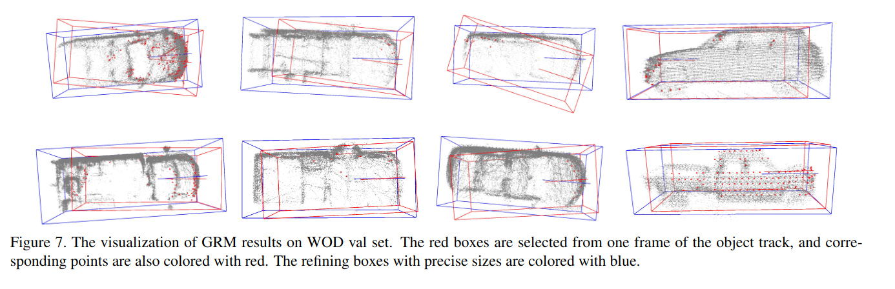
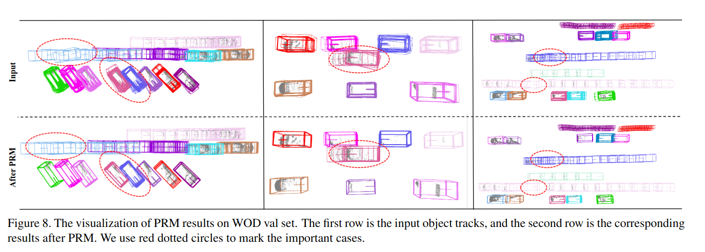
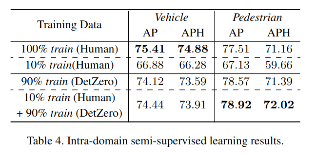
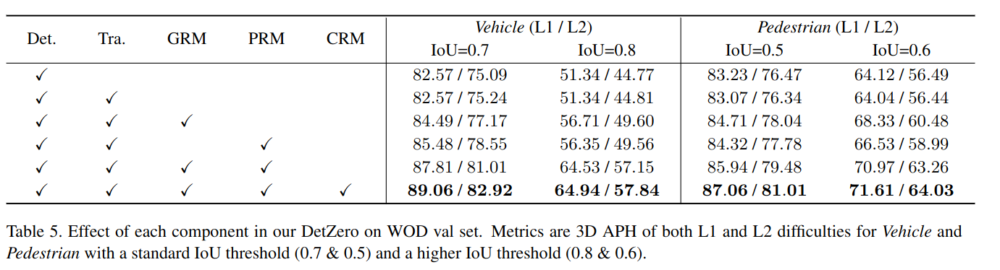

DetZero: Rethinking Offboard 3D Object Detection with Long-term Sequential Point Clouds
=====

Tao Ma, Xuemeng Yang, Hongbin Zhou, Xin Li, Botian Shi, Junjie Liu, Yuchen Yang, Zhizheng Liu, Liang He, Yu Qiao, Yikang Li, Hongsheng Li

Multimedia Laboratory, The Chinese University of Hong Kong など

https://arxiv.org/abs/2306.06023v2 ICCV 2023 accepted

@cohama

## どんなもの

- 3D点群物体検出の SOTA
- 一旦普通に検出後、後処理で検出結果をリファインする
- Waymo Open Dataset で SOTA
  

## 先行研究と比べて何がすごい?

- Offboard 3D 物体検出というものがある。全時刻の全点群データにアクセス可能で推論時間やモデルサイズなどの制約が少ないためより自動アノテーション用など高精度な検出ができる。
- これまでも Offboard な点群物体検出手法があったが長時間の時系列の取り扱いが弱かった。
- 本手法はそれを改善し、既存手法の精度を大きく上回った。

## 技術や手法の肝は?

ざっくり概要
- 検出を行う
- 追跡を行う
- 一連の検出枠に内包される点群を再度収集する
- Geometry Refining Module で枠をリファインする
- Position Refining Module で時系列ごとの中心座標 (移動の軌跡) をリファインする
- Confidence Refining Module で誤検出を検出し、確信度を調整する

### 検出

モデルは CenterPoint という既存手法がベース。

ただし、入力として5フレーム分の点群をまとめて入力する。具体的にはある時刻 T の検出に、T-5 から T-1 までの過去のフレームのデータを入れる。さらに、点の属性にも時刻の情報を入れる。

Two-stage 構成で、1st stage での雑な枠を 2nd stage でリファインするような PDV という手法を使っている。

さらに TTA によるアンサンブルも行う。

### 追跡

Track-by-Detection 方式で追跡を行う。これは既存手法のまま (Simpletrack や Immortal tracker)

概要を見る限り ByteTrack のように確信度の低い枠も利用するような追跡器のように読める。

さらに時間を逆にして再度同じ追跡を行い、結果を WBF (Weighted Box Fusion) で統合する。

### Geometry-aware Points Generation

追跡で得られた一連の検出枠に内包される点を集める。(4096個ずつ)
それぞれの枠を中心を原点とするような座標系に変換する。結果的に点群の重畳のようなことになる。
さらに、点にそれぞれの検出枠の面 (6ある) からの距離の情報も付与する。

### Geometry Refining Module

追跡で得られた一連の検出枠から t 個選び、それに内包される点を集める (256個ずつ)。それを Q とする。

先程作ったオブジェクトごとに重畳した点群を K, V とし、Attention をとる。
最後に FFN をかけて t 個の枠のサイズを回帰する。最後にそれらを平均して一連の系列の枠のサイズとする。

### Position Refining Model

一連の検出枠の中心座標と中心と枠の各頂点の相体位置を集める。これを Q とし、重畳した点を K, V として Attention を取る。
最後に FFN をかけて系列と同数の中心座標と向きを回帰する。

### Confidence Refining Model

Faster-RCNN のように点群に対してある枠を与えたときにそれが True か False か答えるモデルを訓練する。
また、回帰で IoU も出力する。
最終的にこれらのスコアを統合して最終的な確信度とする。

## どうやって有効だと検証した？

### 点群物体検出の結果

### 自動ラベルの性能

### Ablation

## 議論はある?

## 次に読むべき論文

検出のベースになっているもの: Center-based 3D Object Detection and Tracking, https://arxiv.org/abs/2006.11275
Offboard点群物体検出: Offboard 3D Object Detection from Point Cloud Sequences, https://arxiv.org/abs/2103.05073
追跡のベースになっているもの: SimpleTrack: Understanding and Rethinking 3D Multi-object Tracking, https://arxiv.org/abs/2111.09621
追跡のベースになっているもの2: Immortal Tracker: Tracklet Never Dies, https://arxiv.org/abs/2111.13672
WBF: Weighted boxes fusion: Ensembling boxes from different object detection models, https://arxiv.org/abs/1910.13302
