# Swin Transformer: Hierarchical Vision Transformer using Shifted Windows

https://arxiv.org/abs/2103.14030

（まとめ @masahiro6510）

### 出版年月
2021年3月

### 著者
(Microsoft Research Asiaの人)
Ze Liu†* Yutong Lin†* Yue Cao* Han Hu*‡ Yixuan Wei†
Zheng Zhang Stephen Lin Baining Guo

## どんなもの？
TransformerをCVに適用する際の課題を解決するための新しいアーキテクチャを提案した。それによって既存のTransformerベースのCVモデルよりも高速で精度が良いモデルを実現した。アーキテクチャの探索はしていないので、CNNベースの手法と比べると精度に劣るが改善の余地がある。

## 先行研究と比べて何が凄い？
Transformerを言語ではなく画像に適用する際の課題
- 物体のスケールにばらつきがある
    - （例えば文章を単語に分割した場合、単語毎の文字数は大体一緒だが、物体検出の物体は近くにあるか遠くにあるかとかでスケールが大きく異なる）
- 言語と比較して画像中のピクセルの解像度が高い
    - 例えば、文章中の単語の数は長くても数百から数千だが、高解像度の画像だとピクセル数が数百万に及ぶこともある

これらに対処するために、shifted windowsで計算される階層的Transformerを提案した。これが画像分類、物体検出、セグメンテーションなどさまざまなタスクと互換性を持ち、ImageNet, COCO, ADE20K(セグメンテーションのデータセット)でSOTA達成。今後はTransformerがCVのバックボーンとして使える可能性を示唆した

## 技術や手法の肝は？

↓モデル概要(簡易版のSwin-T)
入力をパッチに分割し、各パッチをトークンとして扱う。この実装ではパッチサイズを4とするので次元数=4✖︎4✖︎3=48。これをLinear Embedding層に入力して任意の次元Cに射影する。その次にSwin Transformerブロックに入力

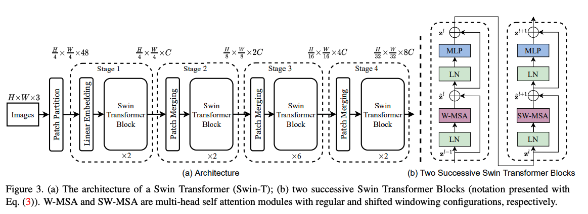

## Swin Transformerブロック
既存のMulti Head self Attention(MSA)モジュールをシフトウィンドウに基づくモジュール(後述)に置き換える(図3(b))

### Shifted Windowに基づくSelf Attention
一般的なTransformerを画像に応用する場合
- globalなself Attentionを行い、あるトークンと他の全てのトークンの間の関係が計算される
    - O(パッチ数^2)の計算量が必要

#### non-overlapped windowsでのself Attention
ローカルウィンドウにおけるself Attentionを計算することを提案。ウィンドウはオーバーラップしないように画像を均等に分割するように配置
グローバルMSAモジュール(既存の手法)とh✖︎w個のパッチの画像に基づく手法(提案手法)の計算量↓

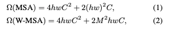

既存手法はパッチ数hwの2次式だが、提案手法はMが固定されている時(デフォルトでは7)はhwの線形オーダーなので良い。

#### Shifted window partitioning in successive blocks 

non-overlappedウィンドウの手法は計算量的には良いが、ウィンドウ間の接続がないためモデル性能は落ちる。グローバルウィンドウとnon-overlapped windowの良いとこ取りをするために2つのパーティションを交互に繰り返す手法を提案

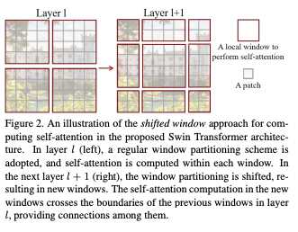

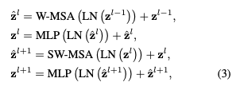

#### Shifted Window に対する効率的なバッチ計算
- シフトされたウィンドウの中には一部サイズが小さいウィンドウが含まれるので不具合がある
- 小さいウィンドウにpaddingする手もあるが計算量増えてしまう
- 図4のようにWindowをシフトさせて計算し、はみ出た部分を反対位置に戻すことで問題を解決する(cyclic shift)

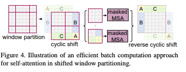

### モデルバリエーション
↓モデル概要(詳細版.サイズの異なる4種類の設定が出てくる)

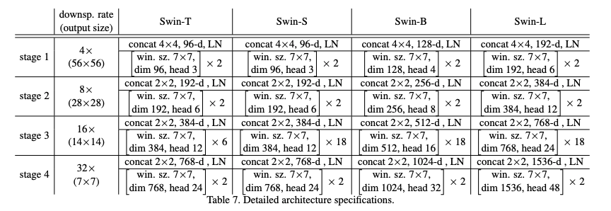

- Swin-BはViTB/DeiT-Bと同様のモデルサイズ
- Swin-T、Swin-S、Swin-Lは、それぞれモデルサイズと計算量が約0.25×、0.5×、2×のバージョンである
- Swin-Tの複雑さはResNet-50(DeiT-S)と同等
- Swin-Sの複雑さはResNet-101と同等
- ウィンドウサイズはデフォルトでM = 7 に設定されています。各ヘッドのクエリ次元はd =32、各MLPの拡張層はα = 4であり、全ての実験においてそうである

## どうやって有効だと検証した？
- ImageNet-1K画像分類, COCO物体検出, ADE20KセマンティックセグメンテーションのSOTAと比較
- SwinTransformerの重要な設計技術を削除してその影響を調べた

### ImageNet 1K（画像分類）

1000クラス128万枚の学習画像と50万枚の検証画像を持つデータセット。

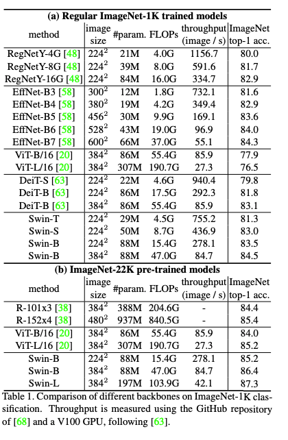

#### TransformerベースのSOTA手法(DeiTというSwinと同等の複雑さのモデル)と比較
- 入力サイズが224x224の場合、Swin-Tは81.3%の精度を持ち、DeiT-S（79.8%）に比べて+1.5%の向上で、Swin-Bは83.3%の精度で、DeiT-B（81.8%）に対して+1.5%の向上
- 入力サイズが384x384の場合、Swin-Bは84.5%の精度で、DeiT-B（83.1%）に対して+1.4%の向上

#### CNNベースのSOTAT手法(Reg-Net, EfficientNet)と比較
- SwinTransformerは僅かに優れた速度-精度のトレードオフを達成(精度は負けている)。RegNetとEfficientNetは徹底的なアーキテクチャ探索がなされているが、SwinTransformerはそうではないので、さらに改善の余地がある。

#### ImageNet22Kで事前学習したモデルをImageNet1Kでfinetune
- いずれのモデルも1Kデータよりも精度が改善した
- これだとViT, Regnetより良い結果が出た

### COCO（物体検出）
訓練データ118K, 検証データ5K, テストデータ20Kの画像を持つデータセット。

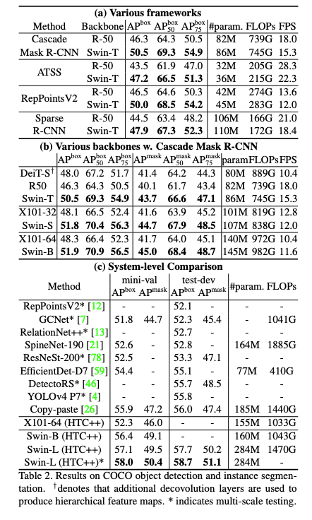

#### DeiTと比較(表2(c))
- SwinTransformerはDeiTと同等のモデルサイズ(パラメータ数が80M vs 86M)で推論速度が速く(15.3FPS vs 10.4FPS)、精度も良い
- DeiTは入力画像サイズに対する計算量がO(N^2)であるのに対して、SwinTransformerはO(N)のため速度に差が出ている

#### SOTAモデルとの比較(表2(c))
COCOテストデータにおいて58.7ボックスAPと51.1マスクAPを達成し、従来の最良の結果を+2.7ボックスAP(外部データなしのCopy-paste [26])と+2.6マスクAP(DetectoRS [46])で上回りました。

### ADE20K（セマンティックセグメンテーション）
150のカテゴリを持つデータセット。訓練データ20K, 検証データ2K, テストデータ3Kの画像を持つ。mmseg [16]のUperNet [69]をベースフレームワークとして、その高い効率性を利用している。詳細は付録のとおりです。

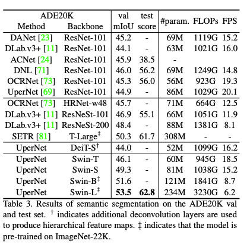

Swin-SはDeiT-Sと同程度の計算量で+5.3mIoU高い(49.3対44.0)ことがわかる。また、ResNet-101より+4.4mIoU、ResNeSt-101より+2.4mIoU高い[78]。ImageNet-22Kを用いたSwin-Lモデルは、valセットで53.5mIoUを達成し、従来の最良モデルを+3.2mIoU上回った(モデルサイズが大きいSETR [81]では50.3mIoU)。

### Ablation Study
提案するSwinTransformerの重要な設計要素を削除して実験した。具体的には、画像分類・物体検出ではカスケードマスクR-CNN, セマンティックセグメンテーションではUperNetを用いてアブレーションスタディを行った。

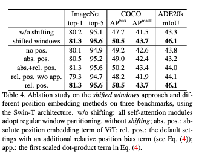

#### shifted windowsの効果
- Swin-Tでは各データでshifted windowsを導入した方がnon-overlappedよりも精度が良い(表4の1, 2行目)

#### 相対位置バイアスの効果
- (相対位置バイアスが良いというのは先行研究で言われていたことらしい)
- 位置エンコードなしより相対位置バイアスありの方が精度高い
- 絶対位置バイアスあり
    - 画像分類では位置エンコードなしより絶対位置バイアスの方が精度高い
    - 物体検出・セマンティックセグメンテーションでは絶対位置バイアスには弊害がある(位置エンコードなしより精度悪い)

#### 異なるself Attention計算法
- shifted_windowsは、Performer(先行研究で最速のモデル)と比較して、同じくらいの精度(勝ってる)で速度が速くなる
- shifted_windowsは、sliding windowより早い

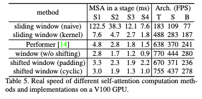

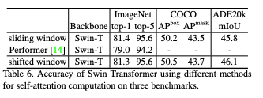

## 議論はある？
精度でCNNベースの手法に負けている事がある。CNNベースの手法と違い、この論文で提案している手法ではアーキテクチャの探索を行なっていない。更なるチューニングを行えばCNNベースの手法に勝てるかもしれない。

## 次に読むべき論文
[Swin Transformer V2: Scaling Up Capacity and Resolution](https://arxiv.org/abs/2111.09883)(SwinTransformerv2の論文)
