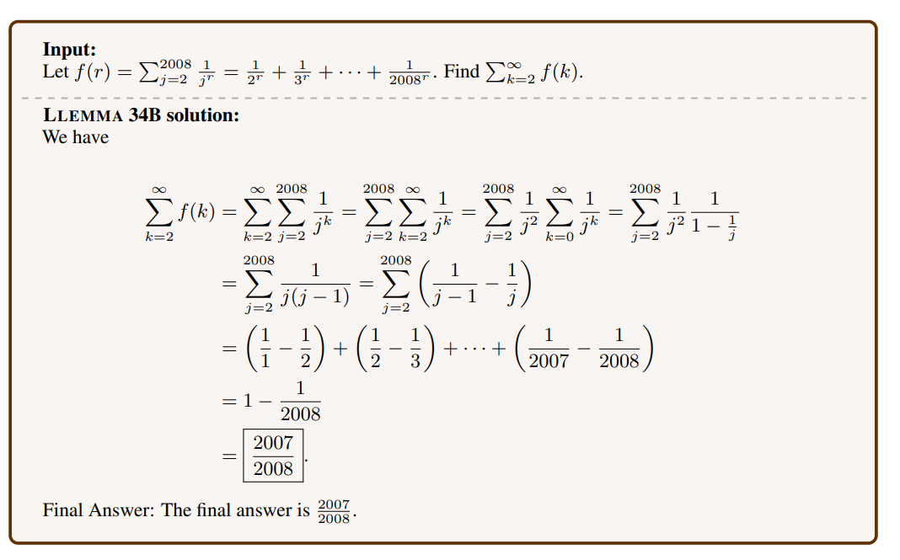
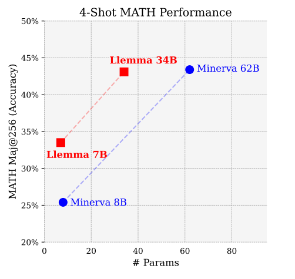
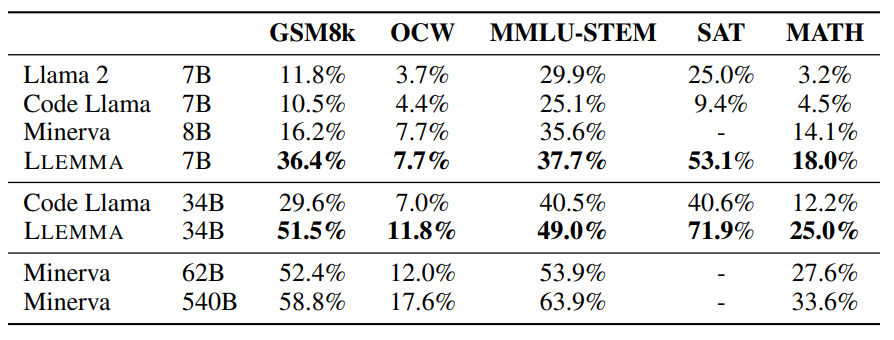
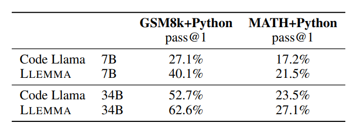
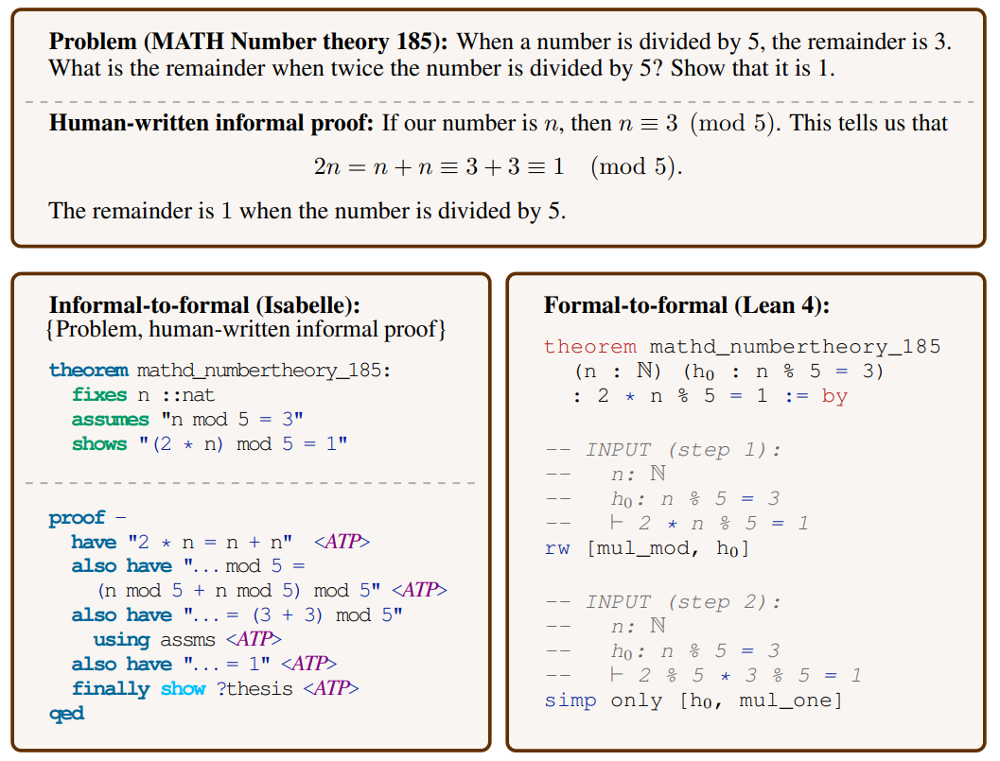
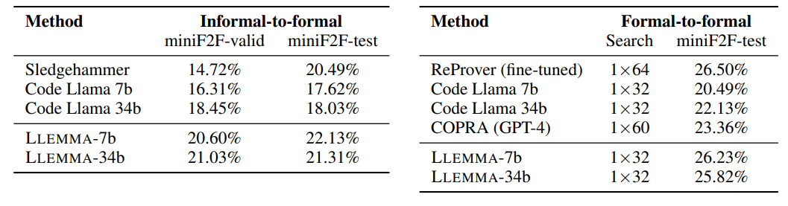
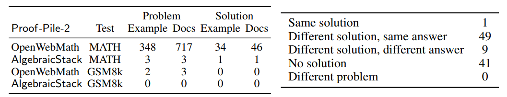

# Llemma: An Open Language Model For Mathematics

[https://arxiv.org/abs/2310.10631](https://arxiv.org/abs/2310.10631)

(まとめ @n-kats)

著者
* Zhangir Azerbayev
* Hailey Schoelkopf
* Keiran Paster
* Marco Dos Santos
* Stephen McAleer
* Albert Q. Jiang
* Jia Deng
* Stella Biderman
* Sean Welleck

ElutherAIやアメリカの大学のいくつかの大学の人たち。
ElutherAIはGPT-jとかを作ったところ。

# どんなもの？
* 数学に特化した言語モデルを作成して公開
* データセットも作成
* 非公開のモデルと同じ程度の性能を達成

# 先行研究と比べてどこがすごい？
先行研究（Minerva）と比べると、精度が改善しているわけではない（少し性能が落ちて、代わりに重みがそれなりに減ったくらい）

Minervaは、データもモデルも公開されていないので、それを整備して公開した。

* ソース: https://github.com/EleutherAI/math-lm
* データ: https://huggingface.co/datasets/EleutherAI/proof-pile-2

# 技術や手法の肝は？
## 訓練設定概要
Code Llamaの重みを初期値としてファインチューニング。Llemma 7B と Llemma 34B の2種類のモデルを作成。

* ライブラリGPT-NeoXを利用
* A100GPU(40GB)を256個
* bfloat16, Flash Attention 2等でメモリ対策
* 7Bモデルは200Bトークン相当を学習（42,000ステップ、1入力4096トークン、23,000A100時間）
* 34Bモデルは50Bトークン相当を学習（12,000ステップ、1入力4096トークン、47,000A100時間）

23,000時間≒1000日≒3年→375万（125万/A100GPU年）

## データ
Proof-Pile-2というデータを作成。55Bトークン。

論文・数学関係のウェブデータ・数学的コードをもとに作成。

* コード：数値計算・計算代数・形式証明関係のものを含むデータAlgebraicStack（11Bトークン）
* ウェブデータ：OpenWebMath（15Bトークン）データセットを利用
* 論文：ArXivのデータから作ったRedPajama（29Bトークン）
* 一般データ：Pile（一般データを入れると正則化の効果があるらしい）

# どうやって有効だと検証した？
## 数学の問題を解く
* MATH ・・・高校数学の問題（12.5k問）
* GSM8k・・・中学数学の問題
* OCWCourses・・・MITのOpenCourseWareの問題
* MMLU-STEM
* SAT・・・アメリカの大学入試の共通試験みたいなもの

で検証

### CoT方式の結果

Code Llamaや Llama2より優れている。

Minervaと比べると、同じくらいの重みならLlemmaが優れている。
しかし、Minervaは540版があってこれには劣る。

### Majority voting方式の結果

### python連携あり
Code Llemmaより大きく改善している。

## 形式証明

Coqなどの形式証明用の言語で証明を補助する。
* informal to formal ・・・人間の証明を形式証明に変換する
* formal to formal・・・形式証明の言語を変換する

miniF2Fデータセットを利用して評価。

SOTA相当といえるが、7Bモデルと34Bモデルの差が小さくて、別の課題がありそう。

## 評価データのリーク
数学の問題が似通っているため、同じ問題が訓練と評価で混ざっている。
30-gramの一致度を分析。

# 議論はある？
数学向けLLM研究のためにオープンなモデル・データを作成した。活用されることが期待されている。

## 私見
数学の問題と言いつつ、難しくても学部レベルの数学なので、数学の研究にどこまで使えるのかは不明。ただ、ArXivのデータで訓練しているから、それなりにの知識を持っている可能性がある。

一般的な会話能力はほかの言語モデルを使って、数学部分はLlemmaを使ってというようなハイブリッドな使い方もいいのだろうか？

# 次に読むべき論文は？
* [Minerva](https://arxiv.org/abs/2206.14858)
* [Code-Llama](https://arxiv.org/abs/2308.12950)