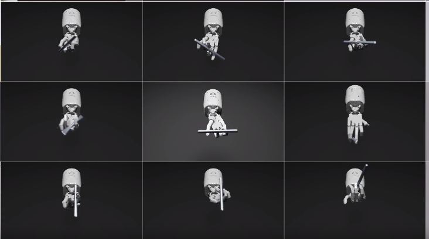
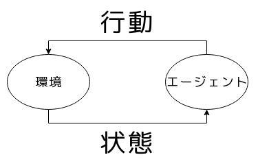
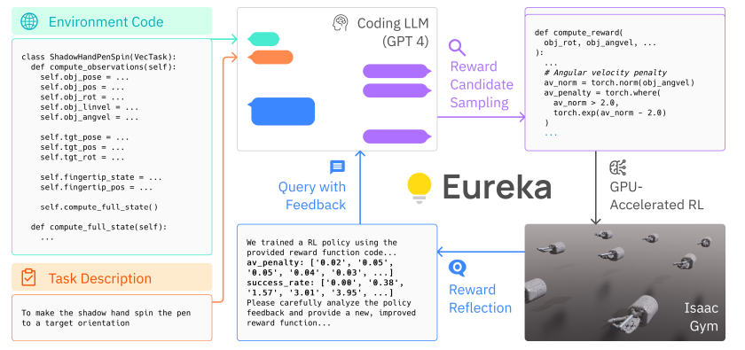
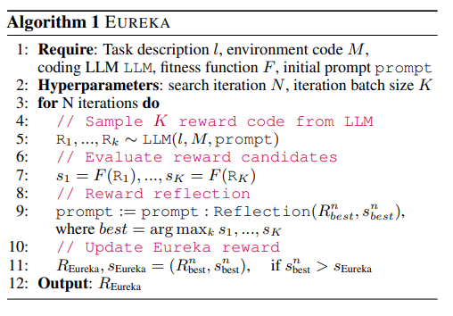
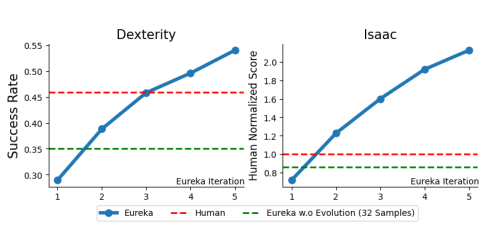
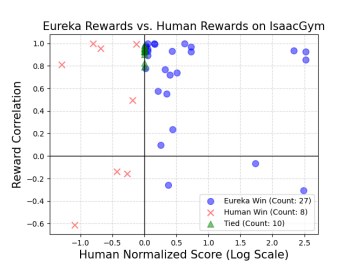
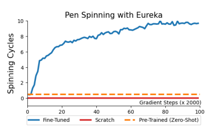
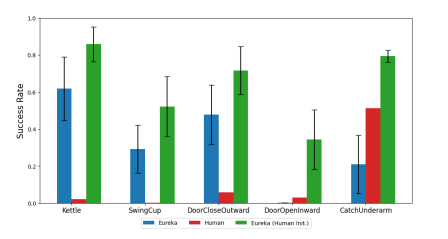

# Eureka: Human-Level Reward Design via Coding Large Language Models
[https://arxiv.org/abs/2310.12931](https://arxiv.org/abs/2310.12931)

(まとめ @n-kats)

著者

* Yecheng Jason Ma
* William Liang
* Guanzhi Wang
* De-An Huang
* Osbert Bastani
* Dinesh Jayaraman
* Yuke Zhu
* Linxi Fan
* Anima Anandkumar

NVIDIAの人たち

# どんなもの？
強化学習の報酬関数をLLMを使って作成・チューニングする手法（EUREKA）を提案。
(Evolution-driven Universal REward Kit for Agent の略)

ペン回しのような複雑な動作を学習することに成功。

色んな動画がこちらに→ [https://eureka-research.github.io/](https://eureka-research.github.io/)

# 先行研究と比べてどこがすごい？
通常の強化学習は、報酬が二値（勝ち負け）か人力で報酬関数を構築して行う。

EUREKAでは、それをLLMに任せることを考えた。
単に一回生成するのではなく、何個も候補を作ったり、学習結果に基づいて何世代か進化させたりする。

また、以下の特徴もある。
* タスクによらない普遍的なアプローチ
* 初期値に人が考えた報酬関数も設定可能（それよりいいものができる）
* RLHFとも組み合わせられる

# 技術や手法の肝は？
## 復習（強化学習）

* 環境＝問題設定
* 環境の状態をもとに行動を判断
* 行動をもとに状態が更新される
* 特定の状態になったりすると価値（報酬）

強化学習は、報酬をうまく解釈して損失関数を作って学習する。

## アプローチ

1. シミュレータのコード＋タスクの説明を指示に入れる
2. 対応する報酬関数のコードを生成させる
3. 生成したコードで強化学習をする
4. 学習結果（スコア）を使ってフィードバックする
5. 2に戻る

## Environment as Context
環境情報はシミュレータのコードで与える（どこまで詳細のコード情報与えるのかは未確認）。
* GPT4はコードに詳しいから余裕で読める。
* どういうもの・変数があるのか等の情報が読み取れる。

この情報を元に報酬関数を作るよう指示する

## Evolutionary search
1発で生成されるコードを使いたいのではなく、いい感じに動くコードがほしい。

そのために結果をフィードバックして改善していく。

1. 報酬関数のコードをk個生成
2. それぞれで学習
3. 評価値（成功率とか）がいいものを採用する
4. 指示に採用したコードや評価値のフィードバックを反映する

これをN回（4〜5回くらい）する。kは16くらいで十分。

## Reward refection
評価値のフィードバックは、そのまま評価値を埋め込んで行う。
（上の方の図のav_penalty）

# どうやって有効だと検証した？
## 精度比較
### EUREKA vs 人間・L2R

青の部分がEUREKA。青の破線が人間が報酬関数を作った場合（1に正規化）。
概ねEUREKAが勝っている。L2Rで出来なかったタスクができるようになっている。

### 世代間比較

1・2世代だと人間と差がつきにくいが、世代を超えるたびにどんどん良くなっている。

### スコア比較

ギリ勝てるようになるのではなく、それなりにいい改善を導入している

### フィードバックの効果
結果のフィードバックをオフにしたら、28.6%悪化

### カリキュラム学習との合わせ技
いきなりペン回しは難しいので、先に、ランダムな姿勢ができるように学習する（Pre-Trained）。それを初期値にしてEUREKAで学習するモデル（Fine-Tuned）とそうでないモデル（Scratch）を比較。結果、Fine-Tunedだけ圧倒的な性能。

これによって色んなペン回しができるようになった（動画はwebsiteに）

### 人間作の報酬関数との合わせ技
EUREKAのフレームワークでは生成した報酬関数をアップデートしていくが、別に生成した関数じゃなくてもいい。

なので、人間作の報酬関数からスタートしてEUREKAで学習する方法を取った。結果、効果的と分かった。

### RLHFとの合わせ技
物事の良し悪しが判定し難い場合、人間のフィードバックを行うRLHF。

これをEUREKAと組み合わせることもできる（スコア・フィードバックの部分で人間に良し悪しを判定させる）。

奇妙な歩き方を改善することができる。

良し悪し以外にも、テキストでのフィードバックもできそう。

# 議論はある？
GPT4は2023年3月版を使っているが、同じ問題を取り組んだ他の人のコードとかがGPT4の学習に使われている可能性がある。その効果の影響が無いと言い切れない。

## 私見
* 指示に入れる環境情報はどれくらい詳細なんだろうか（単にデータ構造だけ？シミュレータ全体？）
* 簡単な指示でロボットを動かすような世界が近づいているように見える。ロボットが上手く学習できなくても、言葉でのフィードバックでコードを更新して、ロボット内のシミュレータで作業を学習をするようなことができるようになるのかも
* シミュレータのようなものが無いタスクでどこまで行くのかが疑問（muzero的なことをすればいいはずだけどどうなんだろう）

# 次に読むべき論文は？
* Appendixのプロンプト達
* [L2R](https://arxiv.org/abs/2306.08647) ・・・ 比較相手の手法
* [PPO](https://arxiv.org/abs/1707.06347)とその実装（[https://github.com/Denys88/rl_games](https://github.com/Denys88/rl_games)）