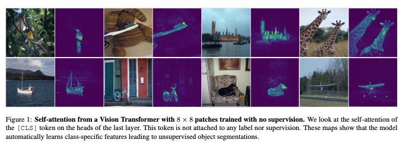
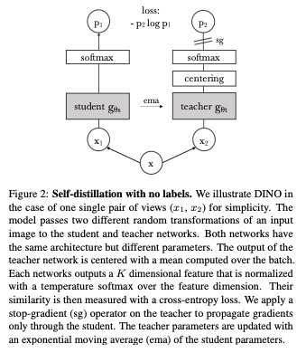
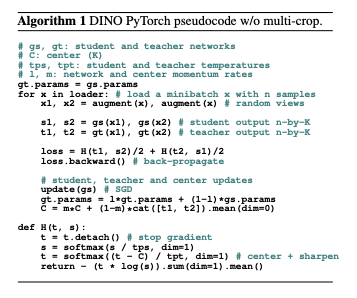
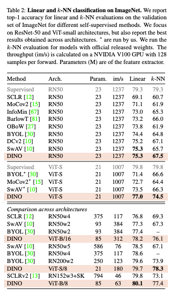
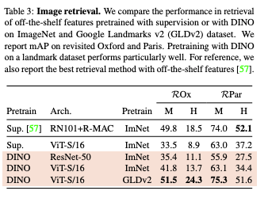

# Emerging Properties in Self-Supervised Vision Transformers

https://arxiv.org/abs/2104.14294

(まとめ @masahiro6510)

### 出版年月
2021年4月

### 著者
Facebook AI Research, Inria(フランスの国立研究所), Sorbonne University(フランスの大学)
- Mathilde Caron
- Hugo Touvron
- Ishan Misra
- Herve Jegou
- Julien Mairal
- Piotr Bojanowski
- Armand Joulin1

## どんなもの？

- 自己教師付き学習をViTに適応させることが有効であることを示した
- ImageNetで80.1%のトップ1を達成
- DINOという単純なモデル（本論文で提案）で自己教師付き手法を実装
ViTを自己教師付きで事前学習することで、この設定に特化したconvnetと同等の性能を達成できる

## 先行研究と比べて何がすごいか？
- movement encoder, マルチクロップ学習, ViTを用いた小さなパッチ利用の有効性を強調
- 自己教師付きViTの特徴
    - 自己教師付きViT特徴は教師付きViTやconvnetでは明確に現れない画像のセグメンテーションに関する情報を含んでいる
    - こららの特徴もk-NN分類機として優れている
- ViTに基づくBERT的なモデルを開発するためには、自己教師付き学習が鍵になり得ることがわかった

## 技術や手法の肝は？
- DINOは最近の自己教師付きアプローチと同じ全体構造
- 教師ラベル付きデータではなく教師モデルから学習する
- 教師モデルと生徒モデルは同じ構造でパラメータが異なる

- x: 入力画像
- p1: 生徒モデルの出力
- p2: 教師モデルの出力

（コードや数式での解説もありましたが、まだ読めていないです）

## どうやって有効だと検証した？
他のモデルと精度比較して良い結果を出した

## 議論はある？
読めていません

## 次に読むべき論文
自己教室あり学習の論文：https://arxiv.org/abs/2006.07733
