# Beyond Human Data: Scaling Self-Training for Problem-Solving with Language Models
[https://arxiv.org/abs/2312.06585](https://arxiv.org/abs/2312.06585)

(まとめ @n-kats)

著者

* Avi Singh
* John D. Co-Reyes
* Rishabh Agarwal
* Ankesh Anand
* Piyush Patil
* Peter J. Liu
* James Harrison
* Jaehoon Lee
* Kelvin Xu
* Aaron Parisi
* Abhishek Kumar
* Alex Alemi
* Alex Rizkowsky
* Azade Nova
* Ben Adlam
* Bernd Bohnet
* Gamaleldin Elsayed
* Hanie Sedghi
* Igor Mordatch
* Isabelle Simpson
* Izzeddin Gur
* Jasper Snoek
* Jeffrey Pennington
* Jiri Hron
* Kathleen Kenealy
* Kevin Swersky
* Kshiteej Mahajan
* Laura Culp
* Lechao Xiao
* Maxwell L. Bileschi
* Noah Constant
* Roman Novak
* Rosanne Liu
* Tris Warkentin
* Yundi Qian
* Ethan Dyer
* Behnam Neyshabur
* Jascha Sohl-Dickstein
* Noah Fiedel

DeepMindの人たち

# どんなもの？
人間のサポートなく、LLMを賢くした話。

学習方法$\text{ReST}^{EM}$ を提案。
PaLM-2を数学・コード生成のタスクで精度改善を確認。

# 先行研究と比べてどこがすごい？
正解が判定しやすい数学・コード生成のタスクでは、その判定を使って人間の力を使わずにそれを学習に反映できる。
そのときの学習は素朴な方法だが、EMアルゴリズムの根拠がある。

この方法が上手く行った。

# 技術や手法の肝は？
## $ReST^{EM}$

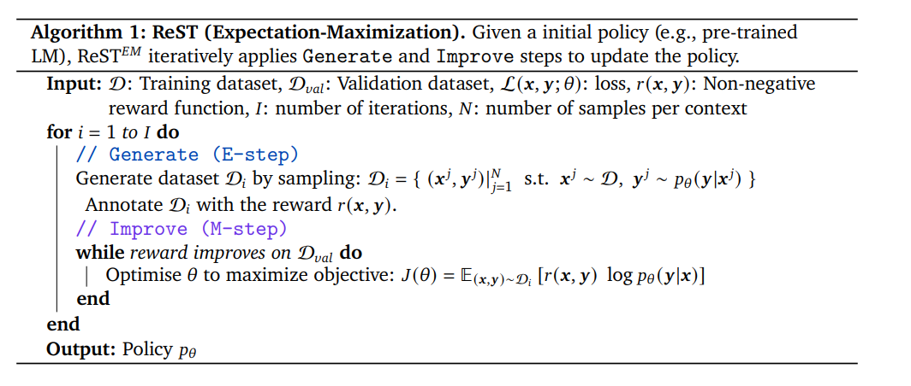

具体的なアルゴリズムはとても単純。
* （E-step）生成モデルでデータを生成する
* （M-step）ファインチューニングする（ロスは、報酬×log生成確率）
  * 報酬の例：生成したデータが正解したら1、そうでないなら0等で設定

報酬の例の場合そのままなら、単純に正解ケースだけで学習するのを繰り返すだけ。

## EMアルゴリズムとの関係
成功するかどうかを変数 O で表記する。
入力xが与えられたときにの成功しやすさは次の式で表現できる（0以下で、大きい程よい）。

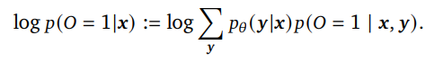

### ELBO
$\log \sum f(\theta)$ という形の式を最大化するときに、$\sum \log f(\theta)$ を最大化する問題に置き換えるといい。値としては違うけど、最大化できるタイミングが同じ。

今回のケースでは次のような計算になる。この最後に出てきた値がELBO。

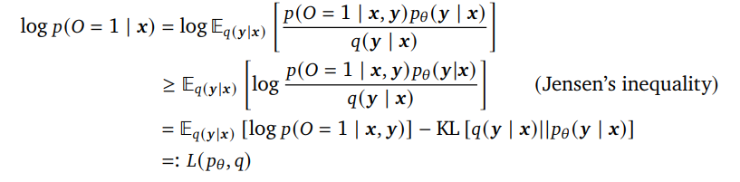

### EM アルゴリズム

* E-step・・・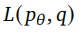 を最大にするqを見つける
* M-step・・・E-stepで見つけたqに対して、 を最大にするθを見つける

### この問題に適用（E-step）

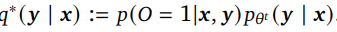

と置くと、

は

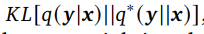

の形をしている。qをいじってこれを最大にするは、qとq* が定数倍の関係にあるとき。

そのような確率は、成功した生成結果内の確率と等しい。

### この問題に適用（M-step）
E-stepで得られたq（式中では $q^{t+1}$ ）は、成功した生成結果内の確率なので、成功した生成結果だけから損失を計算すればいい。

より一般に、p(O=1|x,y) と報酬関数rと比例するように設定すれば、ELBOの最大化の問題は次の式に変形できる。

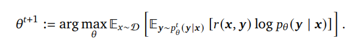

これは、

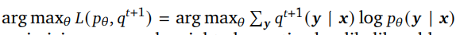

に

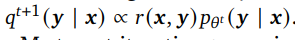

を代入して出てくる。

# どうやって有効だと検証した？
PaLM2で実験（GCPで利用可能）。

数学の問題(MATHデータセット）では1つの問題に32個、コード生成の問題（APPSデータセット）では、1つの問題に64個の回答を最初に生成。そこから10個に厳選(STaRを真似ているらしい)。

## 人間データとの比較
### 数学タスクの場合

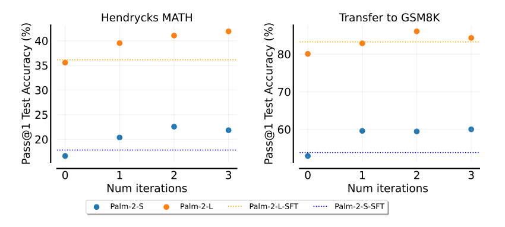

青がPaLM-2-S、緑がPaLM-2-L。どちらも人間データのFTより優れている。

### コード生成タスクの場合

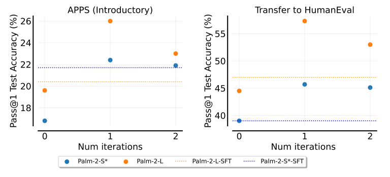

この場合も上手く行っている。
（けど、2イテレーションで落ちている。怪しい）

## 汎化性能
訓練データとテストデータとの性能変化を見ると、精度のギャップがどんどん広がっている。
過学習みを感じる。

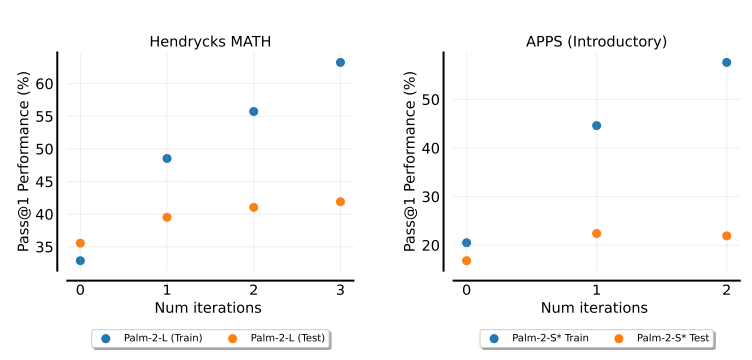

（訓練データの中だけでサンプリングしている影響とかかな？）

## 生成数を増やして評価
K個生成して正解が得られるかを評価した。この場合でも、目に見えて元より良くなっていることが分かる。

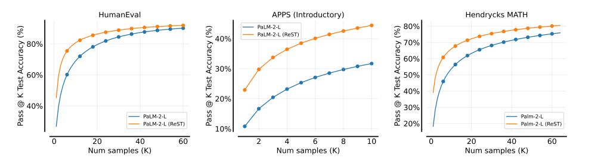

## データサイズ
MATHの場合、データサイズは1000くらいで頭打ちに。

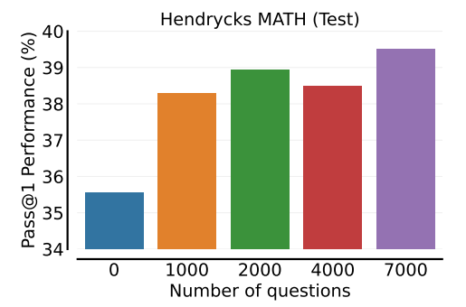

## その他
BBH（BIG-Bench Hard）とHungarian HS Finals Exam（ハンガリーの高校の最終試験の数学の問題）を評価した。

### BBH
他タスクへの影響を見た。
タスクによって良い影響をうけるものと悪い影響を受けるものがある。ただ、CoTを使ってやると（右図）大きく差が付いた（良い意味で）。

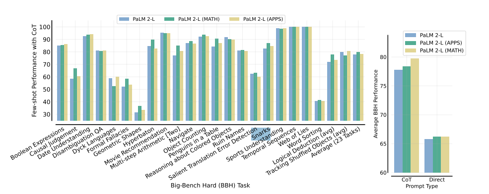

### Hungarian HS Finals Exam

GSM8Kと似た傾向にはある。その中でReST_EMの結果はGP-4には劣るものの、それ以外では最も良い。

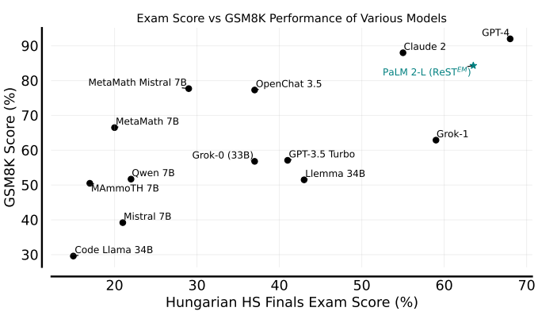

# 議論はある？
* 生成結果は自動で作れるが、問題の方は自動で作れない。
* 報酬をそれぞれで作らないといけない
* 訓練とテストのギャップが大きい・どんどん広がる。

## 私見
# 次に読むべき論文は？
* [STaR](https://arxiv.org/abs/2203.14465)
* [ReST](https://arxiv.org/abs/2308.08998)