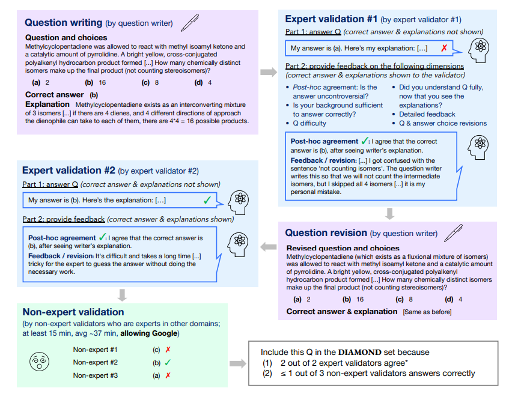
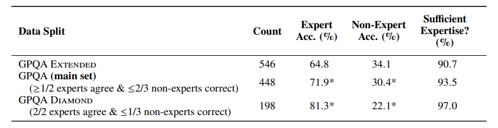
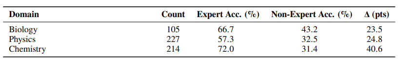
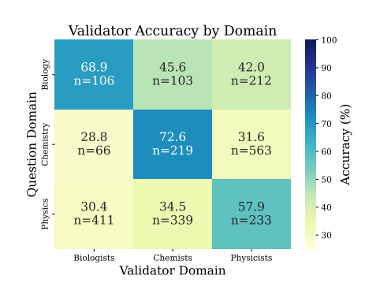
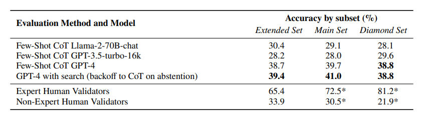

# GPQA: A Graduate-Level Google-Proof Q&A Benchmark
[https://arxiv.org/abs/2311.12022](https://arxiv.org/abs/2311.12022)

(まとめ @n-kats)

著者

* David Rein
* Betty Li Hou
* Asa Cooper Stickland
* Jackson Petty
* Richard Yuanzhe Pang
* Julien Dirani
* Julian Michael
* Samuel R. Bowman

ニューヨーク大学・Cohere・Anthropic（claudeの会社）

# どんなもの？
AIにより複雑な問題を解かせたい。そのためのベンチマークGPQAを作成。

生物・化学・物理学の4択の問題集で、その分野の専門家じゃないと解けないレベルの問題。

# 先行研究と比べてどこがすごい？
似たデータセットとして、ExpertQA があるが、これは、LLMが生成した答えを専門家修正する程度の取り組みしかしていない。

非専門家では解けない問題を目指し検証しているのが特徴。

QuALITYも似た取り組み。30分で読める資料の有無で専門家・非専門家の差を作っている。

GPQAでは、リアルの専門家・非専門家を使って差を作り、より難しい問題を対象にしている。

# 技術や手法の肝は？
## 専門家・非専門家の確保
* Upwork というクラウドソーシングサービスを利用
* 各分野の博士号持ち or 博士課程 の英語ネイティブの人を集める
* 問題作成に61人集める
* 非専門家は、このメンバーの中で調達（自分の分野以外の分野では非専門家役を担当。横断的な分野の人は、隣接分野の問題では非専門家とはしない）

## 問題作成の工程

* （問題作成）専門家が問題・選択肢・答え・解説を作成。
* （専門家検証1）専門家が問題を解いて、回答・説明・問題の是非・フィードバック。
* （問題修正） フィードバックを反映。
* （専門家検証2）専門家検証1と同じ。ただし、フィードバックは間違った場合だけ使う。
* （非専門家検証）3人の非専門家に解かせる（ネット検索OK）

## 問題の分類
問題の妥当性・難易度をもとに問題をフィルターする。

* （main）1人以上の専門家がOKと判断、かつ、1人以上の非専門家が不正解
* （DIAMOND）2人の専門家がOKと判断、かつ、2人以上の非専門家が不正解

DIAMONDは、問題として妥当性が高いが、専門家じゃないと解けない問題を集めたもの。

## インセンティブ
クラウドワーカーに目的通りのデータを作ってもらうために、報酬を用意した。

|作業|条件|インセンティブ|
|---|---|---|
|問題作成|ベース|$10|
||検証担当専門家が2人とも正解|$20|
||非専門家が不正解|$15（1人あたり）|
||検証担当専門家が2人とも正解かつ正解した非専門家が1人以下|$30|
|専門家検証|ベース|$10|
||正解|$10|
||フィードバックの結果（？）、二人目の検証担当専門家が正解|$10|
||フィードバックの結果（？）、2人以上？非専門家が不正解|$5|
|非専門家検証|ベース（15分は考える）|$10|
||正解|$30|

# どうやって有効だと検証した？

## 問題数・正解率

* EXTENDED は全データ
* 「＊」がついているところは、担当した非専門家が間違いやすいところ・担当した専門家が正解しやすいものが選ばれているため、厳密な正解率と言い切れない

## 分野間比較

* ⊿ = （専門家）-（非専門家）
* 化学が専門家と非専門家のギャップが大きい

* 化学の人が全体的に正解率高め。
* 数学・物理・化学・生物 の位置関係で類似度・親和性が高いのが数字に出ている？化学の人が優秀？

## 小分類問題数
* Biology:
  * Molecular Biology (85)
  * Genetics (20)
* Physics:
  * Quantum Mechanics (64)
  * High-Energy Particle Physics (46)
  * Physics (general) (43)
  * Astrophysics (42)
  * Electromagnetism and Photonics (12)
  * Relativistic Mechanics (11)
  * Statistical Mechanics (4)
  * Condensed Matter Physics (4)
  * Optics and Acoustics (1)
* Chemistry:
  * Organic Chemistry (144)
  * Chemistry (general) (64)
  * Inorganic Chemistry (3)
  * Analytical Chemistry (2)
  * Physical Chemistry (1)

## LLM と勝負

* GPT-4は優秀
  * 検索無しでも非専門家より優れている。難しい問題（Diamond）もそれなりに解けている。
  * しかし、専門家には全く及ばない。
* 他は検索あり非専門家より若干劣る（MainやDiamondではLLMが勝っているが、もともと非専門家が不正解した問題だから、非専門家に不利な設定）

# 議論はある？
## Scalable Oversight
Scalable Oversight（スケーラブルな監視）が目標・・・AIを賢くしていったときに、問題が難しくなっていくとそれを人間が評価するには工夫が必要。

[https://distill.pub/2019/safety-needs-social-scientists/](https://distill.pub/2019/safety-needs-social-scientists/)で指摘されていることを確認すると、

* 答えが分かっている
* 間違った場合に間違ったことがわかる
* 専門家の知識が反映されている
* 非専門家が読みきれないレベルの量の情報を反映している（専門家になるための長い鍛錬が必要）
* 信頼できる根拠があること。
* 簡単に教えれないこと。
* 現実の問題であること。

を達成できているが

* 利用に耐えうるデータ（データ量が少ないのでNG）
* バイアスの対処

ができていない。

## 課題・制限
* データが少ない
* 非専門家と言っても完全な素人ではなく、他分野の専門家の知的レベルの高い人たちが対象。真の非専門とは言い切れない。
* Upworkで人を集めたため、得意分野等の偏りがあるかもしれない。言語も英語にしたので、特定の国が強い分野が含まれていなかったりしそう
* 誰も解けない問題を解ける superhuman AI のレベルを達成するためのデータセットではない（専門家なら解ける）

## 私見
* 論文に問題が載っていたが、確かに解けない
  * 手元の量子力学の教科書とか簡単にググっただけでは分からない
* データセットとして作らているけど、こういう問題集をいろんな分野の人が作ったら楽しいのでは？（勉強が捗るのでは？）

# 次に読むべき論文は？
* [https://arxiv.org/abs/2401.06751](https://arxiv.org/abs/2401.06751) ・・・もともとこっちを読もうとしていた、このGPQAのことを知った。とはいえ、GPQAで検証していないので、今後のGPQA研究に期待
* [https://distill.pub/2019/safety-needs-social-scientists/](https://distill.pub/2019/safety-needs-social-scientists/)・・・scalable oversight に関して詳しそう