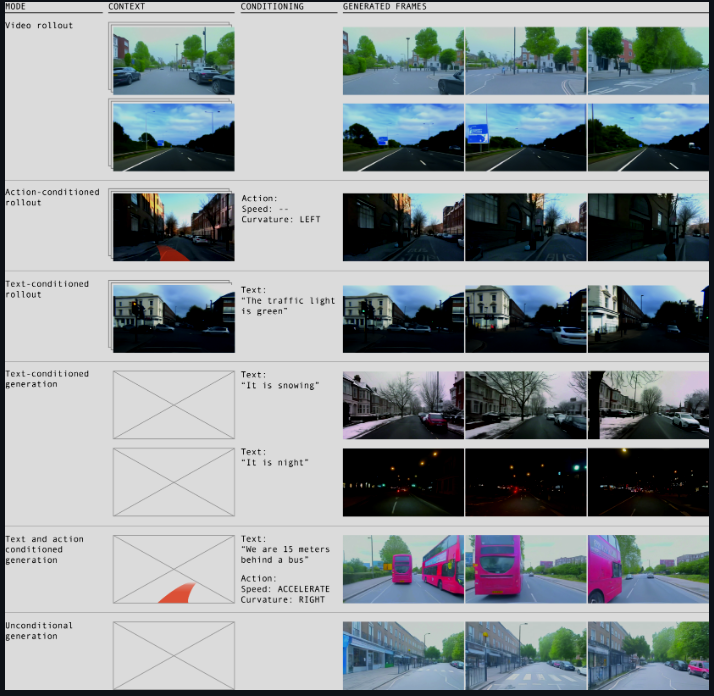
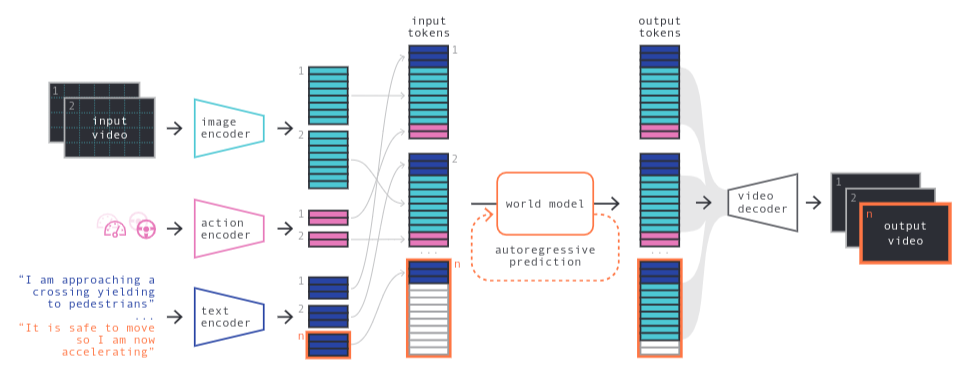
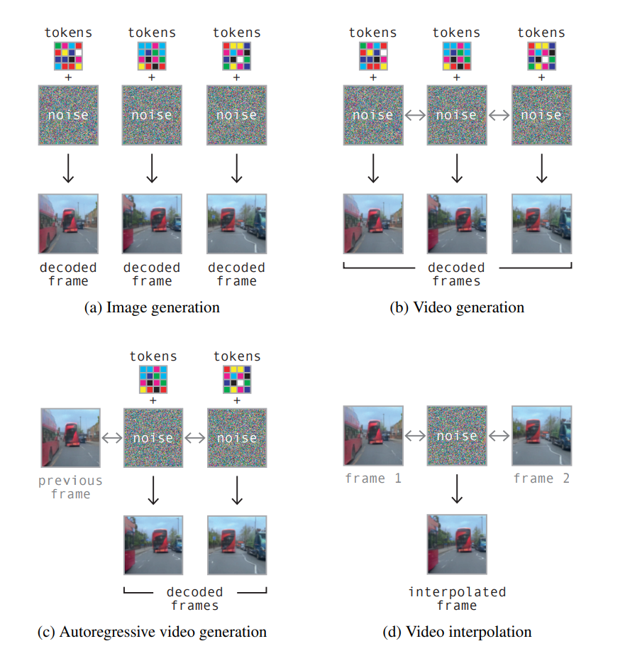
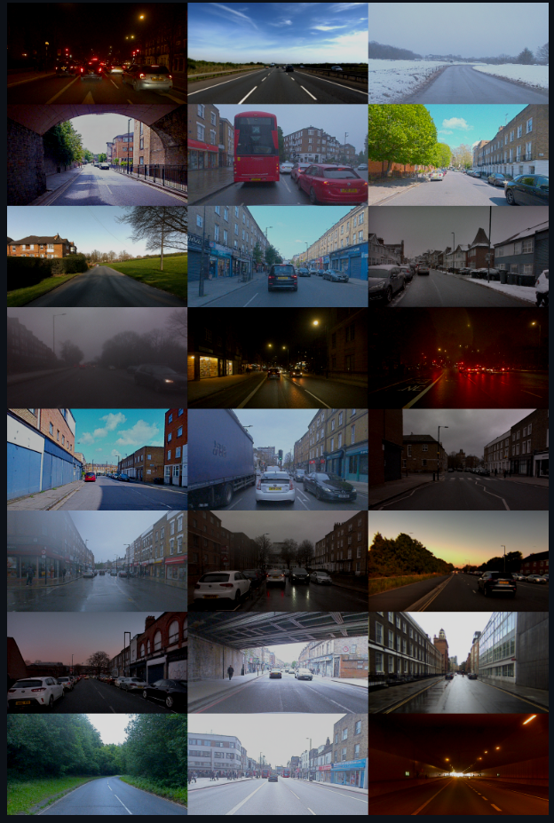
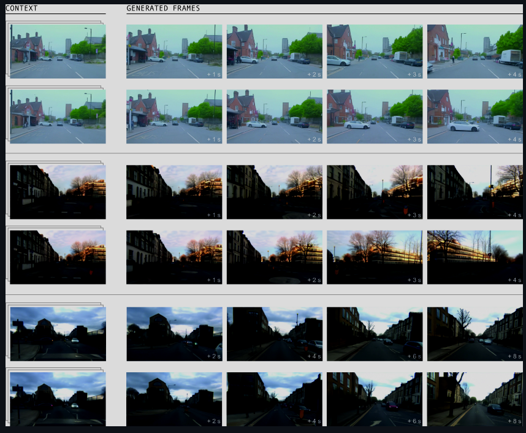

GAIA-1: A Generative World Model for Autonomous Driving
===

論文：<https://arxiv.org/abs/2309.17080>

2023/09/29

著者：Anthony Hu, Lloyd Russell, Hudson Yeo, Zak Murez, George Fedoseev, Alex Kendall, Jamie Shotton, Gianluca Corrado

Wayve というイギリスの自動運転スタートアップの人たち

（まとめ @wakodai）

## どんなもの？
+ GAIA-1 (Generative AI for Autonomy) という生成型世界モデルの紹介
+ ビデオ、テキスト、アクションを入力として、現実的な運転シナリオ（動画）を生成する
+ 生成した運転シナリオを自動運転車の学習に用いることで自動運転開発を加速する

## 先行研究と比べて何がすごい？
+ ビデオ、テキスト、アクション入力を統合して、より現実的で詳細な運転シナリオを生成できること
+ 自車の挙動、シーンの細かな制御が可能
  + (走れ、止まれ、追い越せ、xxを避けろ、雨、霧、雪、...)
+ 従来のモデルは特定の入力や限定されたシナリオでの予測程度だった

## どうやって有効だと検証した？
https://www.youtube.com/watch?v=5Jx2QgEUZUI&t=2s

## 技術や手法の肝は？

+ 3 種類の入力（ビデオ、テキスト、アクション）からの情報を共通の表現にエンコードする
+ 画像
  + 畳み込み 2D U-Net で画像特徴を抽出
  + 画像特徴を Embedding Table でトークン化
  + このとき DINO (窪田さんが昨年 11 月に読んだほう) からの誘導バイアス(?)を利用して量子化された画像特徴が意味のある表現を持つようにする

+ World Model
  + ワールドモデルの入力は、ビデオ、テキスト、アクションから得られるトークンのシーケンス
  + 自己回帰トランスフォーマーネットワークで構成されている
    + 過去の全てのトークンに基づいて、次のイメージトークンを予測する
  + ビデオフレームレートを落としたりするなどして長時間にわたる推論を可能にするなどの工夫もしている
+ Vide Decoder
  + ワールドモデルが生成したトークンから、高解像度のビデオレンダリングおよび時間的アップサンプリングを行い、滑らかなビデオを生成する
  + denoising video diffusion models を採用
  + 各フレームトークンを独立してピクセル空間にデコードする単純なアプローチでは、時間的に一貫性のないビデオ出力が得られてしまう
  + 拡散プロセス中にフレームのシーケンスをデノイジングし、モデルが時間を超えた情報にアクセスできるようにすることで、出力ビデオの時間的一貫性を向上する。

+ スケーリング則が適用できる
  + LLM と共通するアプローチであるため、パラメータ数、データ量、計算リソースの増加につれ性能が向上する可能性が高い

## 議論はある？
+ さらに未知のシナリオへの一般化能力を高める研究の重要性を指摘

## 次に読むべき論文は？
+ DriveGPT4: Interpretable End-to-end Autonomous Driving via Large Language Model
  + https://arxiv.org/abs/2310.01412

