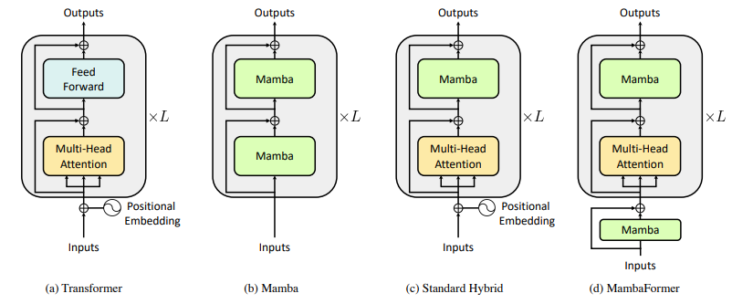
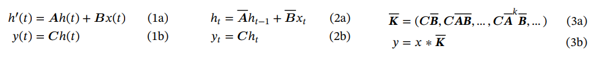
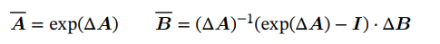
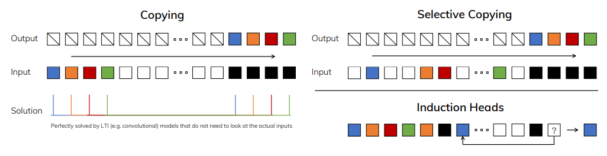
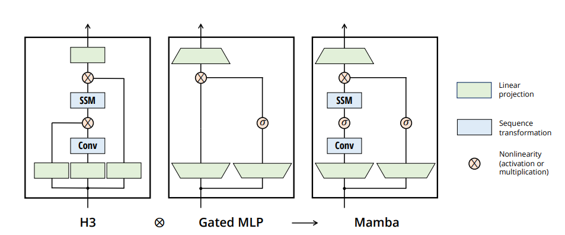
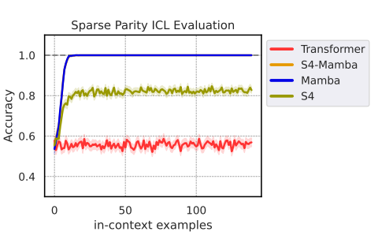
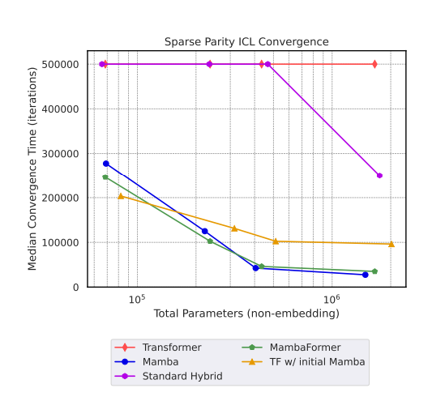
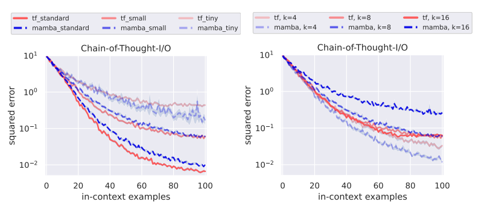

# Can Mamba Learn How to Learn? A Comparative Study on In-Context Learning Tasks
[https://arxiv.org/abs/2402.04248](https://arxiv.org/abs/2402.04248)
(まとめ @n-kats)

著者
* Jongho Park
* Jaeseung Park
* Zheyang Xiong
* Nayoung Lee
* Jaewoong Cho
* Samet Oymak
* Kangwook Lee
* Dimitris Papailiopoulos

KRAFTON（韓国のゲーム会社）・ソウル大学・ウィスコンシン大学・ミシガン大学の人達

# どんなもの？
トランスフォーマーの計算量対策に登場した非トランスフォーマーモデルのMambaとトランスフォーマーをICL（In Context Learning）の様々なタスクで比較し、それぞれの弱点を分析。
いいとこどりのMambaFormerを提案。

# 先行研究と比べてどこがすごい？
Mambaとトランスフォーマーを比較してMambaの欠点を挙げる研究はあった。
* [https://arxiv.org/abs/2312.04927](https://arxiv.org/abs/2312.04927)・・・後述のMQARというタスクで欠点を指摘。

（類似研究でRpeat After Me[https://arxiv.org/abs/2402.01032](https://arxiv.org/abs/2402.01032)という研究もある。）

この研究では、ICLの実験設定を複数考え、Mambaだけでなくトランスフォーマーの弱点も調べ、そのいいとこどりまで狙っている。

# 技術や手法の肝は？
## 概要
ICL というと、言語モデルの入力で事例を挙げてそれをヒントに推論させる方法と思ってしまうが、これだと実験の評価が難しい。

* ICL を(x_1, y_1, ..., x_n, y_n, x_n+1)を入力して次のy_n+1を予想させる回帰のタスクと整理する。
* xとyは、重みwで変化する関数族f_wを使って、y = f_w(x) という関係になるようにする。（同じ入力セット・コンテキストではwを共有）
* f_w を何パターンか考えて、Mamba・トランスフォーマー・MambaFormer等を訓練し、予測値と正解の誤差を比較する。

### MambaFormer

* 入力直後に位置埋め込みを与えるのではなく、Mamba のブロックを入れる。
* Multi-Head Attention と Mamba のブロックを交互に入れる。

## 結果

* Mambaは一部だけを拾ってくると良いタスク（決定木・垂直方向外れ値あり回帰・MQAR）が苦手
* トランスフォーマーは、各事例をちゃんと反映した推論が必要なタスク（符号推論）が苦手
* MambaFormer はいいとこどりできた。

## Mamba・SSM
この節の内容は、[Mambaの論文](https://arxiv.org/abs/2312.00752)から。
### SSM
SSM（State-space model）は、雑にいうと、現代的に洗練されたRNN。
* RNNと同じように、時系列に沿って入力が与えられる毎に潜在ベクトル（状態ベクトル）を更新していくモデル。
* 下の微分方程式を離散化したものとして定式化することで、学習時は畳み込み、推論時はRNNというようにモードを変えて効率的に運用できる。
* RNNなので、計算量は入力の長さに対して線形（トランスフォーマーの弱点克服）

以前、こはまさんが扱った RetNet もこの仲間。

### Mamba
* SSMブロックにSelection（S6）の機構を提案（過去情報を残すかどうかを選択的にする？）
* 先行研究のH3とGated MLP を融合

# どうやって有効だと検証した？
## 実験設定
（パラメータなどは断りがなければ連続値は正規分布・離散値は等確率で選択）

（次元をそろえるために、yは[y,0,...,0]のように0で補う）

* 普通設定
  * 線形回帰・・・f_w(x) = w・x
  * スパースな線形回帰・・・線形回帰のwをスパースにしたバージョン（ランダムにk成分だけ残して他を0にする。実験ではk=3）
  * 2層NN回帰・・・f_w(x) = W_2×relu(W_1×x) という2層のネットワーク
  * 決定木・・・各分岐で、x[i]>0かで分岐。それぞれの葉に値を対応させる。（実験の木の深さは4）
* 外れ値あり設定・・・線形回帰に一定割合で外れ値を入れる（外れ値以外の部分を学習）（テキストのように本題と関係の薄い部分が多い場合を想定）
  * 垂直方向外れ値あり回帰・・・u,v⊥wとなるようにu,wをとり、x,yがu,vの線形結合になるようにする（論文の式が怪しい）
  * 多外れ値あり回帰・・・9割をx=[1,1,...1], y=[1,0,...,0]に置き換える
* 離散関数
  * 符号推論・・・・x=[±1,...±1]とする（符号はバラバラ）。S: {1,...,d}からk個サンプリング（wの役）。f_S(x)=Π_i x[S_i]。（これだけ分類問題）
* CoT・・・s=relu(W_1×x), y=W_2×sとして、(x_1,s_1,y_1, ..., x_n+1)を入力して、y_n+1を評価する（s_n+1はスルー）
* MQAR・・・(k_1, v_1, ..., k_n, v_n, q)を入力して、qと同じk_iに対応するv_iを予測する（qは複数パターン行う） 

## 結果（再掲）

* Mambaは一部だけを拾ってくると良いタスク（決定木・垂直方向外れ値あり回帰・MQAR）が苦手
* トランスフォーマーは、各事例をちゃんと反映した推論が必要なタスク（符号推論）が苦手

## 符号推論
MambaのS6無し版（S4）だと、符号推論の精度が落ちる。

### 学習速度

トランスフォーマーでは訓練に時間がかかっている。MambaFormerはMamba並の訓練ステップでOK。入力直後に位置ベクトルを入れる代わりに、Mambaのブロックを入れた効果が強い。

## CoT
Transformerの方がよい（左）。チャンネル数によってMambaの精度が大きく変わる（右）。

# 議論はある？
Mambaとトランスフォーマーの得意・不得意を明らかにした。特に、MambaにICLの能力があることを確認できた。Mambaもトランスフォーマーもすべてを解決してくれるわけではなく、これらを混ぜた手法を使うのがよさそう。

## 私見
混ぜたけど、トランスフォーマーの計算量オーダー問題が残っている（倍速くらいにはなりそうだけど）。

# 次に読むべき論文は？
* [https://arxiv.org/abs/2312.00752](https://arxiv.org/abs/2312.00752)・・・Mambaの論文
* [https://arxiv.org/abs/2312.04927](https://arxiv.org/abs/2312.04927)・・・MQARの論文。どういう観点なのか。