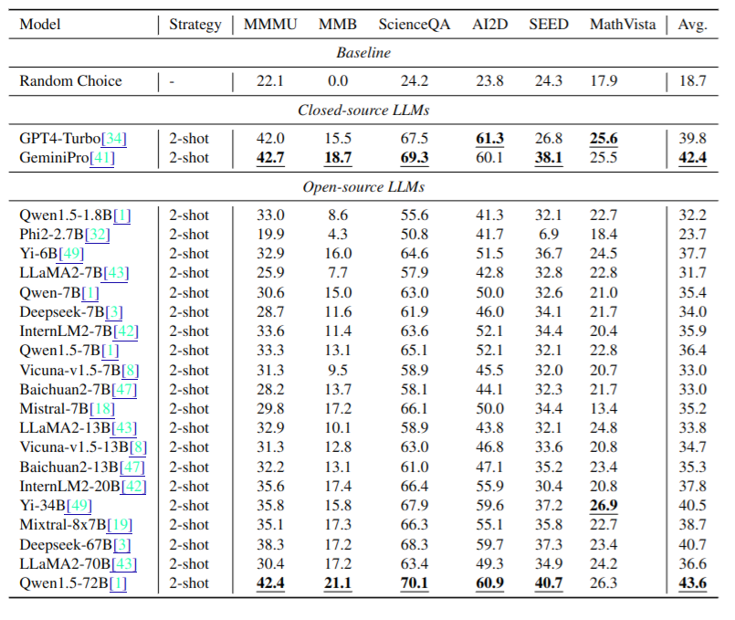
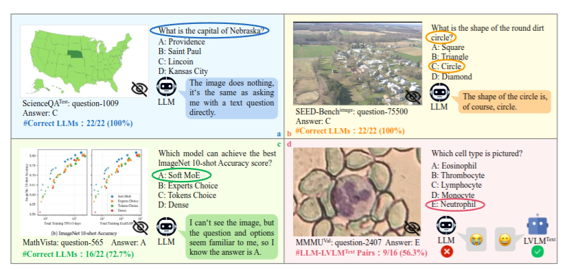
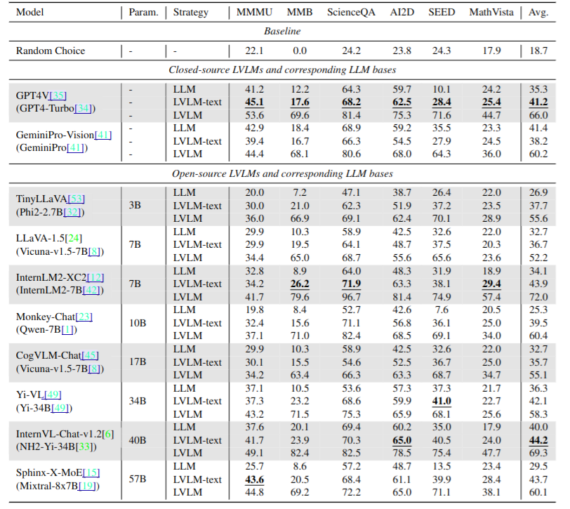
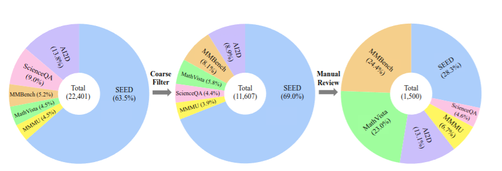
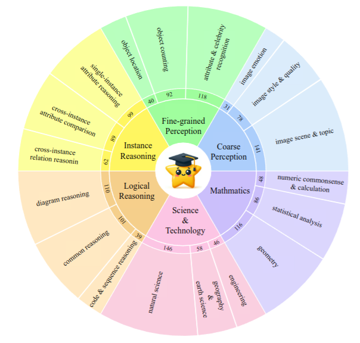
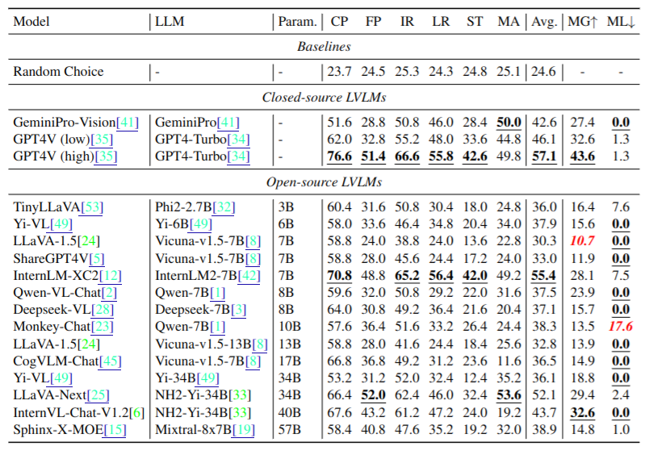
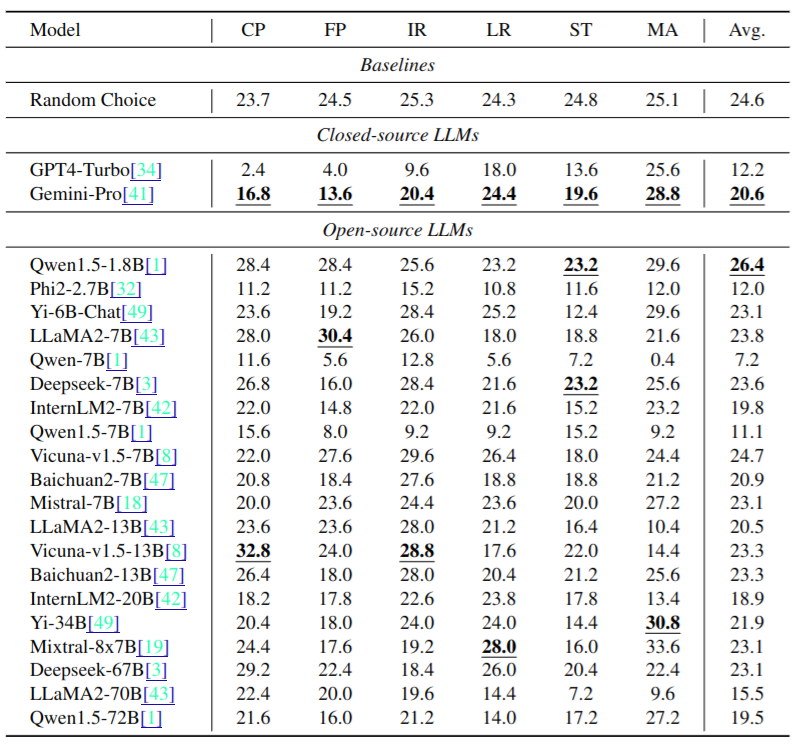
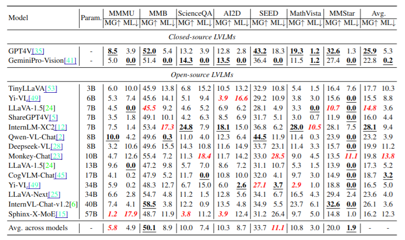

# Are We on the Right Way for Evaluating Large Vision-Language Models?
[https://arxiv.org/abs/2403.20330](https://arxiv.org/abs/2403.20330)
(まとめ @n-kats)

著者
* Lin Chen
* Jinsong Li
* Xiaoyi Dong
* Pan Zhang
* Yuhang Zang
* Zehui Chen
* Haodong Duan
* Jiaqi Wang
* Yu Qiao
* Dahua Lin
* Feng Zhao

中国科学技術大学・香港中文大学・上海AIラボラトリーの人たち

# どんなもの？
LVLM（画像も使うLLM）を評価するデータセットがたくさんあるが、実は画像を使わずに回答出来てしまうものがあるという問題を見つけた。そのような問題を抑えたデータセットMMStarを作成した。

# 先行研究と比べてどこがすごい？
## VQA
古くは、VQAという問題設定があった（元祖はこれ→[https://visualqa.org/](https://visualqa.org/)）。COCOのVQAや[A-OKVQA](https://allenai.org/project/a-okvqa/home) も有名。これらは、LVLMの認識・推論能力を評価するには不十分。

## LVLMを評価するデータセット
選択式の問題集が以前から作られてきた。
* [SEED](https://github.com/AILab-CVC/SEED-Bench) ・・・v1で19k（12分野）、v2で24k（27分野）
* [MMBenth](https://github.com/open-compass/MMBench) ・・・2974問（20分野）
* [MMMU](https://mmmu-benchmark.github.io/) ・・・ 大学レベルの問題集11.5k問（30分野）

# 技術や手法の肝は？
## 画像要らない疑惑
LLMだけでの評価値が完全ランダムより明らかにいいのがいる。

（フォーマットミス防止のために2-shotで推論）

### 具体的な問題点

* 文章だけで回答できる
  * 一般常識から質問文だけで回答できる（左上）
  * 質問文のキーワードから、正解が類推出来てしまう（右上）
* 意図しないリーク
  * マニアックな情報だけど、学習データに含まれる情報から回答できる（左下）

### 画像の有無の差
LVLMの評価と、画像を入力しない場合の評価と、ベースになったLLMの評価。

* （LVLM v.s. LVLM-text）画像を使って解いている問題はそれなりにある
* （LLM v.s. LVLM-text）LVLM化の学習の際に、何故かスコアが上がる。リークでは？（単に賢くなっただけかも）

## MMStar
既存データセットから、LLM・人力によって1500問（18分野）にフィルターして作成。

### どういうものを選びたいか
* 画像が必須
* 意図しないリークを抑える
* 難易度にバリエーションをもたせる

### フィルター方法

* ベースにするデータセットを用意
  * 写真ベースのデータセット（MMBench・SEED）
  * 科学・技術のデータセット（MMMU・ScienceQA・AI2D・MathVista）
* LLMで推論・評価
  * GPT4-Turbo・GeminiPro・LLaMA-70B・Qwen-1.5-72B・Mixtral-8x7B・Internlm・Yi・Deepseek llm を利用
  * オープンなLLMでは2-shot方式で推論
* 正解率が25%以下のものだけ抽出（22401個中11607個になる）
* 難易度計算
  * 16種のLVLMで評価
  * 正解数応じて分類
    * easy (12-16)
    * moderate (8-11)
    * hard (4-7)
    * tough (0-3)
* 人手で確認
  * 3人のエキスパートに依頼
  * 画像が必要か、網羅的なデータになっているか、高度な推論が必要かを確認
  * 網羅性・難易度を考慮して1500問を抽出

### データ分布

大グループ6種・少グループ18種
* CP(Coarse Perception): 画像の外観・全体像を問う
* FP(Fine-grained Perception): 画像の詳しい情報（ものの位置・数・状態）を問う
* IR(Instance Reasoning): もの同士の関係などを問う
* LR(Logical Reasoning): 図式などが絡む問題
* ST(Science & Technology): 科学・技術の問題
* MA(Mathematics): 数学的な問題（計算・図形・統計）

# どうやって有効だと検証した？
## MMStarのLVLMの評価

* GPT4Vが圧勝。
* 画像利用度の指標：MG=（画像ありスコア - 画像なしスコア）を見ても、GPT4が圧勝（ちゃんと画像を見て正解している）
* リークの量の指標：ML=（画像なしスコア - ベースのLLMスコア）（0以下は0とする）も多くのモデルで0か少数。

## MMStarのLLMの評価結果
ちゃんとランダム相当の正解率になっている（むしろ、サンプリングで使ったからGPT4は悪い）

## MMStarと抽出前との差（MG・MLの比較）

* MG（画像利用度の指標）
  * もとのデータでもMGが高いデータセットがある。
  * MMStarのMGはそれより小さい。
  * （難易度が変わっている影響もあって一概に比較できない）
* ML（リークの量の指標）
  * MMStarが他を圧倒して低い

# 議論はある？
議論というか著者のコメント
* 今回のような、画像要らない・リーク発生についてアイデアがデータセットを作る人に示唆を与えれたらなー
* MMStarを大規模・オンライン（訓練しながらという意味？）なものに拡張したい

# 次に読むべき論文は？
* MMMU
* InternLM-XC2 ・・・GPT4Vに匹敵するくらいの評価値