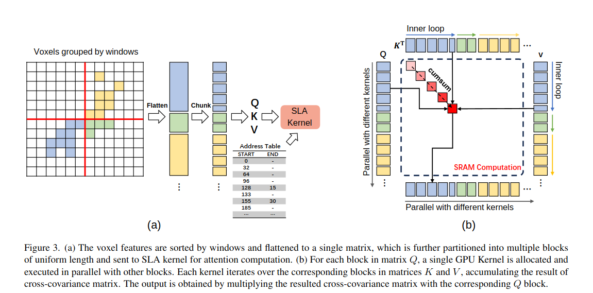
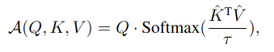
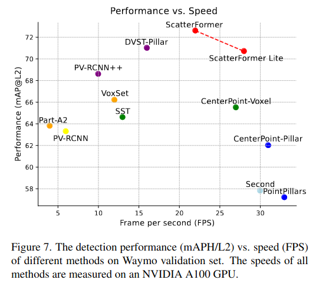
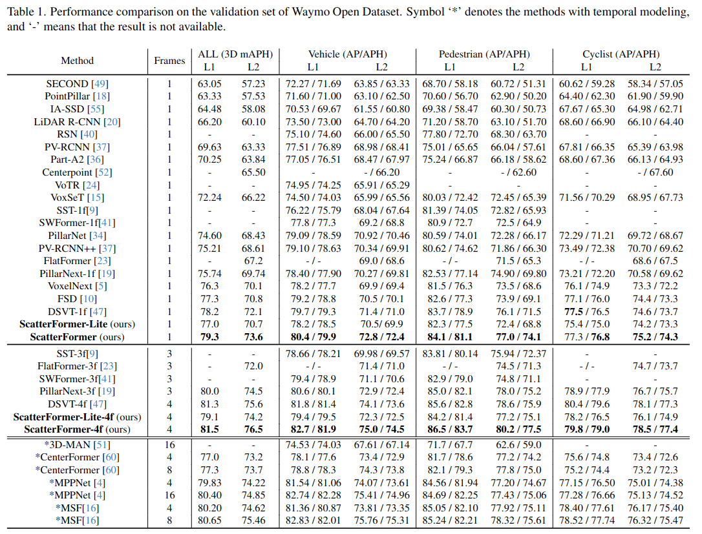
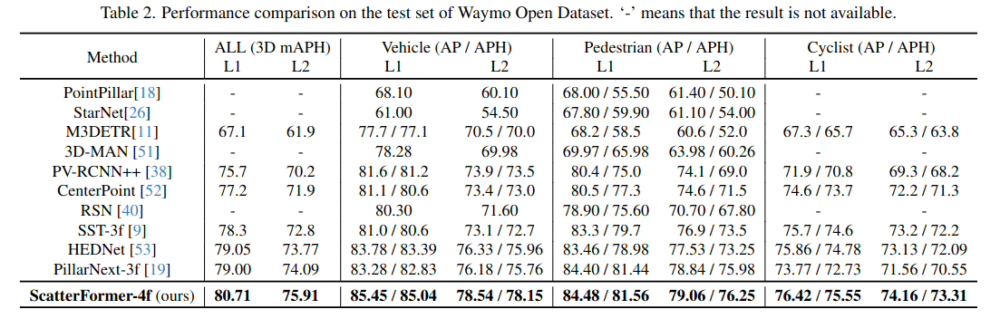

ScatterFormer: Efficient Voxel Transformer with Scattered Linear Attention
======
Chenhang He, Ruihuang Li, Guowen Zhang, Lei Zhang

The Hong Kong Polytechnic University
OPPO Research Institute

https://arxiv.org/abs/2401.00912

@cohama

## どんなもの

- 3D点群物体検出のひとつ
- スパースなボクセルに対する効率的な Attention 機構により精度と速度のより良いトレードオフを実現

## 先行研究と比べて何がすごい?

- 点群の認識は大きく point ベースと voxel ベースの2種類がある。こちらは voxel ベースの方
- voxel ベースは (スパースな) 畳み込みがよく使われるが、近年は Transformer を使うものも増えてきている。
  - VoxSet: set attention
  - SST: shifted window attention。SwinTransformer のようなもの？
  - OcTr: OctTree-based attention
  - DSVT: ボクセルをx軸またはy軸順にソートし、それらを固定長グループごとにウィンドウ化して計算。計算効率が良いが空間的近接性が失われる。また、グループ化の計算コストも高い

## 技術や手法の肝は?

- 全体的なアーキテクチャは一般的な Voxel ベースの 3D 物体検出でよくある形
- 特徴抽出部分が(特殊な) Transformer になっている
  - SLA: 全体のボクセルをウィンドウに分割した上でウィンドウ内の疎なボクセルに対して Linear Attention (計算時間がトークン数 N に比例) を計算
  - CWI: 疎なボクセルに対して Linear Attention (計算時間がトークン数 N に比例) を計算

## Scatter Linear Attention (SLA)

- 全体をある程度の大きさのウィンドウに分割する (12x12 とか)
- ウィンドウ内で Attention を計算する。このときの Attention は XCiT と呼ばれる Linear Attention の一種を用いる。

### Linear Attention について
- Attention の計算は通常は `Attn(Q, K, V) = A(Q, K) V = softmax(Q K^T)/√d V`
- `A(Q, K)` のところで N^2 のオーダーの計算が必要
- これを高速化するために `A'(Q, K) = φ(Q)φ(K)^T` で代用する。`φ` にいい感じの関数を選べば同じ結果になるが実は割となんでもよい (`cos` とか恒等関数とか)
- すると計算順を変えられて `Attn'(Q, K, V) = φ(Q)φ(K)^T V = φ(Q) (φ(K)^T V)`
- 先に `φ(K)` と `V` の内積を取ってから `φ(Q)` を掛けるだけで良いので `O(n)` で済む。

### XCiT について

- SLA では XCiT という手法で提案された以下のような Attention の計算に用いる。

`τ` は学習可能な温度パラメータ
`K^` と `V^` は l2 で正規化された K， V

### GPU に最適化した計算

SLA では Flash Attention と同様、GPU にとって最適になるような工夫もある。
Q, K, V などの各行列を GPU の SRAM にのるサイズのチャンクに分割し、チャンクごと逐次的に計算を行うことでメモリの局所性を最大限利用している
実装は OpenAI の triton を使用

## Cross Window Interaction

ウィンドウ内で Attention を計算し、その後、ウィンドウ間の情報を混ぜる必要がある。

よくある方法だとウィンドウをシフトさせる方法などがあるが、実はカーネルサイズの大きな Convolution で OK。
カーネルの大きさはウィンドウサイズ+1に設定

## どうやって有効だと検証した？

waymo や nuScenes で検証

### Ablation

## 議論はある?

## 次に読むべき論文

- Transformer 系
  - SST: Lue Fan, Ziqi Pang, Tianyuan Zhang, Yu-Xiong Wang, Hang Zhao, Feng Wang, Naiyan Wang, and Zhaoxiang Zhang. Embracing single stride 3d object detector with sparse transformer. In Proceedings of the IEEE/CVF conference on computer vision and pattern recognition, pages 8458–8468, 2022.
  - DVST: Haiyang Wang, Chen Shi, Shaoshuai Shi, Meng Lei, Sen Wang, Di He, Bernt Schiele, and Liwei Wang. Dsvt: Dynamic sparse voxel transformer with rotated sets. In Proceedings of the IEEE/CVF Conference on Computer Vision and Pattern Recognition, pages 13520–13529, 2023.
- 高速な Attention
  - Flash Attention: Tri Dao, Daniel Y. Fu, Stefano Ermon, Atri Rudra, and Christopher R´e. FlashAttention: Fast and memory-efficient exact attention with IO-awareness. In Advances in Neural Information Processing Systems, 2022
  - Linear Attention: Angelos Katharopoulos, Apoorv Vyas, Nikolaos Pappas, and Franc¸ois Fleuret. Transformers are rnns: Fast autoregressive transformers with linear attention. In International conference on machine learning, pages 5156–5165. PMLR, 2020
  - XCiT: Alaaeldin Ali, Hugo Touvron, Mathilde Caron, Piotr Bojanowski, Matthijs Douze, Armand Joulin, Ivan Laptev, Natalia Neverova, Gabriel Synnaeve, Jakob Verbeek, et al. Xcit: Cross-covariance image transformers. Advances in neural information processing systems, 34:20014–20027, 2021
