# YOLOX: Learning What You Want to Learn Using Programmable Gradient Information

https://arxiv.org/abs/2402.13616

(まとめ @masahiro6510)

### 出版年月
2024年2月

### 著者
Chien-Yao Wang, I-Hau Yeh, Hong-Yuan Mark Liao

## どんなもの？
- ディープラーニングのネットワークは、特徴抽出や空間変換を行いながら入力データが層を通過する過程で大量の情報が失われる
- これに対処するためにPGI(Programmable Gradient Information)という概念を導入し、新しい軽量ネットワークアーキテクチャであるGELAN(Generalized Efficient Layer Aggregation Network)を提案
- 上記を採用する事で、MS COCOでSOTAより良い結果になった

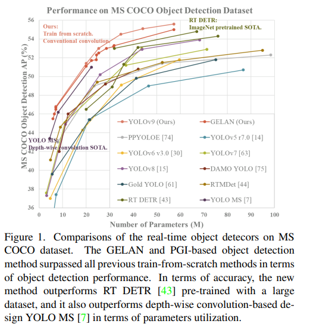

## 先行研究と比べて何がすごいか？
- PGIにより軽量モデルとディープモデルの両方で精度改善が見られた
- PGIとGELANを組み合わせることで、ディープモデルではyolov8と比較してパラメータ数を49%, 計算量を43%削減しつつ、APが0.6%改善した

## 技術や手法の肝は？
### 問題提起
- 情報ボトルネックの原理
    - 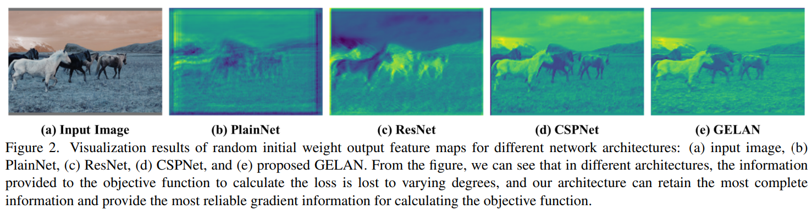
    - 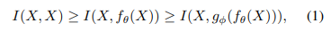
        - f, g: 変換関数(ニューラルネットワークの連続する2層)
        - X: 入力データ
        - I: 相互情報量
    - ネットワークの層が深くなるほど入力データの情報が失われる
        - 学習するときには教師とモデルの出力から損失を計算して勾配を更新するので、層が深くなると信頼性の低いな情報を学習に利用し、信頼性の低い勾配になり収束しにくくなる
        - パラメータ数を増やすことで情報の損失を減らすアプローチが取られることが多いが、根本的な解決にならない
- 可逆関数
    - 関数rが逆変換関数vを持つような関数を可逆関数と呼ぶ
    - 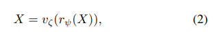
    - 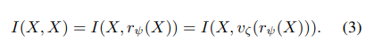
    - ネットワークの変換関数を可逆関数で構成することで、信頼性の高い勾配でモデルを更新することができる
        - 例えばPreAct resnet
        - 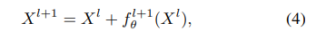
    - (この後で入力と教師の相互情報量の話も出てきたけど読めていない）

### 提案手法
- Programmable Gradient Information(PGI)
    - 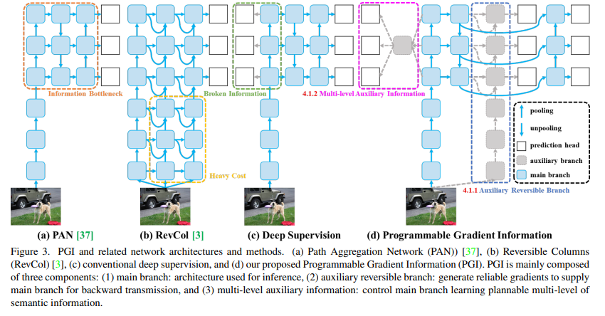
    - 3つの要素から構成される
        - main branch: 推論用
        - Auxiliary Reversible Branch
            - 信頼性の高い勾配を生成して、パラメータ更新を補助する
            - revcolだと推論時間が20%増加してしまうので、訓練時のみ使用する(fig3(b))
        - Multi-level Auxiliary Information
            - deep supervisionのように複数の予測ブランチで異なるサイズの物体を検出する手法がある。

- Generalized ELAN(GELAN)
    - CSPNetとELANを組み合わせて、軽量性、精度、速度を考慮したネットワークを構築

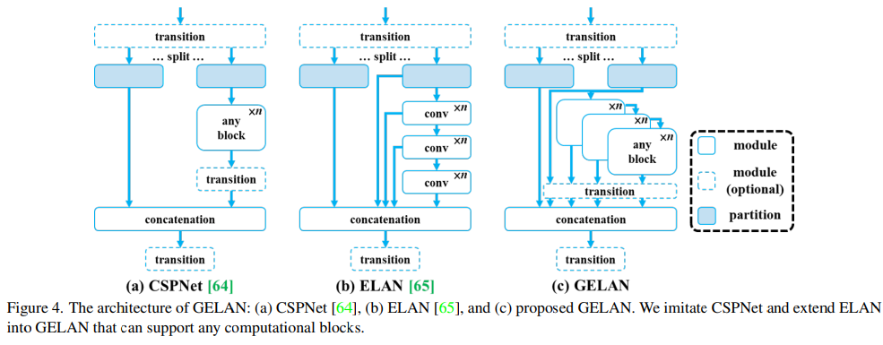

## どうやって有効だと検証した？
- 実験設定
    - MS COCOデータセットを使う
    - YOLOv7 AFをベースに提案手法を組み込む
    - 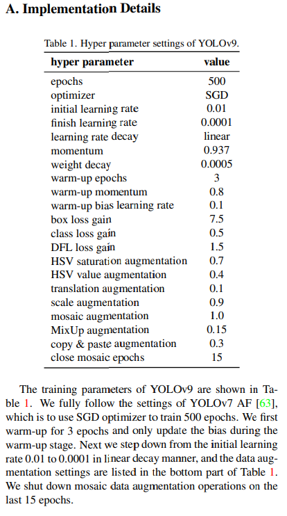
- SOTAとの比較
    - 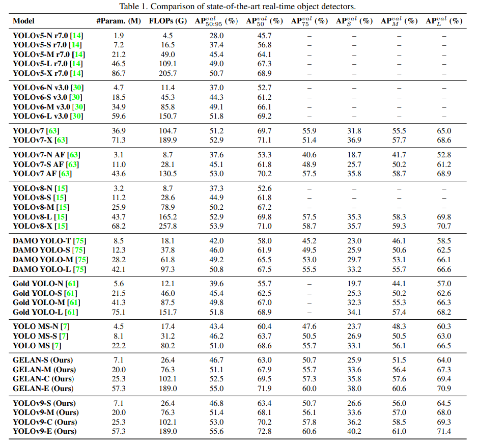
    - 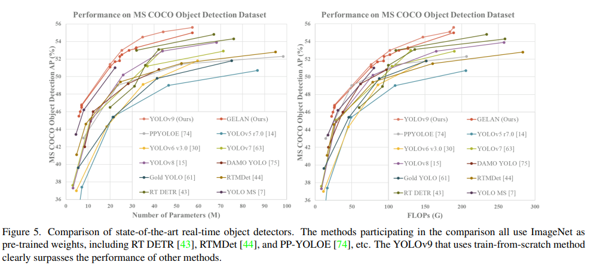
    - 他の手法と比べて精度も良いしパラメータ数も少ない
- Abration
    - GELAN
        - 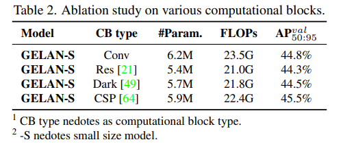
            - GELANで計算ブロックを変えた。CSPブロックを入れると特に良い性能
        - 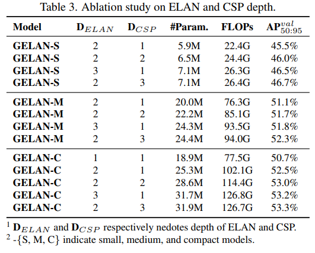
            - ELAN, CSPの深さと精度の関係
            - ELANの深さを1→2にすると特に精度が向上する
            - 深さ2以上では、ELAN, CSPを深くしてもパラメータ数、計算量、精度は線形関係
                - 深さに敏感ではないので、GELANのネットワークアーキテクチャを任意に設計できる
    - PGI
        - 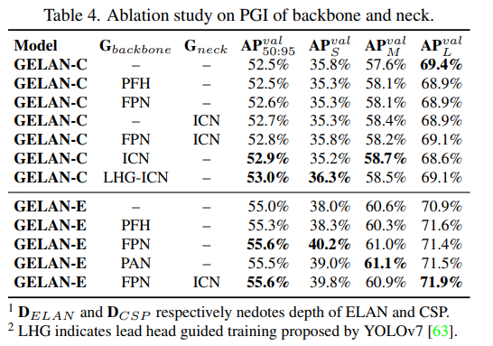
        - 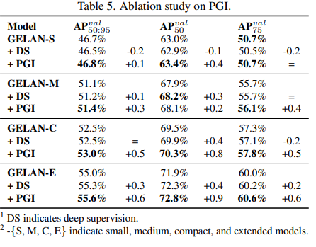
            - DSを使うと軽量モデルでは精度が低下するが、PGIは様々なサイズのモデルで精度が向上する
    - 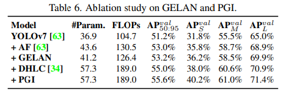
        - yolov7にGELANやPGIを追加することで精度改善する
- 可視化
    - 初期重みでの特徴マップの可視化
        - 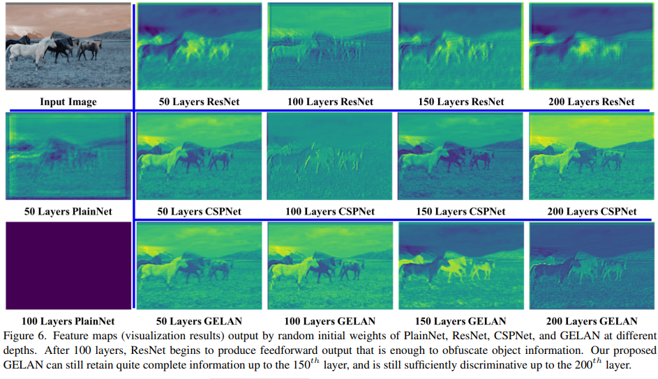
    - 1epoch warmup後の特徴マップ(GELAN vs YOLOv9(GELAN&PGI))
        - 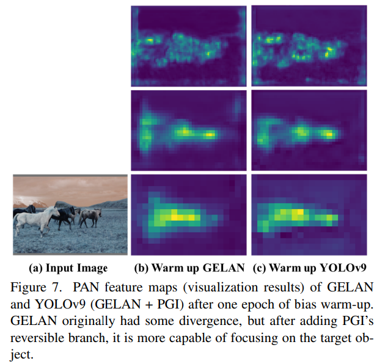

## 議論はある？

## 次に読むべき論文
- CSPnet: https://arxiv-org.translate.goog/abs/1911.11929?_x_tr_sl=en&_x_tr_tl=ja&_x_tr_hl=ja&_x_tr_pto=sc
- Deep Supervision:
    - https://arxiv.org/abs/1409.5185
    - https://ieeexplore.ieee.org/document/7298594
    - https://arxiv.org/abs/1505.02496
- ELAN: https://arxiv.org/abs/2211.04800
