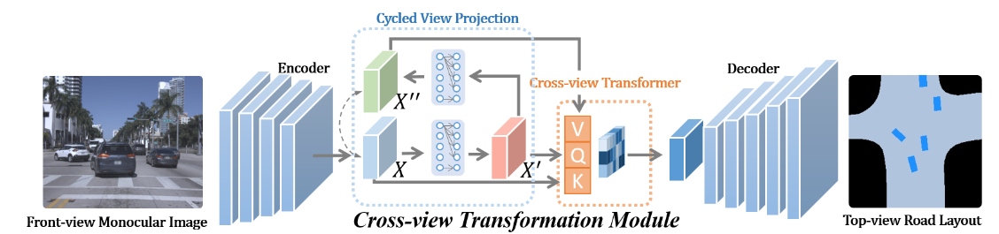
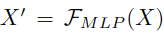
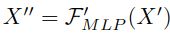
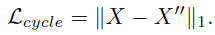
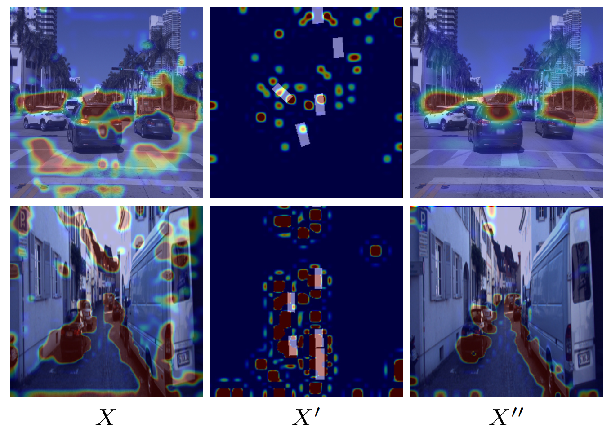

# Projecting Your View Attentively: Monocular Road Scene Layout Estimation via Cross-view Transformation
[https://openaccess.thecvf.com/content/CVPR2021/papers/Yang_Projecting_Your_View_Attentively_Monocular_Road_Scene_Layout_Estimation_via_CVPR_2021_paper.pdf](https://openaccess.thecvf.com/content/CVPR2021/papers/Yang_Projecting_Your_View_Attentively_Monocular_Road_Scene_Layout_Estimation_via_CVPR_2021_paper.pdf)
(まとめ @wakodai)

著者
* Weixiang Yang
* Qi Li
* Wenxi Liu
* Yuanlong Yu
* Yuexin Ma
* Shengfeng He
* Jia Pan

福州大学, 上海科技大学, 上海工学研究センター, 華南理工大学, 香港大学
CVPR2021 Paper

# どんなもの？
単眼の前方視画像から鳥瞰図（トップビュー）での道路シーンレイアウトと車両占有を推定する新しいフレームワークを提案。このフレームワークは、クロスビュートランスフォーメーションモジュールとコンテキスト対応識別器を利用して、HDマップの再構築を効率的に行います。
## (補足)
もともと、Tesla のようなマルチカメラの自動運転手法の調査をしていた。カメラ特徴を BEV(Bird Eye View) 特徴に変換し、かつ複数カメラを同一マップで表現する手法だが、そもそもカメラ特徴を BEV に変換する部分について詳しく知りたく、その走りのような論文だったので選んだ（この論文は単眼カメラでやっている）

# 先行研究と比べてどこがすごい？
従来の手法は、
- 高価な LiDAR センサーに依存し、計算時間がかかる
- カメラベースの手法では道路セグメンテーションと視点変換を個別に行うために歪みやコンテンツの欠落が生じることが多い

本研究は、単一の前方視画像のみを使用して、鳥瞰図の形で道路レイアウトと車両占有を同時に再構築する点で先行研究を超えています。

# 技術や手法の肝は？

- Cross-view Transformation Module
前方視ドメインの特徴をトップビュードメインに変換する。以下 2 つのモジュールから構成される
  - Cycled View Projection
  - Cross-view Transformer
- コンテキスト対応識別器
車両と道路の空間的関係を考慮し、推定された車両マスクとその道路との相関を測定する

## Encorder
入力前方視画像は、ResNet をバックボーンネットワークとして採用したエンコーダを通して視覚特徴を抽出
## Cross-view Transformation Module
本手法のネットワークは、フロントビューの単眼画像をトップビューの道路レイアウトに変換することを目的としている。
以降、CVP と CVT について説明
### Cycled View Projection (CVP)
- フロントビュー領域 X からトップビュー領域 X' に特徴を投影する
  - MLP ベースのサイクル構造を利用し[31] する
    - [Cross-view Semantic Segmentation for Sensing Surroundings](https://arxiv.org/pdf/1906.03560)
    - (3DCG を使って depth 情報もある状況で学習する...？)
- しかしそれだけでは前方視の情報を効果的に伝達することが保証されないらしい
- トップビューの特徴 (X') を前方視のドメインに戻すサイクル自己監視スキームを導入
- X'' は同じ MLP 構造を介して X' を前方視のドメインにサイクルバックすることで計算される

- X' と X'' のドメイン一貫性を保証するためにサイクル損失 Lcycle を組み込む

- サイクル構造によって前方視とトップビュー間の接続が強化される
- Lcycle が最小となる場合に X'' はビュー投影に最も関連する情報を保持する
  - X'' は X' から投影されるため
- X'' はビュー投影のための前方視の最も関連する特徴を含む

# どうやって有効だと検証した？

# 議論はある？

# 次に読むべき論文は？
