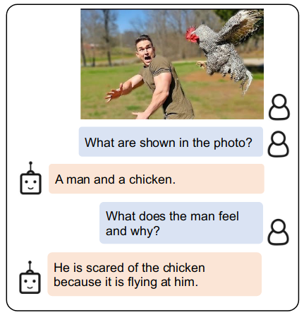
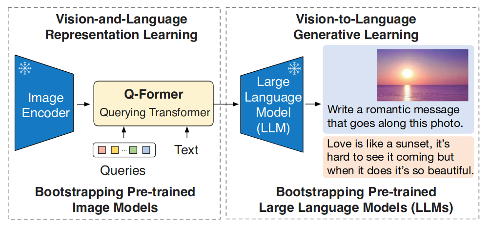
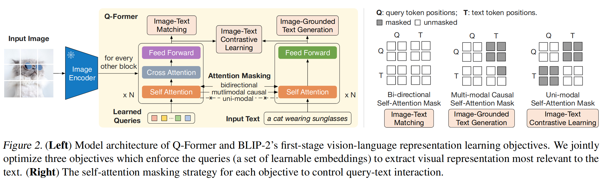
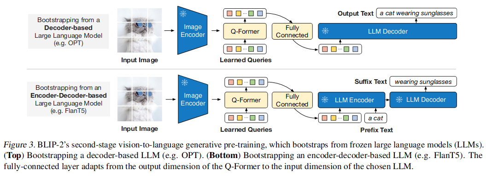
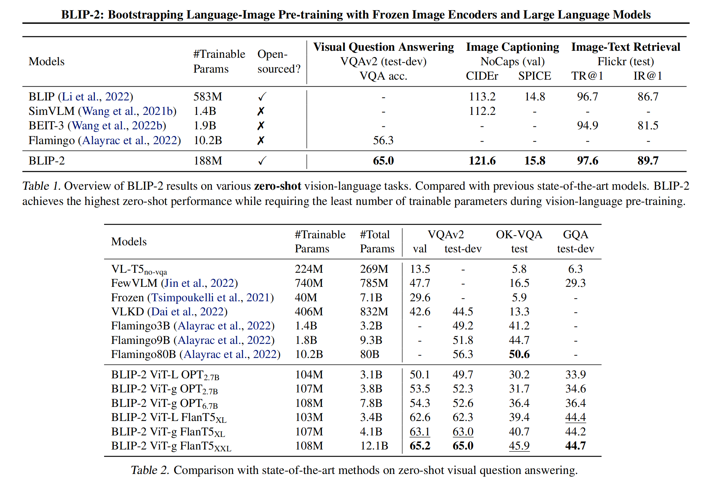
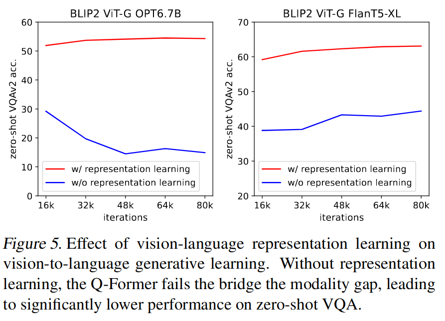

BLIP-2: Bootstrapping Language-Image Pre-training with Frozen Image Encoders and Large Language Models
======
Junnan Li, Dongxu Li, Silvio Savarese, Steven Hoi

Salesforce Research

https://arxiv.org/abs/2301.12597

@cohama

## どんなもの

- Vision-Language モデルを効率的に訓練する手法である BLIP-2 を提案
- 重み固定した画像エンコーダと LLM を利用することで効率的、効果的に画像テキスト間の対応関係を学習する

## 先行研究と比べて何がすごい?

- End-to-End (つまり、画像エンコーダと言語特徴抽出を同時に学習させる) に Vision-Launguage モデルを訓練する手法はいくつもあった。代表的なものだと CLIP など。
  - End-to-End だとモデルサイズも大きくなりがちで訓練がものすごく大変。
  - 近年発展しつつある LLM を活用しづらい

- 一方で pretrain の画像エンコーダと LLM を組み合わせる手法もある。
  - 例えば Flamingo は重み固定された LLM に対して新しい Cross Attention レイヤーを挿入して訓練を行う
  - BLIP-2 も基本的にはこちらの考え方。ただし、訓練手法やモデルを工夫することで大幅に効率化、高性能を達成した
  - BLIP-2 は Flamingo に比べてゼロショット VQA で 8.7% 精度を上回りつつ、訓練すべきパラメータ数は54分の1

## 技術や手法の肝は?

### アーキテクチャ

画像とテキストの modality gap を埋めるために Q-Former というモデルを提案する。

Q-Former の訓練は2フェーズに分かれている。

1. まず重み固定された画像エンコーダと Q-Former を使い、画像とテキストの表現学習を行う
2. さらに重み固定された LLM を追加し画像からのテキスト生成を訓練する

Q-Former は Self Attention 部分の重みが共有された2つの Transformer からなる。

### Vision-Language 表現学習

表現学習のフェーズでは3つのタスクを同時に学習させる。

1. Image-Text Contrastive Learning (ITC) ... 同じペアの画像とテキストそれぞれから得られるベクトルが似たものになるように、逆に同じペアでないものは異なるものになるようにする
2. Image-grounded Text Generation (ITG) ... 画像と(途中までの)テキストから続きの単語を生成し、それが実際のテキストと合っているか
3. Image-Text Matching (ITM) ... 画像とテキストが対応するかどうかの二値問題

前述したように Self Attention の重みは画像側、テキスト側で共有されている。Attention のマスクをタスクによって変えることで最適な学習ができるようにする

* ITC の場合 ... Q (画像側) がテキストと似たベクトルになるようにしたい。そのときに T (テキスト側) と Attention を取ってしまうとある意味リークになってしまう。Q は Q だけで、T は T だけで Attention を取るようにする。
* ITG の場合 ... 画像からテキストを生成するという都合上、Q 側は T と Attention を取るのは NG。T 側が Q と Attention を取るのは OK。T 内の Self Attention は前方の単語だけから取る。(Causal Self Attention)
* ITM の場合 ... 画像とテキストの対応を取りたい。全部 Attention 取る

### Vision Language 生成学習

テキスト生成

表現学習で訓練済みの Q-Former (と重み固定された画像エンコーダ) に重み固定された LLM を接続してテキスト生成の訓練を行う

LLM の種類によって2つの構成がある。
* decoder ベース LLM
* encoder-decoder ベース LLM

### 訓練について

学習に使ったデータセットは
* COCO
* Visual Genome
* CC3M/CC12M
* SBU
* LAION400M

学習に16台の A100 で6+3日で済むので効率的！

## どうやって有効だと検証した？

### ゼロショットの Vision Language タスク

### 表現学習の効果

## 議論はある?

* LLM が持つ能力の一つに in-context learning がある。要は少数のサンプルを提示させるとその情報を元にタスクを理解して解答できる。一方でそのような LLM を使っても BLIP-2 では発揮されない。pre-train のデータセットがそのようなコンテキストを持つようなものになっていないからと思われる。将来的にはそのようなデータセットを作りたいと著者等は述べている。
* LLM の弱点も引き継いでしまう可能性がある。攻撃的な発言、社会的バイアス、個人情報漏えいなど

## 次に読むべき論文

- CLIP: https://arxiv.org/abs/2103.00020
- BLIP: https://arxiv.org/abs/2201.12086
- OmniDrive: VQA ではなく自動運転の文脈で BLIP-2 を参照していたもの。マルチモーダルな訓練の基盤となりうる。
  http://arxiv.org/abs/2405.01533
