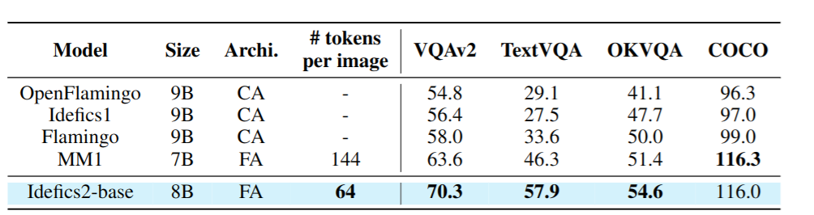
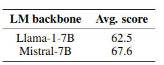
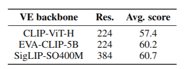
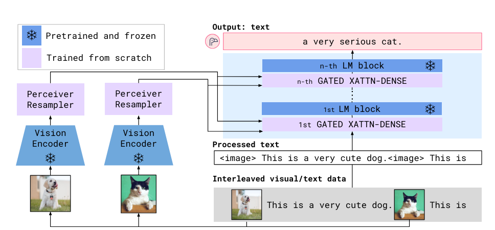
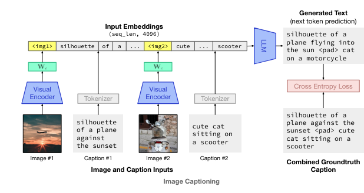
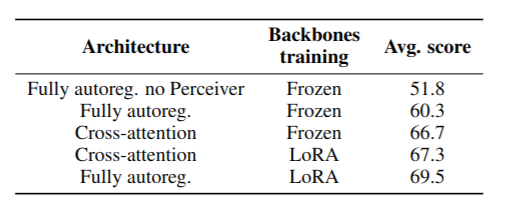
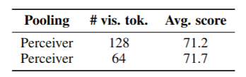
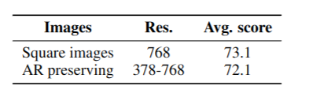
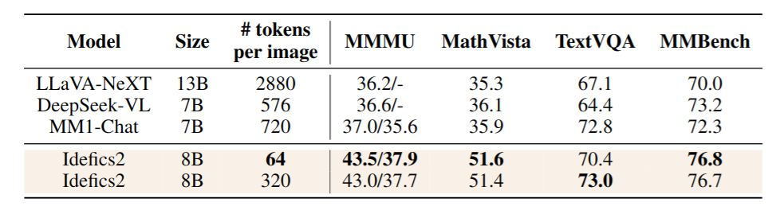

# What matters when building vision-language models?
[https://arxiv.org/abs/2405.02246](https://arxiv.org/abs/2405.02246)
(まとめ @n-kats)

著者
* Hugo Laurençon
* Léo Tronchon
* Matthieu Cord
* Victor Sanh

Hugging Face・ソルボンヌ大学の人達

# どんなもの？
VLM（vision-language model）を作成してその設計方針について調査しまとめた論文。

pretrainモデル・ネットワーク・データ・訓練方法を変えて、効果を検証した。

最終的にIdefics2というモデルを作成した（8Bパラメータ）。ちゃんとチューニングしたことで、4倍のモデル並の性能を達成した。(データも公開)

# 先行研究と比べてどこがすごい？
VLMの論文はそれなりにあるものの、VLMのモデルをどう設計すべきかはちゃんと研究されていなかった。

チューニングして、前回モデルやFlammingoを超える性能を達成した。

# 技術や手法の肝は？
## 実験一覧
* pretrainモデルのbackboneの効果は？
* 画像特徴とテキストの統合は、cross-attention方式と結合方式のどちらがよい？
* 入力解像度・トークン数のトレードオフは？
* 画像の分解の効果は？

## 実験基本設定
4-shot性能を以下のデータセットで評価し、平均を取った。
* VQAv2・・・一般的なVQAデータセット
* TextVQA・・・OCRの評価用データセット
* OKVQA ・・・外部知識を使うVQAデータセット
* COCO ・・・ 画像キャプションのデータセット
で評価

## pretrainモデルのbackboneの効果は?
サイズ・データ・訓練ステップを揃えて、比較した。

### 言語モデルを変更した場合

5ポイントもの差があり、大きな影響がある。

### 画像モデルを変更した場合

言語モデルの変更よりも効果は小さいが、それなりの影響がある。

（他の論文で、画像モデルの影響がかなり大きかったという報告があったが、そもそも訓練が足りていなかっただけだったっぽい）

## 画像特徴とテキストの統合は、cross-attention方式と結合方式のどちらがよい？
### cross-attention方式（Cross-attention）

[https://arxiv.org/abs/2204.14198](https://arxiv.org/abs/2204.14198)より

### 結合方式（Full autoreg)

[https://arxiv.org/abs/2301.13823](https://arxiv.org/abs/2301.13823)より

### 比較結果

重み固定をするかどうかで結果が変わる。
重み固定すると、cross-attentionが有利になる。
そうでないと、若干結合方式が有利になる。

LoRAでないと、発散したらしい。

## 入力解像度・トークン数のトレードオフは？
### トークン数
Perciever方式で、トークンを減らす処理を行った。

トークン数を減らしても、性能は落ちない。むしろ、高速化ができて良い。

### 入力解像度

正方形に拡大していることが多いが、そのままのサイズ・アスペクト比で推論してもそんなに性能が落ちないことがわかった。処理速度的に、正方形に拡大する必要はない。

## 画像の分解の効果は？

画像を４つに分けて、オリジナルと合わせて5つの画像を入力する作戦がある。
性能は上がるが、計算量が増える。特に、文字を読むタスクでは効果がある。

instruction fine-tuning の段階でこれを使うことにした。
さらに、全部の画像で分割をするのではなく、半分だけにした。
このようにすると、推論時に分割画像を入力しなくとも大きな影響はなかった。

## Idefics2
以上の実験をもとにIdefics2というモデルを作成した。

1. (pretrain) SigLIP-SO400MとMistral-7B-v0.1の組み合わせで以下のデータで訓練
  * OBELICS・・・3.5億枚の画像・115Bトークンのテキストからなるデータセット。画像とテキストが交互にあるデータ。
    Spawing APIやFalcon-1Bモデルで一部のデータを除去
  * PMD・・・人間がアノテーションした画像テキストのペアのデータ。
    LAION COCOを使って、一部のデータを除去（NSFWな画像の除去）。
  * OCR-IDL・・・1900万のPDFドキュメントデータ
  * PDFA6・・・1800万のPDFドキュメントデータ
1. (instruction) 「The Cauldron」というデータを作成した
  * 50種の画像・テキストデータを利用
  * テキスト飲みのデータセットも利用
  * DoRAという手法を利用（LoRAの亜種）
  * Q/Aペアに対してロスを計算して学習
  * 細かい工夫
    * NEFTune・・・埋め込みにノイズ追加
    * 画像のランダムリサイズ
    * 文書の順番変更（可能なら）
1. (chat) チャット用のモデルを別に作成（ベンチマーク向けのものは短い回答が期待される）
  * LLaVA-ConvとShareGPT4Vを利用

# どうやって有効だと検証した？
## Idefics2 のスコア

pretrain/instruction 両方のモデルで既存の同サイズのモデルを超える性能を達成した。

## チャットモデルの評価
* blind human evaluations（詳細を伝えず、良し悪しを人間に判断させる）
* adversarial stress-test（敵対的ストレステスト。わざと悪意あるデータを入れる）

# 議論はある？
VLMでよく取られる選択を再実験して調査した。この研究で、より複雑な問題がとけるようになることを期待する。

# 次に読むべき論文は？
* Flamingo
* DoRA