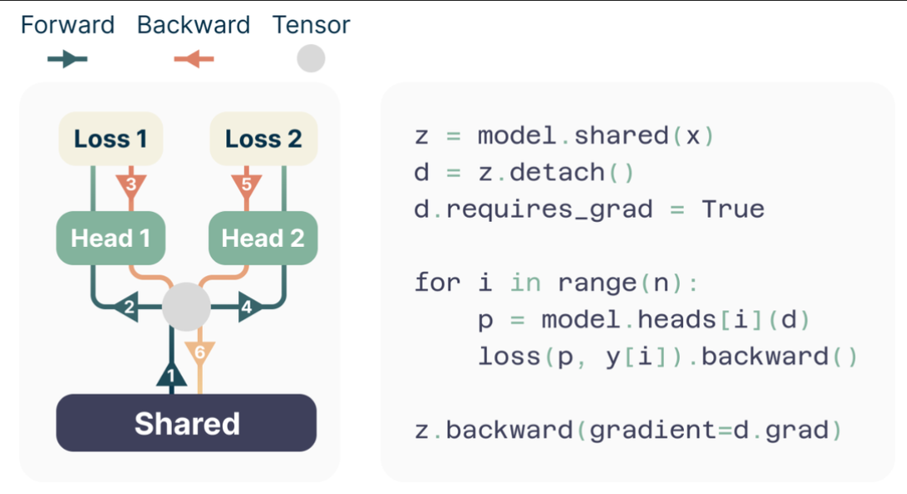
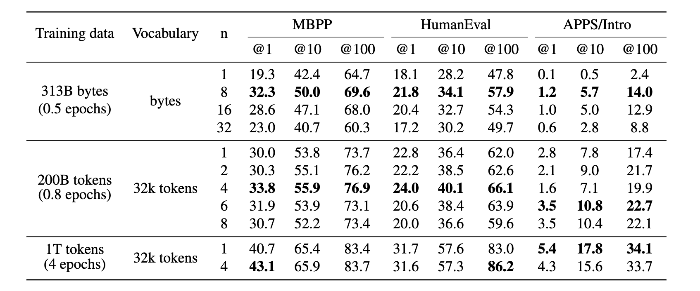
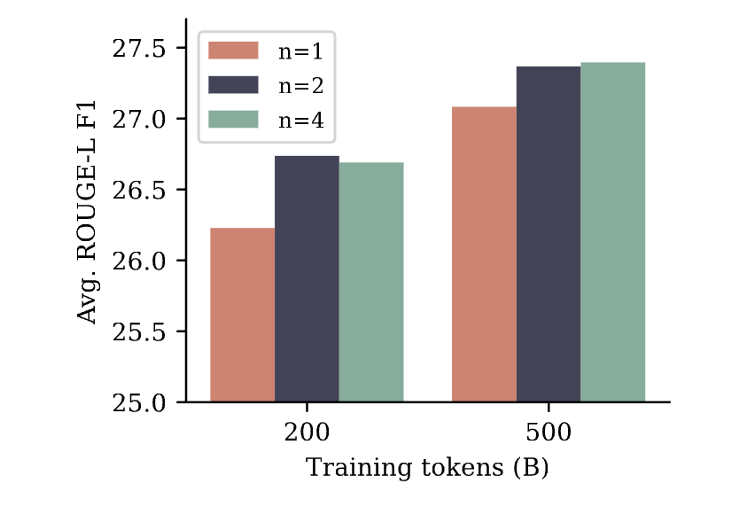
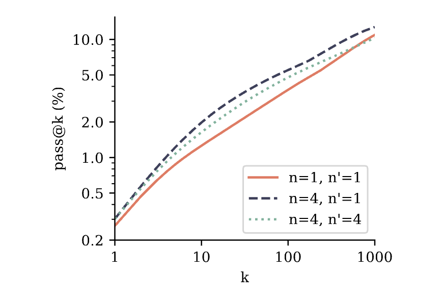
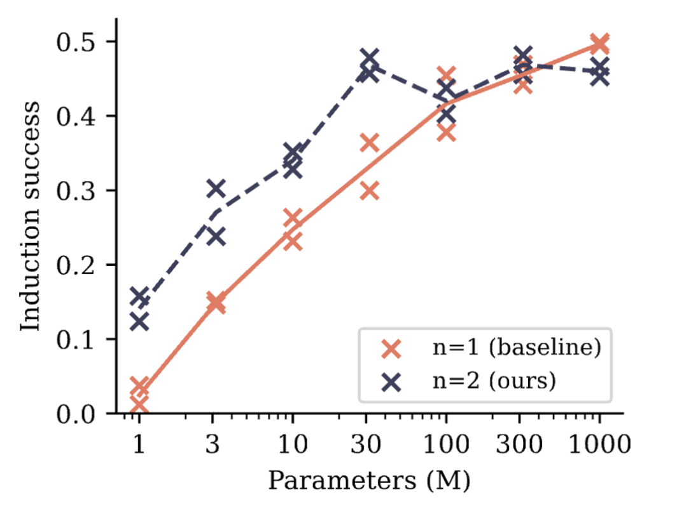
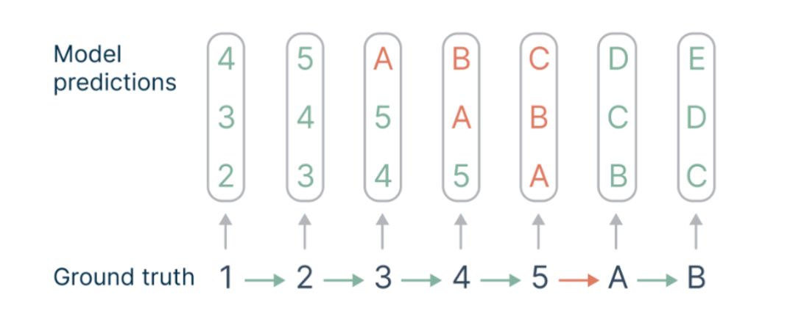

### どんなもの？

マルチトークン予測を用いることで、大規模言語モデルの性能と効率を向上させる手法について述べている

### 先行研究と比べて何がすごい？

- 先行研究
    - 事前学習の際のタスクは入力文字列の次のトークンを逐次予測するタスクがよく用いられていた
    - 入力に対して直近の1トークンを予測するタスクだったために広範囲での文脈理解能力に関しては改善の余地が大きかった
    - 入力に対して次の1トークンしか予測しないため、推論時の計算効率が悪かった
- 提案手法
    - 1つの入力に対して複数トークンの予測をするようにした
    - モデルが考慮する文章範囲が広がることによって論理的な理解力が向上
    - 一度に複数トークンを予測できるようになったことで、推論効率が向上 (推論速度が最大3倍)

### 技術や手法の肝は？

- 1つの入力に対して複数のトークンの予測結果をつくり、損失関数を計算している点
- 一度にすべての予測トークンのロスを逆伝播させるのではなく、一旦途中で止めて累積してから伝搬させることでGPUメモリの節約をしている点

### どうやって有効だと検証した？

- n-token predictionタスクにおいてpass@kを比較することでベースラインと比較して優位性があることを示した
- 要約タスクにおいてROUGE F1を比較することでベースラインと比較して優位性があることを示した
- 提案手法を使って事前学習したモデルをさらにfine-tuneしても性能が向上した

### 議論はある？

文脈を理解した推論の能力について

モデルサイズが小さいときには明確に提案手法の性能が優れているが、モデルサイズが大きくなるにつれてその差が縮まっている。これは、複数トークンを予測させることによってモデルが得る推論能力が、モデルサイズを大きくすることによっても得られるものである可能性を示している。

なぜ複数トークンを予測するタスクにすることで推論能力が上がる？

文章には、next tokenを予測するのが簡単な部分もあれば難しい部分もある(e.g. 段落の切れ目)。n-token predictionにすることによってロスにしめる予測が難しい部分の割合が増加し、今まで困難だった部分の推論能力が向上したのでは？

### 次に読むべき論文は？

- multi-token predictionの先行研究：
    - https://arxiv.org/pdf/2001.04063