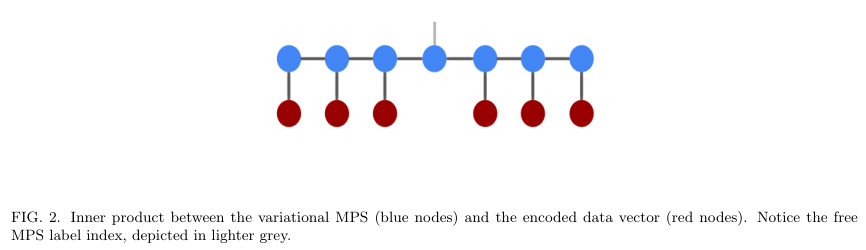
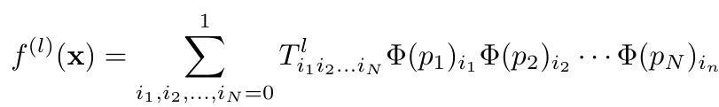
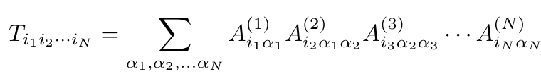
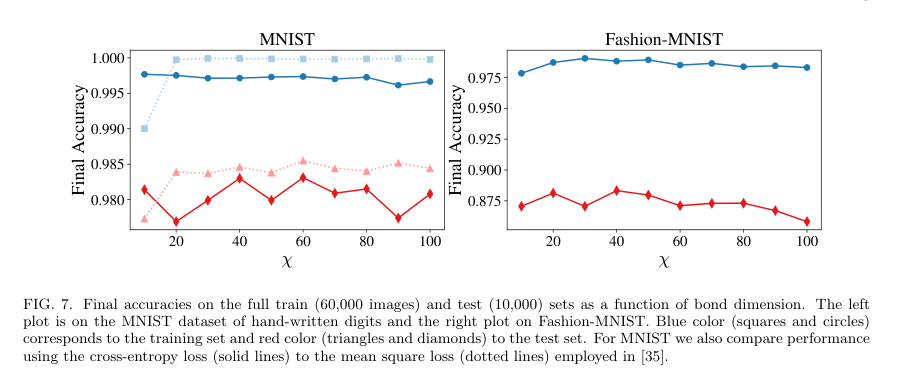
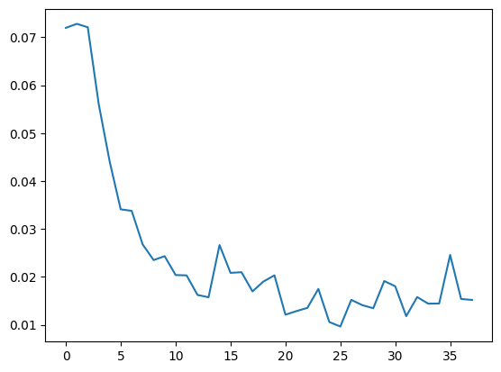

# TensorNetwork for Machine Learning

論文: [https://arxiv.org/abs/1906.06329](https://arxiv.org/abs/1906.06329) [7 Jun 2019]


（まとめ @derwind）

- 著者
    - Stavros Efthymiou ${}^{1,2}$, Jack Hidary ${}^1$, Stefan Leichenauer ${}^1$
- 所属
    - ${}^1$ Alphabet (Google) X
    - ${}^2$ Max-Planck-Institut für Quantenoptik

## どんなもの？

- テンソルネットワークを使った画像分類モデル (for MNIST)
- ベースとなっている論文 arXiv:1605.05775 [Supervised Learning with Quantum-Inspired Tensor Networks](https://arxiv.org/abs/1605.05775) では、機械学習と統計物理学の結びつきの評価を踏まえ、物理学の計算技術の成果を機械学習に適用した。
- 前述 arXiv:1605.05775 では「DMRG (密度行列繰り込み群) アルゴリズム」という計算物理の（従って機械学習の実践者には一般には馴染のない）手法が使われていたが、自動微分による勾配計算を用いた、より ML 的なものに改めた。

## 先行研究と比べてどこがすごい？

- ML の実践者には馴染み深い手法が使われることで、ML の実践者が取り組みやすくなった。

## 技術や手法の肝は？

- 画像データ $\mathbf{x} = (p_1, \ldots, p_N) \in [0, 1]^N$ を特徴マップ $\Phi$ で高次元特徴空間 $\mathbb{R}^{2^N}$に埋め込んで得た高次元ベクトル

$$
\begin{align*}
\Phi(\mathbf{x}) = \Phi(p_1) \otimes \cdots \otimes \Phi(p_N) \in \mathbb{R}^{2^N}
\end{align*}
$$

$\ \quad$ を線型分類する。ここで、 $\Phi(p) = (1-p,\ p)^T$ とする。
- 数字に対応する（パラメータを持つ）重みベクトル $W^0$, $W^1$, ..., $W^9$ を訓練しておいて、内積

$$
\begin{align*}
f^{\ell} (\mathbf{x}) = W^{\ell} \cdot \Phi(\mathbf{x}) \quad\quad (0 \leq \ell \leq 9)
\end{align*}
$$

$\ \quad$ の値が一番大きいもの $\arg \max_{\ell} f^{\ell} (\mathbf{x})$ を分類結果とする。
- 損失関数はマルチクラスクロスエントロピー損失。

### 補足

非常に高次元のベクトル空間での内積計算を行う形ではあるが、実際には比較的軽量の計算でできる（ようなシチュエーションを考える）。

**内積計算の模式図**:



赤紫のノードが特徴空間のベクトル $\Phi(p_j)$ に対応していて、横線で繋がった青いノード群が重みベクトル $W$ が「うまいことテンソルネットワークで（近似）表現できた」形状に対応する。

**実際の計算**:

内積計算は「テンソルの縮約計算」というもので実行される。



ここで、



計算の疑似コード:

```python
p1, p2, p3 = feature_map(x)  # x は画像を平坦化したもの

# A1,A2,A3 は多次元リスト、p1,p2,p3 はベクトル (1次元リスト)
logits = torch.einsum(
    "ia,jabL,kb,i,j,k->L", A1, A2, A3, p1, p2, p3)
output = F.log_softmax(logits)
...
```

## どうやって有効だと検証した？

- MNIST および Fashion-MNIST のテストセットで精度評価。



## 議論はある？

- テンソルネットワークをより伝統的な手法と組み合わせることで、最先端をさらに推し進めることができるかもしれない。

## 次に読むべき論文は？

### 元になっている論文

- _Supervised Learning with Quantum-Inspired Tensor Networks_: https://arxiv.org/abs/1605.05775

### テンソルネットワークの他の ML 領域への応用例

**ニューラルネットワークの圧縮**

- _Tensorizing Neural Networks_: https://arxiv.org/abs/1509.06569
- _CompactifAI: Extreme Compression of Large Language Models using Quantum-Inspired Tensor Networks_: https://arxiv.org/abs/2401.14109

**説明可能な人工知能 (Explainable Artificial Intelligence:
XAI)**

- _Tensor networks for interpretable and efficient quantum-inspired machine learning_: https://arxiv.org/abs/2311.11258
- _Tensor Networks for Explainable Machine Learning in Cybersecurity_: https://arxiv.org/abs/2401.00867

## 実験

オリジナルは TensorFlow 2.0? ベースの実装だったが、PyTorch 2.3.0 でも実装して試してみた。

1 エポックの訓練と評価で以下のような結果になった。



> ...
> Train Epoch: 1 [59200/60000 (99%)] Loss: 0.015644
>
> Test set: Average loss: 0.0131, Accuracy: 54402/60000 (90.67%)

注意として、重みをランダム初期化すると大体失敗した。公式実装が提供されているので、それに倣うのが無難そうであった。
