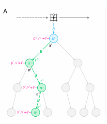
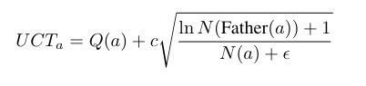
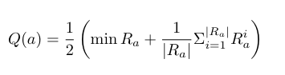
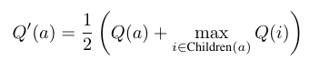
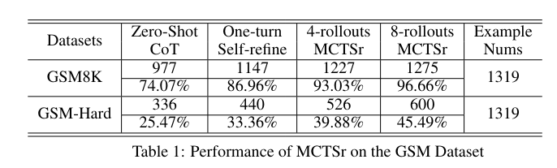
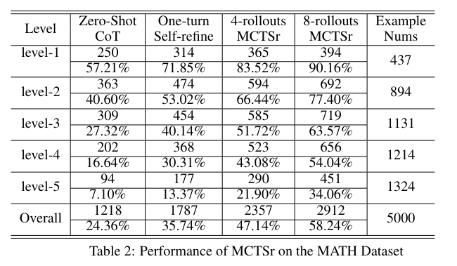
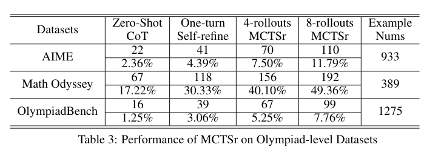
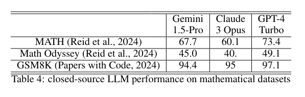

# Accessing GPT-4 level Mathematical Olympiad Solutions via Monte Carlo Tree Self-refine with LLaMa-3 8B
[https://arxiv.org/abs/2406.07394](https://arxiv.org/abs/2406.07394)
(まとめ @n-kats)

著者
* Di Zhang
* Xiaoshui Huang
* Dongzhan Zhou
* Yuqiang Li
* Wanli Ouyang


# どんなもの？
モンテカルロ木探索を用いて、数学能力を大幅に上げることができることを示した論文（その手法をMCTSrと呼んでいる）。

GPT-4レベルの性能をLlama-3 8Bで達成した。

# 先行研究と比べてどこがすごい？
数学×LLMの研究では、
* 数学特化のデータ・モデルをつくる（LLemma）
* 解答作成のワークフローを工夫する（$ReST^{EM}$, 外部ツール利用）
* LLMを評価するデータセットを作る（MathVista, GPQA）

のようなものがある。この研究は、ワークフローの工夫として、モンテカルロ木探索を用いている。

モンテカルロ木探索を数学×LLMに適用する研究はすでにある。
* [Alphamath](https://arxiv.org/abs/2405.03553)
* [https://arxiv.org/abs/2309.03224](https://arxiv.org/abs/2309.03224)

これらの手法は、自己改善・自己評価をモンテカルロ木探索の枠組みにそこまでうまく混ぜ込めていない（と言っている）。

# 技術や手法の肝は？
## MCTSr 基本的なアイデア

)

* 各ノードが数学の解答になるような木をモンテカルロ木探索の枠組みで作成する
* 親ノードの解答を自己改善して、子ノードを作成する
* 新しいノードを評価する（-100～100の点をつける）
* 新しい評価値を親ノードにフィードバックする
* これを繰り返す

## おさらい（モンテカルロ木探索）

[MuZero回の解説](https://github.com/mlnagoya/surveys/blob/master/20200116_reports/muzero_1911.08265.md#%E3%83%A2%E3%83%B3%E3%83%86%E3%82%AB%E3%83%AB%E3%83%AD%E6%9C%A8%E6%8E%A2%E7%B4%A2)

AlphaGo 登場前の囲碁で採用され棋力を向上させた手法。確率に基づいてランダムにゲームを進行させ、その結果で勝てそうな手かを判断する。（MuZeroは各ノードに盤面の潜在ベクトルをあてはめる）



* ノードの選択
* 子ノードの生成
* 新ノードの評価
* 評価値のフィードバック

を繰り返す。

## notataion
* P: 問題
* A: ノードの集合。Ｐの解答の集合。
* a: Ａの要素。ノード。
* M_a: ノードaからの自己改善の方針（改善方針だけ）
* R_a: ノードaの評価の集合
* Father(a): ノードaの親ノード
* Children(a): ノードaの子ノード
* N(a): ノードaの訪問回数 = |R_a|
* Q(a): ノードaの評価値（子ノードたちの評価も反映された値）

## 初期化
最初の解答は、普通に生成いするか、「I don't know.」のようなダミー解答を用いる。

## 選択
選択方法は、場合によって変わる。今回は、



の値が最大のものを選ぶ方式を採用。

（他の手法と違って、LLMのコストが高く、ランダム要素は持たせていない？）

## 自己改善
いきなり改善するのではなく、一度、改善案を生成する（M_a）。


### 改善案の生成のプロンプト（ChatGPT訳）

```
ユーザー: 現在の回答が不十分なため、この回答を修正するための反省やフィードバックを提供してください。この回答を厳密に分析し、すべての欠点を指摘し、すべての可能な欠点ごとにスコアをマイナスしてください！
ステップバイステップで考えましょう。
```

### 改善のプロンプト（ChatGPT訳）

```
ユーザー: 反省やフィードバックに基づいて回答を改良してください。応答は[推論プロセス]...[検証]...で始まり、[最終回答] 答えは[回答式]で終わるべきです。
ステップバイステップで考えましょう。
```


## 評価（新しいノードのQの計算）
新しいノードの-100～100の値で評価を行う（複数取得）。

この値を以下の式で統合して、Qを計算する。



### 評価のプロンプト（ChatGPT訳）

```
ユーザー: 質問: question
回答: ans
この回答を厳密に分析し、すべての欠点を指摘し、すべての可能な欠点ごとにスコアをマイナスしてください！評価の際には非常に厳しく、完璧なスコアを絶対に与えないようにしてください。スコアの信頼性を確保するために、-100から+100の間でスコアを出力してください。
応答形式:
[分析者]...[スコア]...
```

（このプロンプトがうまく機能するかが重要そう）

## 逆伝播（親ノードのQの更新）

以下の式で、親ノードのQを更新する。




## 終了条件

* Early stopping（改善が見えられない場合）
* 上限到達（depthなど）
* 目標達成

終了したら、Qの値などを使って、最終的な解答を選択する。

# どうやって有効だと検証した？
LLaMA3-8Bで実施。ロールアウト設定を4と8に設定。

データセットは、
* GSM8k ・・・ 小学校算数の問題
* [GSM Hard](https://huggingface.co/datasets/reasoning-machines/gsm-hard)  ・・・ GSM8kを難しくしたもの
* MATH ・・・高校数学の標準的な問題
* [AIME](https://huggingface.co/datasets/qq8933/AIME_1983_2024)・・・[数学オリンピックのアメリカ予選](https://artofproblemsolving.com/wiki/index.php/AIME_Problems_and_Solutions)
* [Math Odyssey](https://github.com/protagolabs/odyssey-math/tree/main) ・・・高校生の競技数学の問題から大学レベルの問題まで
* [OlympiadBench](https://github.com/OpenBMB/OlympiadBench) ・・・ 国際数学オリンピックの問題や中国の大学入試の難問がある

## GSM



基本的な問題とはいえ、MCTSrの有無で大きなギャップがある。
zero-shotだとGPT-4と大差があったが、MCTSrを使うことで、GPT-4と同等の性能を達成した。

## MATH



いずれの難易度でも効果が見られる。
MCTSr を使ってもボチボチ劣る結果。

## 数学オリンピック系



1,2％しか正解できない状態から、少しましなレベルになった。Math Odysseyだと、GPT-4相当である。

## 他モデル



# 議論はある？
closedなSOTAモデルをopenで軽いモデルで同等を達成できた。

一般の意思決定の場面にも応用できるようにしたい。

## 私見
モンテカルロ木探索を使う方法で面白い。ToTと似ているが、ToTは逆伝播時にもLLMでコメントするようなやり方だった気がする（スコアではない）。

たしかに効果があるように見えるが、盆ミスが減らせるというレベルの効果かもしれない。
数学オリンピック系の問題とはいえ、予選の簡単な問題を拾えるようになっただけかもしれない。

ロールアウトの回数をもっと増やしたらどうなるのかとか、気になる点が多い。


# 次に読むべき論文は？
* MCTを使った他手法
  * [Alphamath](https://arxiv.org/abs/2405.03553)
  * [https://arxiv.org/abs/2309.03224](https://arxiv.org/abs/2309.03224)