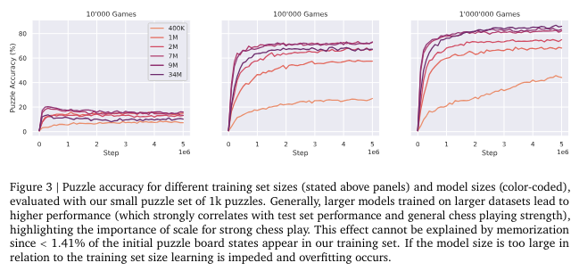
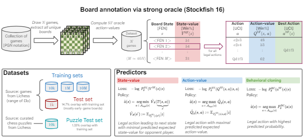
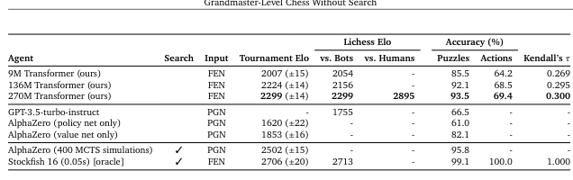
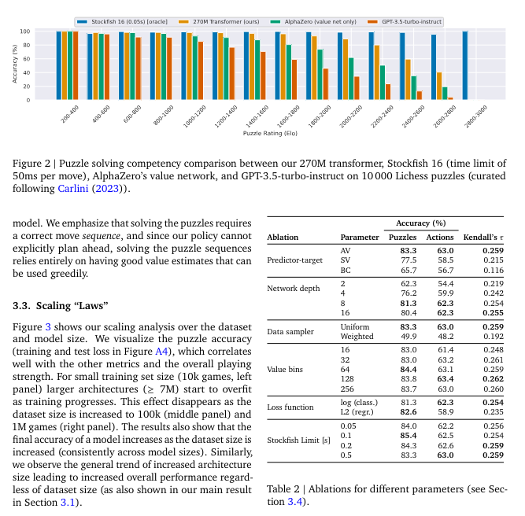

## Grandmaster-Level Chess Without Search

### どんなもの？

教師あり学習で、チェスで”探索なし”でつよつよTransformerベースモデル

### 先行研究と比べて何がすごい？

- 先行研究
    - chess,碁といったら、探索、強化学習（自己対戦のイメージ）
- 提案手法
    - Lichess (lichess.org) から1,000 万対局をダウンロード
    - Stockfish 16 を使用して、行動価値、状態価値、最善手を取得して、transformerで学習

### 技術や手法の肝は？

- scsling規則がchessで当てはまるか検証＞当てはまる

- 探索なしでつよつよ
- 

### どうやって有効だと検証した？

- 指し手の一致率(Action-accuracy)
- 行動価値？のKendall の 𝜏
- パズルの精度
- Lichessで人間のみまたはボットのみを相手に Blitz 対戦

### 議論はある？

Stockfish 16　で一部強化学習つかっているようなことをchatgptが言ってた。これつかってないともっとすごいな思った

### 次に読むべき論文は？（ちょっと適当すぎたかも、関連論文ってことで記載）

- mAlphaZeroES: Direct score maximization outperforms planning loss minimization：
    - https://arxiv.org/abs/2406.08687
  - Accurate structure prediction of biomolecular interactions with AlphaFold 3
  - https://www.nature.com/articles/s41586-024-07487-w