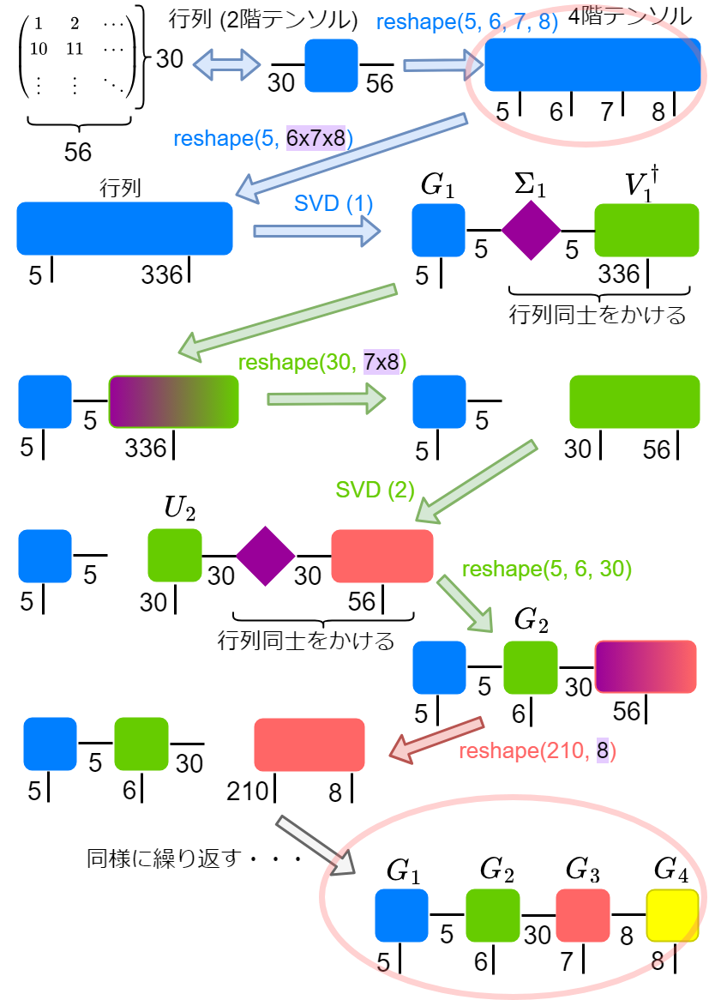
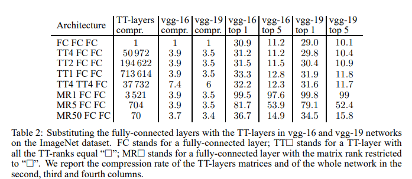
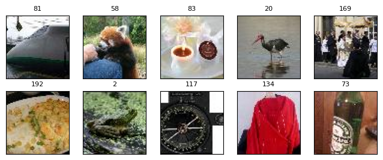

# Tensorizing Neural Networks

論文: [https://arxiv.org/abs/1509.06569](https://arxiv.org/abs/1509.06569) [22 Sep 2015]

（まとめ @derwind）

- 著者
    - Alexander Novikov ${}^{1,4}$ Dmitry Podoprikhin ${}^1$ Anton Osokin ${}^2$ Dmitry Vetrov ${}^{1,3}$
- 所属
    - ${}^1$ Skolkovo Institute of Science and Technology, Moscow, Russia
    - ${}^2$ INRIA, SIERRA project-team, Paris, France
    - ${}^3$ National Research University Higher School of Economics, Moscow, Russia
    - ${}^4$ Institute of Numerical Mathematics of the Russian Academy of Sciences, Moscow, Russia

## どんなもの？

- ディープニューラルネットワーク（DNN）は多くの分野で最先端の性能を発揮する一方で、計算リソースを大量に消費
- 特に、一般的に使用される全結合層には大量のメモリが必要
- 全結合層の重み行列を **分解して** Tensor Train フォーマットに変換することで、パラメータ数を大幅に削減 + 同時に層の表現力を維持
- VGG のネットワークについて、重み行列のパラメータ数を1/200000 まで落とし（e.g., 25088×4096 の行列サイズの全結合層のパラメータ数を 528 にまで削減）、全体のモデルサイズを 1/7 にまで圧縮

## 先行研究と比べてどこがすごい？

**既存手法**

- 低ランク近似 (e.g., $W = AB$; $W \in Mat(m,n)$ 行列（パラメータ数: $mn$）を $A \in Mat(m,r)$ と $B \in Mat(r,n)$ （パラメータ数: $r (m + n)$）に分解 / 特異値分解: $W = U \Sigma V^\dagger$ / CP 分解)

- ハッシュ技術: 全結合層の要素 $(a_{ij})$ をハッシュ関数でグループ化して、グループごとに値を共有する（重み共有）

**本研究**

- 低ランク近似のアイデアを一般化
- 低ランク近似の代わりにテンソルトレイン分解アルゴリズムを適用する。

**優位性**

- テンソルトレイン分解に既に成功例がある
- 従来よりも多くの隠れユニットを使用できる（多くの隠れユニットによる表現力の向上を狙えるかも）
- 他の幾つかの類似手法では次元の呪いにかかるが、本手法は次元に関してロバストである

## 技術や手法の肝は？

- 全結合層の重み行列をテンソルトレイン分解し、“結合次元” を下げることでモデル圧縮を行う
    - 本手法を 2 階テンソル = 行列に適用した場合、低ランク行列形式（例えば SVD: $W = U \Sigma V^\dagger$）と一致。この場合は「結合次元を下げる = 小さい特異値をカット」
    - 一般には、行列を一旦多階のテンソルに変換する（一意性はない）: 例 $W \in Mat(30, 56)$ の場合、`W.reshape(5,6,7,8)` を適用すると 4 階のテンソルになる

[参考: 概念図]

入力ベクトルとの計算について:

1. 30 次元のベクトル (1階テンソル) を `reshape(5, 6)` で2階テンソルに変換
2. `einsum` で青と緑のテンソルとの間で計算すると、赤と黄色のテンソルから2階テンソルとして出力を得られる
3. これを `flatten` すると、56 次元のベクトルになる
4. 入出力だけをみると、サイズ 30x56 の行列を作用させた形

## どうやって有効だと検証した？

**TT-Layer のパラメータ数について**

- MNIST データセットの手書き数字認識タスクで実験（32x32 にリサイズ）
- `Linear(in=1024, out=1024) - ReLU - Linear(in=1024, out=10)` の短いネットワークで、最初の 1024x1024 の行列をテンソルトレイン分解して実験

- HashedNet（ハッシュ技術を用いて重み共有を行うネットワーク）との比較

**CIFAR-10**

- CIFAR-10 Quick CNN なる既存のネットワークをベースラインに使用。全結合層をテンソルトレイン分解してエラー率を観察。

**ImageNet**

VGG の全結合層を設定したランク (1, 2, 4) のテンソルにまで分解した時のエラー率を観察:

## 議論はある？

- CIFAR-10 の結果から、非畳み込みニューラルネットワークの SOTA を達成
- 対応する全結合層と比較して推論時間が速い
- 広く浅いテンソルネットワークは、リアルタイムアプリケーションやモバイルデバイスで使用するための、時間とメモリの効率的なモデルになり得る
- [課題] $M \times N$ 重み行列 の $M$ と $N$ に対する依存性があるので解消したい

## 次に読むべき論文は？

- _CompactifAI: Extreme Compression of Large Language Models using Quantum-Inspired Tensor Networks_: https://arxiv.org/abs/2401.14109

## 実験

- Stanford の「Tiny-Imagenet-200」という 64x64 のサイズの画像からなる 200 クラスのデータセットを用いた。

**ベースラインモデル**

- VGG16 を「転移学習」+「ネットワーク全体を訓練可能にしてファインチューニング」の2段階で訓練
- 検証精度 Top-1: 52.2%、Top-5: 76.9%
- ネットワークサイズ約 120MB

**テンソルトレインによる枝刈り後**

- 検証精度 Top-1: 48.4% (3.8%↓)、Top-5: 74.6% (2.3%↓)
- ネットワークサイズ約 73MB (モデルサイズ 40%↓)
- (オマケ: Grad-CAM による局所的説明にも大きな影響はなさそうだった)
