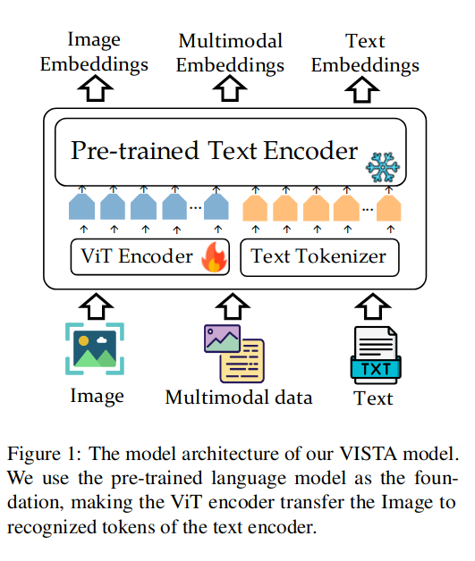
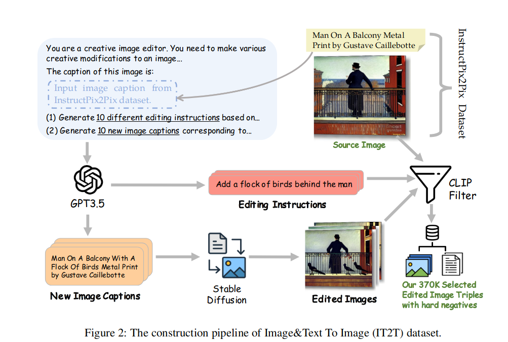
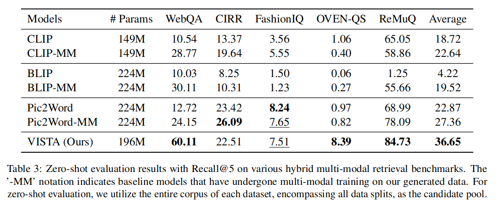

VISTA: Visualized Text Embedding For Universal Multi-Modal Retrieval
======

Junjie Zhou, Zheng Liu, Shitao Xiao, Bo Zhao, Yongping Xiong

https://arxiv.org/abs/2406.04292
Accepted to ACL 2024 main conference

@cohama

## どんなもの

- Vision-Language のためのよりよいエンコーダモデル VISTA を提案

## 先行研究と比べて何がすごい?

- Vision-Launguage モデルの一種。代表的なものだと CLIP がある。
  - これらの VLM はテキストの表現力が弱い。
  - 画像とテキストを独立に符号化しているが結合した表現ができていない

## 技術や手法の肝は?

### モデルアーキテクチャ

### Image&Text to Image (IT2I) データセット生成

InstructPix2Pix と同じように画像編集のデータセットを自動生成する。

InstructPix2Pix との違いは同時に10個の異なる編集画像を作る部分。

異なる10個の編集画像はそれぞれのペアがハードネガティブとして扱われる。

### Text to Image&Text (T2IT) データセット生成

1. キャプション付き画像のデータセット (ShareGPT4v) を用意 (C, T)
2. キャプション C を GPT-3.5 に突っ込んでより詳細な文書 T を作る
3. キャプションの文書 D と画像 I を GPT-3.5 に突っ込んで検索するためのクエリ Q を作る
4. Q を入力として I と T を選ぶようなデータセットになる

### Two-stage Training

1. 最初は Contrastive Learning で ViT を訓練する (Laion-2B を使用)
2. マルチモーダル訓練をする (IT2I と T2IT を使用)

## どうやって有効だと検証した？

## 議論はある?

* IT2I データセットは Stable Diffusion を使って画像を生成しているが、データセットの多様性以上にはデータが増えていない可能性がある
* 画像を直接トークンとして Text Encoder に突っ込んでいるが、トークン長を固定にしている。これを可変長にできるとより効率的になる

## 次に読むべき論文

- CLIP: https://arxiv.org/abs/2103.00020
- Pic2Word:
- InstructPix2Pix:
