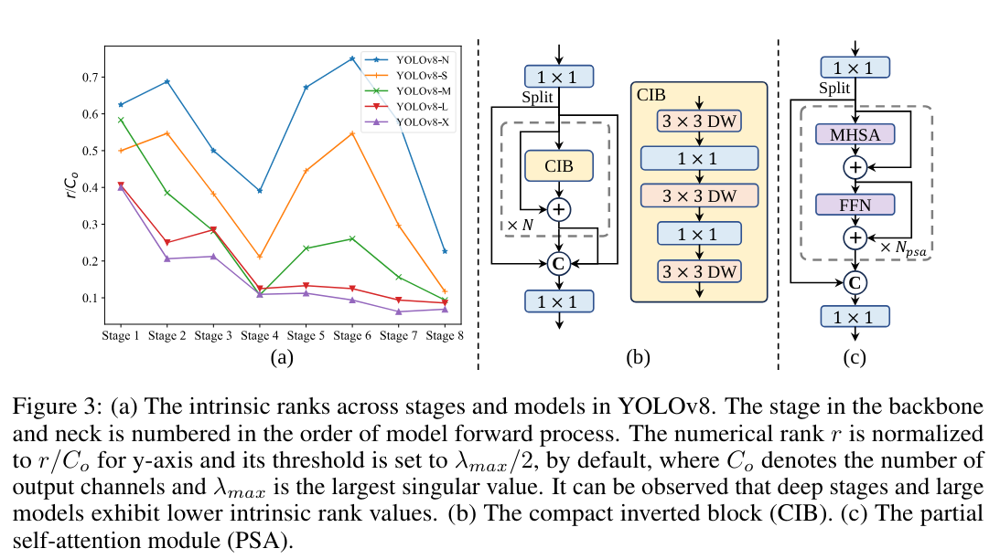
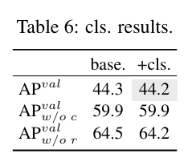
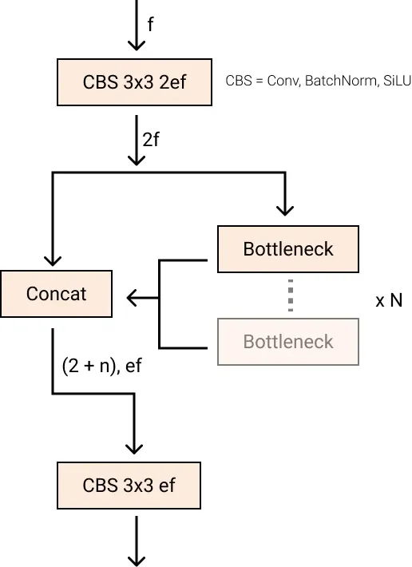

# YOLOv10: Real-Time End-to-End Object Detection

https://arxiv.org/abs/2405.14458

(まとめ @masahiro6510)
### 出版年月
2024年5月

### 著者

(清華大学の人達) Ao Wang, Hui Chen, Lihao Liu, Kai Chen, Zijia Lin, Jungong Han, Guiguang Ding

## どんなもの？
- yoloの最新版。
- 既存のYOLOのNMSの推論レイテンシー、モデルアーキテクチャを見直して効率化した。

## 先行研究と比べてどこがすごい？
- 既存のYOLOの問題点
    - NMSが推論レイテンシーに悪影響を与える。
    - 各種コンポーネントに冗長性があり、パフォーマンス改善の余地がある。
- 本研究では、後処理とモデルアーキテクチャの両方から上記の問題に対応して効率的なエンドツーエンドのモデルを提案
    - NMSフリーな手法を提案
    - モデルアーキテクチャの見直し
- 提案したYOLOv10モデルは、YOLOv9と比較して良い性能のモデルになった。

## 技術や手法のキモはどこ？

### NMS-free学習における一貫性のあるDual Assignments
- YOLOv10より前
    - 1対多で正事例を割り当てて推論処理後にNMSを行っていた。このやり方だとNMSに依存するので推論効率が低下する。
    - これを解決するために1対1の割当も提案されているが、これも推論オーバーヘッドを引き起こすか、精度低下につながっていた。
        - 教師データの情報を十分に活用出来ないため（ちゃんと理解できていないが、<https://arxiv.org/abs/2211.12860>に書いているらしい）
- 提案手法
    - 2重のラベル割り当て

        

        - 1対多の割当と1対1の割当の良い所取りのような手法。YOLOモデルに別の1対1のヘッドを追加し、最適化目標を維持しつつ1対1の割当を利用する。
        - 訓練中は両方のheadを同時に最適化して、推論時には1対1のheadのみを利用して、推論オーバーヘッドを最小限にする。
        - 一貫したマッチング指標
        - 割当時には1対1と1対多の割当の一致度を定量的に評価する指標。分類スコア、バウンディングボックスの位置、およびインスタンスのサイズを組み合わせて評価する。
### 効率性と精度を両立したモデル設計
従来のYOLOは各コンポーネントに対する包括的な検査が不十分で、無視できない計算冗長性と精度の制約がある。より高効率・高性能にするためにYOLOのモデル設計を考える。

#### 効率駆動モデル設計
- YOLOはstem、ヘッド、ダウンサンプリングレイヤー、基本ビルディングブロックの4つのコンポーネントで構成されている。この中でstemは計算コストが小さいので、他の3つを考える。

- ##### 軽量分類ヘッド
    - YOLOでは通常分類headと回帰headは同じアーキテクチャを共有しているが計算オーバーヘッドには大きな差がある。
        - 例えばYOLOv8-Sでは回帰headに対して分類headはFLOPｓが2.5倍、パラメータ数が2.4倍多い。
    - しかし、回帰ヘッドの方がYOLOの性能に大きな影響を当たる（表6）
        - →分類headを軽量化することでoverheadを削減することができる。
    - 分類headに軽量なアーキテクチャ((3,3)の深さ分離可能な畳み込みとそれに続く(1,1)畳み込み)を採用した。

- ##### 空間-チャネル分離ダウンサンプリング
    - これまでのYOLO
        - (3,3)畳み込みをstride2で利用し、空間ダウンサンプリング(HxWからh/2xW/2)とチャネル変換(Cから2C)を同時に行う。
            - 計算コストがO(9/2 HWC^2)、パラメータ数がO(18C^2)と大きい。
    - 提案手法
        - 空間削減とチャネル増加操作を分離した効率的なダウンサンプリング。
        - pointwise畳み込みでチャネル調整→depthwise畳み込みで空間ダウンサンプリング
            - 計算コストがO(2HWC^2 + 9/2 HWC)、パラメータ数がO(2C^2 + 18C)に削減さる。
            - ダウンサンプリング中に情報保持出来るので、レイテンシ削減と精度を両立。
- ##### ランクガイドブロック設計
    - これまでのYOLOは、通常全てのステージで同じblockを使用していた(例えばYOLOv8のボトルネックブロック)。
    - 

     (yolob8のボトルネック。<https://blog.roboflow.com/whats-new-in-yolov8/>から引用)
    - 各ステージの冗長性を分析するために固有ランク(具体的には、各ステージの最後の基本ブロックの最後の畳み込みの数値ランクを計算し、しきい値を超える特異値の数をカウント)を利用
        - Fig3(a)はYOLOv8の冗長性を示す(小さいほど冗長性がある(無駄が多い))。深いステージや大きなモデルは冗長性がある。
        - →単純に同じブロックを組み合わせるのは最適ではない。
    - ランクガイドブロック設計方式を提案
        - 空間ミキシングに軽量なdepthwise畳み込み、チャネルミキシングにpointwise畳み込みを採用したCIB blockを提案し、これを基本ブロックとする(Fig3(b))。これをELANに組み込む(Fig3(c))。
    ランクガイドブロック配置方式
        - 性能を損なうことなく、効率的なモデルにするためにランクガイドブロック配置戦略を提唱。
        - 処理の流れ
            - モデルが与えられた場合、固有ランクに基づいて全てのステージを昇順に並べ替える。
            - 基本ブロックの置き換えによるパフォーマンスの変動を検査し、元のモデルと比較して性能の劣化がない場合は、その後のステージとモデルスケールの置き換えをする。
    - （Appendixにアルゴリズムの詳細(数式と擬似コード)も書いていましたが、読めていないです）

#### 精度駆動モデル設計
最小限のコストで更なる性能向上を目指して、大カーネル畳み込み、self-attentionを考える。
- ##### 大カーネル畳み込み(large kernel convolution)
    - カーネルサイズを大きくすると、
        - メリット
            - receptive fieldが広くなり、性能が良くなる。
        - デメリット
            - 小さい物体の検出をする際に悪影響がある可能性。
            - 高解像度のステージでは、I/Oオーバーヘッドやレイテンシを引き起こす。
    - 提案手法
        - depthwiseステージ内のCIBで大カーネル畳み込みを活用する。
            - CIB内の2番目の(3,3)depthwise畳み込みを(7,7)にする。
            - 構造的最パラメータ化技術(先行研究の手法)を使用する。
        - モデルサイズが大きくなると何もしなくてもreceptive fieldが広がるので、大カーネル畳み込みを使う利点が小さくなるので、大カーネル畳み込みは小規模モデルの時しか使わない。

- ##### partial self-attention
    - self-attentionは性能は良いが、計算コストやメモリ使用量が大きい。これに対処するために、attention headの冗長性を考慮して、効率的なpartial self-attention(PSA)を提案。
        - 具体的な処理
            - (1,1)畳み込み後に特徴をチャネル全体で均等に2つに分割します。
            - 1部をMHSAブロックに供給し、一部をfeed forward networkに統合。そして、これらを(1,1)畳み込みで連結させる。
            - クエリとキーの次元をMHSAの値の半分に割り当て、LayerNormをBatchNormに置き換え、高速推論を行う。
            - PSAは最低解像度のステージ4以降にのみ配置し、self attentionによる過剰なオーバーヘッドを回避。

## どうやって有効だと検証した？

### COCOデータセットでの実験

（APの列は†が付いていないやつがNMS-freeの結果で、付いているやつがNMSありの手法の結果）

- 先行研究の手法と比べて、レイテンシーを低下させた。また、様々なスケールのモデルで計算コストと精度のトレードオフが優れている。

### アブレーションスタディ
- NMS-freeの導入により、APが0.6%低下するがLatencyが4.63msと大幅に短縮される。
- 効率駆動モデル設計とすることでパラメータ数、FLOPsが大幅に削減される。
- 精度駆動モデル設計にすると、効率駆動モデル設計よりは若干レイテンシーが大きくなるがAPも改善される。

## 議論はある？
- 計算資源が限られていたので、Objects365などの大規模データセットに対するYOLOv10の事前学習は調査していない。
- NMS-freeの手法は、特に小さいモデルではNMSありの手法と比べて性能が悪い。例えば、YOLOv10-NとYOLOv10-SではNMSありのモデルの性能はそれぞれ1.0%AP, 0.5%AP高い。今後、ここの差を埋めるための研究が必要。

## 次に読むべき論文は？
- TAL(既存のYOLOの割当手法)
    - <https://arxiv.org/abs/2108.07755>
    - <https://arxiv.org/abs/2211.12860>
- ランクを冗長性の指標にする話の元ネタ
    - <https://arxiv.org/abs/2206.06072>
