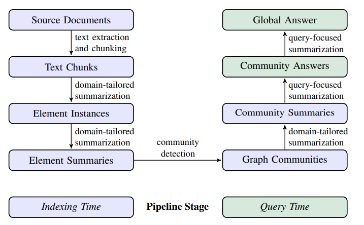
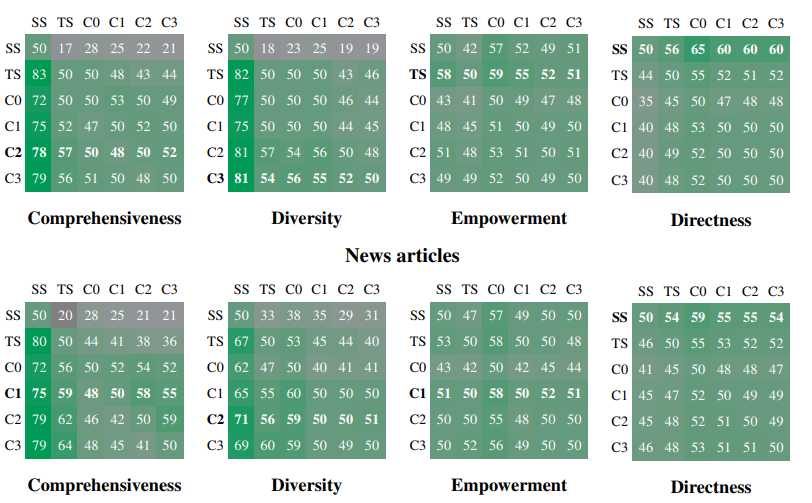

# From Local to Global: A Graph RAG Approach to Query-Focused Summarization
[https://arxiv.org/abs/2404.16130](https://arxiv.org/abs/2404.16130)
(まとめ @n-kats)

著者
* Darren Edge
* Ha Trinh
* Newman Cheng
* Joshua Bradley
* Alex Chao
* Apurva Mody
* Steven Truitt
* Jonathan Larson

マイクロソフトの人たち

# どんなもの？
RAGの新方式GraphRAGを提案。
文章を解析して、要素をもとにグラフを構築してRAGを行う手法。

# 先行研究と比べてどこがすごい？
通常のRAGでは、**狭い範囲** に書かれた情報を取り出すことを想定していることが多かった。

GraphRAGでは、文章データセット全体の要約のような **広い範囲** を取得する必要が有る場合にも備えたRAG手法を提案している。（query-focused summarization（QFS）というらしい）

ライブラリ（[https://github.com/microsoft/graphrag](https://github.com/microsoft/graphrag)）が公開されている。Azure用の利用支援ツールもある。

なお、チュートリアルを手順通り実行したら、$10 取られた。

# 技術や手法の肝は？
## メタアーキテクチャ

* 準備段階（青）
  1. 元の文章群を分割
  1. 要素を抽出して要約・解析
  1. 要素感の関係からグラフを構築
  1. ノードの集まり（community）に対しても要約・解析
* 推論段階（緑）
  1. 回答に適したcommunityを抽出
  1. communityの要約を使ってRAGを行う

## チャンク化（Source Documents → Text Chunks）
1回の推論で入力するサイズに分割する。チャンクのサイズが大きいと、若干漏れが発生する。

実験では、1チャンク600トークンで、100トークンオーバーラップさせていた。

## 要素抽出（Text Chunks → Element Instances）

グラフのノードやエッジになる要素を多段階のLLM推論で抽出する。

1. 要素を、名前・種類・説明を含む形で抽出する。
1. 要素間の関係を推論する

### 工夫
複数回のgleaning（取得）を行うことで、精度を向上させている。

「前回の回答は漏れがたくさんあります。」のようなパワハラ風プロンプトを使う。

## 要素解析（Element Instances → Element Summaries）

要素や関係の説明を作成する。

このとき、同じ意味合いのノードが複数あることがありえる（別の呼び方などで）。その場合、統合はしない（しないほうが検出されやすい）。

## community作成（Element Summaries → Graph Communities）

**Leiden** というグラフの階層的なcommunity構造を構築するアルゴリズムがあって、それを用いる。
この手法は、大きなサイズのグラフで効果的に機能する。

## community解析（Graph Communities → Community Summaries）

communityの要約を作成する。

* leaf-leval community
 * 素朴に個別の要素の要約をトークン上限まで集めて要約を作成する。
* higher-level community
 * 低レベルの要約を使って、要約を作成する。

## 推論時（Community Summaries → Community Answers → Global Answer）

1. （準備）communityの要約をシャフルして、その順で結合した後、チャンクに分割する。・・・均等になるように
1. （community内の回答作成）communityの要約をつかって、回答を作成する。このとき、有用性を0〜100で評価する。
1. （全体の回答作成）有用性が高いものから順に、回答を組み合わせて、最終的な回答を作成する。

# どうやって有効だと検証した？
* Podcastの原稿・・・1669チャンク分
* ニュース記事・・・3197チャンク分

を使って評価。

## 評価条件
* C0: root-levelのcommunityの要約を使って回答
* C1: high-levelのcommunityの要約を使って回答
* C2: 中間-levelのcommunityの要約を使って回答
* C3: leaf-levelのcommunityの要約を使って回答
* TS: グラフを介さずに、元の文章を使って回答
* SS: naive RAGの方法で回答

## 評価項目
* Comprehensiveness:  回答がどれだけ情報を含んでいるか
* Diversity:  回答がどれだけ多様な情報を含んでいるか
* Empowerment:  回答がどれだけ有用な情報を含んでいるか
* Directness:  回答がどれだけ直接的か

をLLMで評価した。

## 評価結果
勝率（縦軸が横軸に勝つ確率）は以下の通り。

課題やデータによって、どの手法が良いかが変わる。

広い範囲を見ないといけないComprenhensivenessやDiversityでGraphRAGが有効だった。

一方で、Directnessでは、GraphRAGが劣っていた（SSが勝っている）。

# 議論はある？
QFSで問われるComprenhensivenessやDiversityに強い手法を提案した。

2つのデータセットでしか評価できていない問題がある。

グラフに更に情報を乗せることで改善ができるのではないか。

# 次に読むべき論文は？
* Leiden