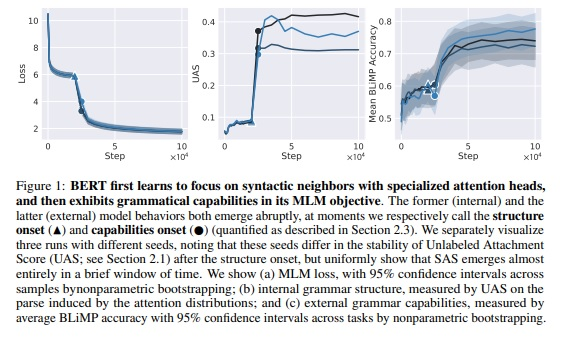
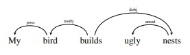
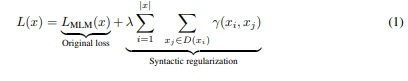
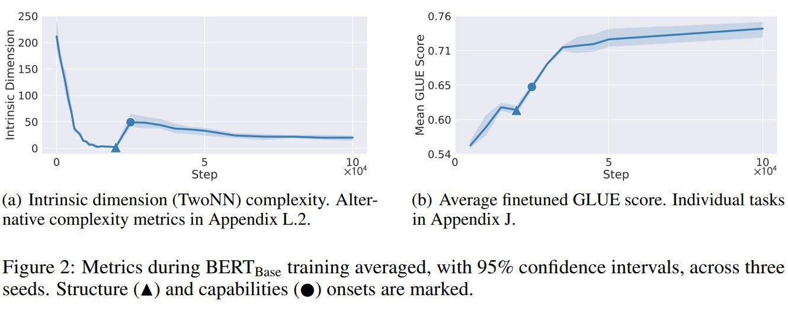
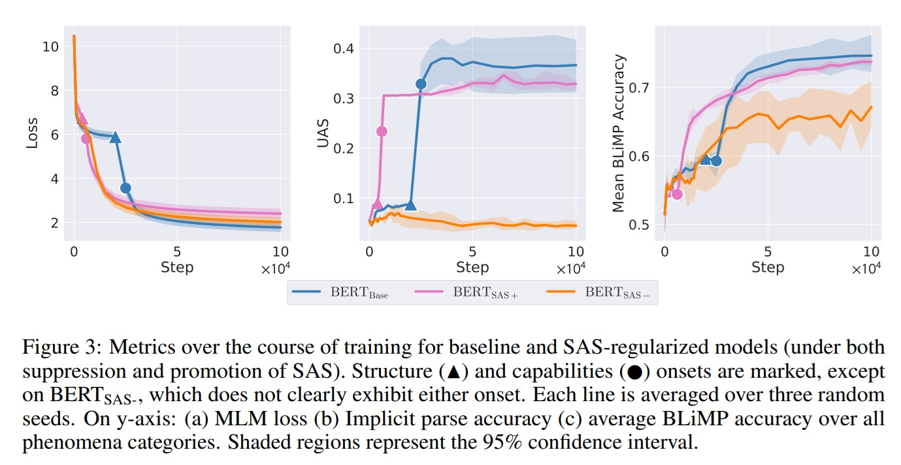
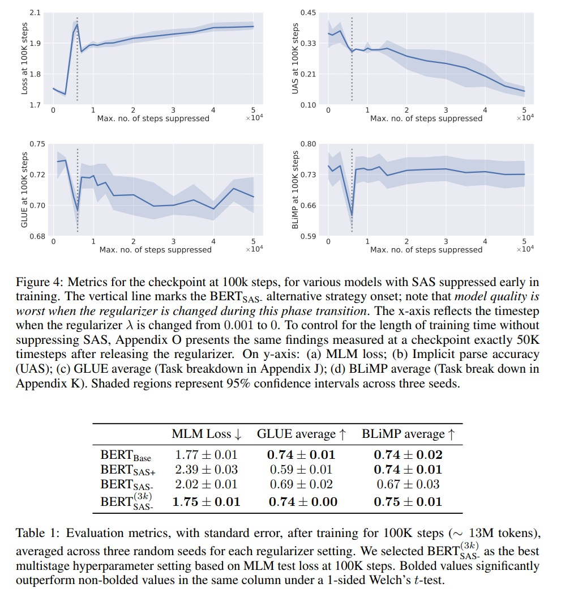

## SUDDEN DROPS IN THE LOSS: SYNTAX ACQUISITION, PHASE TRANSITIONS, AND SIMPLICITY BIAS IN MLMS

Angelica Chen1 Ravid Shwartz-Ziv1 Kyunghyun Cho1,2,3
Matthew L. Leavitt4 Naomi Saphra5

NYU Genentech CIFAR LMB DatologyAI Kempner Institute, Harvard

Masaaki Saito

### どんなもの？

transformerの内部動作を理解する系論文。学習途中の経緯観察。
文章理解するなかでの文法理解の注意機構に注目、介入し、変化を確認、考察してえいる。

「ブレークスルー（突破口）」、「エマージェンス（出現）」、「ブレイクス（急変）」、「フェーズ・トランジション（相転移）」などと呼ばれる能力の急激な変化に焦点を当てた

文法能力　、　相転移　、単純バイアス　について考察

### 先行研究と比べて何がすごい？

- 先行研究
    - 解釈可能性の今までの研究の多くは、最終的な学習済みモデルのみを使用している。
    　例えば,HeyIntheStackでキーワード見つけるattentonがあるという論文がそうか？
    　4桁の足し算をする能力の調べるものでは、各桁の足し算ができるようになり、その後キャリーができるように
    　なる話もあったので、学習途中見ていたとは思う。
    - SASが生まれる等の研究はあった。

- 提案手法
    - 言葉の親子関係の予測精度を表すUAS(Unlabeled Attachment Score)を策定し、その能力が生まれ始める時点     structure onset (▲) 、その能力ができあがる時点capabilities onset (●) を
    loss(マスク事前学習)、UAS、BliMP(文章理解),GLUE,Intrinsic(構造単純)のグラフでプロットし、
    考察している。そのなかで、単純性バイアス、文法理解以外の代替え戦略等に触れている。

    - SASを監視、複数の相転移で構成される急激な損失低下を特定
    - SASの成長と文書理解の精度との関連を考察
    - SASに正則化を導入し、SASの必要性、代替え戦略と競合することを確認した
    - SASを短時間抑制でモデルの質向上確認、学習戦略の新たな分野？提示

### 技術や手法の肝は？

- 以下のグラフから言えそうな事
  
  文法能力ができはじめで、lossも急に下がる
  
  完成するとlossもなだらかに（若干ラグあり）
  
  文法能力できはじめて完成するまで、文章理解は一時的に下がる
  
  文法能力でき始める前に、文章理解はいい感じで上がる

- 以下のような単語間の関係を把握する注意機構に注目し、その精度をUASとして定義し、ラムダを＋、－あうることで、成長を促進、抑制して実験した

「Intrinsic dimension（内在次元）」とは、データが本質的に存在する低次元の空間の次元を指します。これは、データがどれだけの次元で表現できるかを示す指標。これがstructure onset (▲)で上がり始める

文法能力促進すると文章理解も文法能力も早く伸びるが、文章理解も文法能力もBASEにまける

文法能力抑制しても、文章理解やloss削減は進む＞文法大事でない

文法能力抑制すると、当初文書理解一番早く成長　（代替え戦略採用？）

相転移中にラムダの値かえると精度わるくなる（多分）
3kあたりで抑制とめるのが一番よくなる

簡単なタスクから始めて、徐々に難易度を上げていくことでモデルを訓練する方法では、単純化された戦略を助長する可能性で、初期はいいが、大規模スケールではよくない可能性あり　　＞　たくさん営業電話すれば初期は売上げ貢献につながるが、的な話？

### どうやって有効だと検証した？ < 当てはまるのなし

### 議論はある？

UASの急激な変化をなだらかに見せるなにかしらの手段はあるか？
（スタンフォードの創発性は指標の選択、評価粒度が原因？の論文のように）

UASでMAXみているだけでいい？（そもそもUASよくわかってないが）

代替え戦略もなんとかして可視化できたら面白そう（人間の理解でないものなら無理そう）

SASは人間にとっての顎？音楽などの副作用でできたもの？
この論文では重要そうに見える

### 次に読むべき論文は？

- Critical Phase Transition in a Large Language Model
- https://arxiv.org/pdf/2406.05335
- 