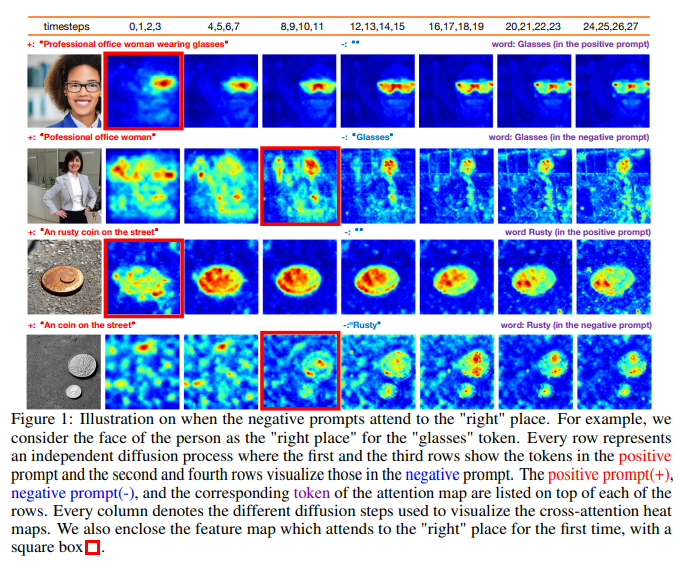
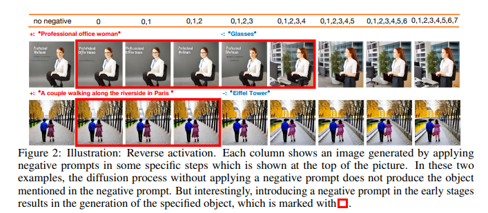
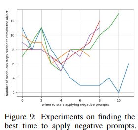
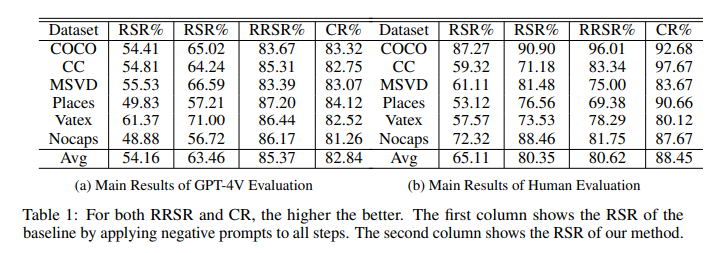
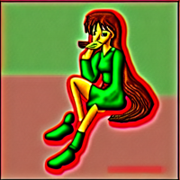

# Understanding the Impact of Negative Prompts: When and How Do They Take Effect?

論文: [https://arxiv.org/abs/2406.02965](https://arxiv.org/abs/2406.02965) [5 Jun 2024]


（まとめ @derwind）

- 著者
    - Yuanhao Ban ${}^{1}$, Ruochen Wang ${}^{1}$, Tianyi Zhou ${}^{2}$, Minhao Cheng ${}^{3}$, Boqing Gong ${}^{4}$, Cho-Jui Hsieh ${}^{1}$
- 所属
    - ${}^1$ UCLA (University of California, Los Angeles)
    - ${}^2$ UMD (The University of Maryland)
    - ${}^3$ PSU (The Pennsylvania State University)
    - ${}^4$ Google

## どんなもの？

- **ネガティブプロンプト** とは、Stable Diffusion等の画像生成の拡散モデルにおいて、生成してはいけないものを指定することでモデルを誘導するテキストプロンプト
- 何かしらの画像を生成する場合、「Glasses」というネガティブプロンプトを用いることで、眼鏡のない画像を生成できる

**数式**

${\epsilon}_ {\theta}$ は拡散モデルで U-Net で実装される部分とする。ここの部分にプロンプトのテキスト埋め込みを反映した $\hat{\epsilon}_ {\theta}$ を使うと生成される画像の内容を誘導できるというもの。

- 分類器なしガイダンス:
    - 右辺第一項: （ポジティブ）プロンプトのテキスト埋め込みを適用した U-Net
    - 右辺第二項: テキスト埋め込みを適用**しない** U-Net

$$
\begin{align*}
\hat{\epsilon}_ {\theta} (\mathbf{x}_ t, c (s), t) = (1 + w) \epsilon_ \theta (\mathbf{x}_ t, c (s), t) - w {\epsilon}_ {\theta} (\mathbf{x}_ t, c (\emptyset), t)
\end{align*}
$$

- ネガティブプロンプト:
    - 右辺第一項: （ポジティブ）プロンプト $p_ {+}$ のテキスト埋め込みを適用した U-Net
    - 右辺第二項: ネガティブプロンプト $p_ {-}$ のテキスト埋め込みを適用した U-Net

$$
\begin{align*}
\hat{\epsilon}_ {\theta} (\mathbf{x}_ t, c (s), t) = (1 + w) \epsilon_ \theta (\mathbf{x}_ t, c (p_ {+}), t) - w {\epsilon}_ {\theta} (\mathbf{x}_ t, c (p_ {-}), t)
\end{align*}
$$

- 大きな注目を集める技術ではあるが、その多くは実験結果に頼ったものであり、ネガティブプロンプトがどのように機能するかについての深い理解がない
- ネガティブプロンプトに関する体系的な研究を行う
- 拡散ステップのダイナミクスに焦点を「ネガティブプロンプトはいつ、どのように効果を発揮するのか」を中心的な研究課題とする
- 以上を踏まえた新しい制御可能なインペインティングアプローチの紹介

## 先行研究と比べてどこがすごい？

- 先行研究は実験結果に頼ったもの（こういうネガティブプロンプトを与えるとこうなるといった結果の提示をしているブログ記事とか）
- 本研究では機能面や効果について体系的な研究を行う

## 技術や手法の肝は？

- 「ネガティブプロンプトがいつ影響を及ぼし始めるか？」を調べるために、画像ピクセルに特定のトークンが出現する可能性を示すモデルのクロスアテンションマップを分析した
    - ネガティブプロンプトとポジティブプロンプトの作用の劇的な違い (Fig. 1)
        - Pos: 早期影響 / Neg: 影響の遅延



- 拡散モデルのアーキテクチャを掘り下げて、物体を消去するタスクにおける推定ノイズのパターンを分析
    - ネガティブプロンプトは（実は）最初に画像内の特定の位置に対象物体を生成し、それが減算過程によってポジティブノイズを中和し、効果的に物体を消去
    - 拡散の初期ステップでネガティブプロンプトを導入すると、Fig. 2 に示すような直感に反するモデル動作 “Reverse Activation” が観察される



- よって、ネガティブプロンプトの適用が早すぎると、画像の本来の構造を歪めてしまうという潜在的な危険性がある
- 逆拡散過程の途中（「クリティカルステップ」と呼ばれるタイミングの後）でネガティブプロンプトを導入することを提案

## どうやって有効だと検証した？

「新しい制御可能なインペインティングアプローチ」について: 

- ネガティブプロンプトの最適な投入タイミング（「クリティカルステップ」）を調べ（以下だとステップ 4 周辺）



- その後にネガティブプロンプトの投入した場合のスコアをRSR (Removal Success Rate), RRSR (Relative Removal Success Rate), CR (Comparison Rate)といったメトリクスで確認。
    - 左: 従来通り全ステップにNegプロンプト適用
    - 右: **クリティカルステップ後**にNegプロンプト適用



- 人間による評価もしているらしいが、それが載っているらしいAppendixがarXiv論文内に見つからず。

## 議論はある？

- “glasses” や “Eiffel Tower” のような名詞による物体の削除、“rusty” のような形容詞に焦点を当てた属性の制御に焦点を当てたので、他の品詞（「ゆっくりした」とか？）やタスクについては未調査

## 次に読むべき論文は？

基本的な「分類器なしガイダンス」の論文として:

- arXiv:2207.12598「Classifier-Free Diffusion Guidance」

他のネガティブプロンプト関連の論文として:

- arXiv:2304.04968「Re-imagine the Negative Prompt Algorithm: Transform 2D Diffusion into 3D, alleviate Janus problem and Beyond」

## 実験（お遊び）

簡単な画像生成の実験をしてみた。

ネガティブプロンプトを試しやすい「Counterfeit-V3.0」というStable Diffusion v1.5ベースのイラスト生成モデルと、ネガティブプロンプト詰め合わせ集の「EasyNegativeV2」を使用。

**ベーシックなネガティブプロンプトの確認**

(1) ベースライン

```python
prompt = "girl eating pizza"
negative_prompt = None
```


(2) “生成してはいけないもの” を定義した「EasyNegativeV2」を敢えてポジティブプロンプトに指定

- 以下のような出来栄えのものを “生成してはいけない” と（Textual Inversionを用いて）指定していることが分かる


```python
prompt = "girl eating pizza, EasyNegativeV2"
negative_prompt = None
```



(3) EasyNegativeV2（+ 指が変になるのを禁止）

- 確かに “低品質っぽい画像” が禁止されている感じがする

```python
prompt = "girl eating pizza"
negative_prompt = "EasyNegativeV2, extra fingers, fewer fingers"
```


**“Reverse Activation” の確認**

(4) 眼鏡の生成禁止

- ステップ数 50
- 眼鏡の生成は抑制されているが少し目つきが・・・

```python
prompt="girl eating pizza",
negative_prompt="wearning glasses",
num_inference_steps=50,
```


- ステップ数 30
- ステップ数を減らすと眼鏡っぽい何かが生成されかけている！？

```python
prompt="girl eating pizza",
negative_prompt="wearning glasses",
num_inference_steps=30,
```


(5) 眼鏡の生成抑制 + Reverse Activation 抑制

- ネガティブプロンプトの投入を 5 ステップ遅延
- 目元の違和感はなくなったし、眼鏡もかけていない

```python
prompt="girl eating pizza",
negative_prompt="wearning glasses",
num_inference_steps=50,
```


・・・とは言え、このポジティブプロンプトで眼鏡が生成されることはレアな気もするので、それを意図的に抑制指示するのが適当かは微妙・・・。
