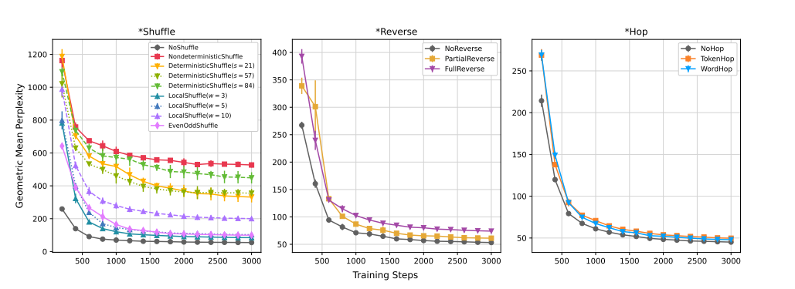
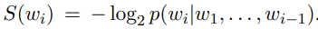
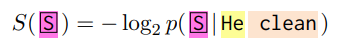
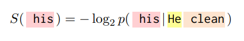
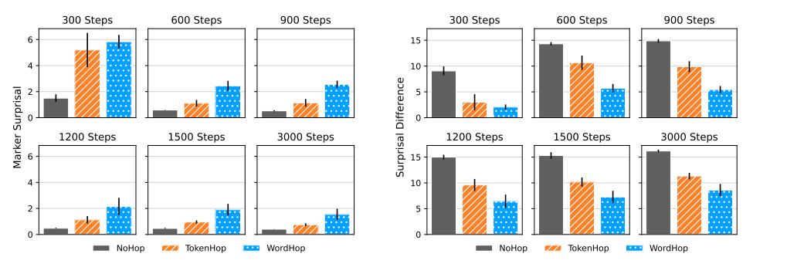
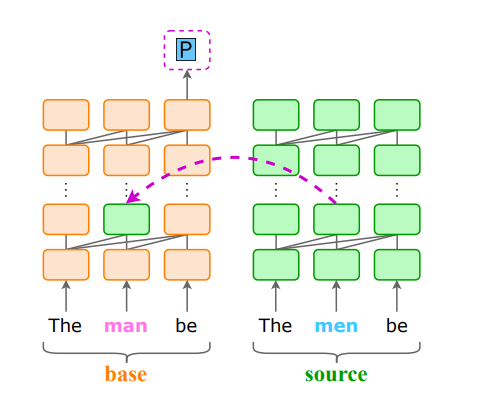
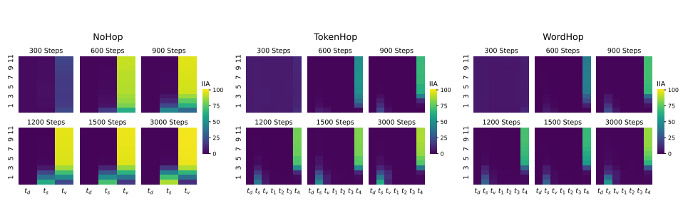

# Mission: Impossible Language Models
[https://arxiv.org/abs/2401.06416](https://arxiv.org/abs/2401.06416)
(まとめ @n-kats)

著者
* Julie Kallini
* Isabel Papadimitriou
* Richard Futrell
* Kyle Mahowald
* Christopher Potts

スタンフォード大学・カルフォルニア大学・テキサス大学の人たち

# どんなもの？
著名な言語学者のチョムスキー(生成文法で有名,95歳存命)らが、「人間では学習不可能な言語でも、LLMなら通常の言語と同程度に学習できる」と主張していた。
しかし、これには実験的な根拠はなく、それに反論する実験を行った。

# 先行研究と比べてどこがすごい？
文法によって学習難易度が変わることを観測したい。その方法を提示した。

具体的には、

* どうやって人間が学習不可能な言語をつくるか
* 学習に苦労しているのをどうやって数値化するか

を決めて、実験を行った。

# 技術や手法の肝は？
## 人間が学習不可能な言語をつくる方法
### シャッフル系
* no shuffle: シャッフルしない
* non deterministic shuffle: 非決定的にシャッフル
* deterministic shuffle: 文章の長さごとに決定的に（同じ順番になるように）シャッフル
* local shuffle: 固定サイズ毎に、決定的にシャッフル
* even-odd shuffle: 偶数番目のトークンだけ＋奇数番目のトークンだけという順番になるように変更

#### local shuffle（窓サイズ2）の例

this is a pen → is this pen a 

### 反転系
* no revese: 反転しない（他と状況を合わせるため、基準になる位置に専用トークン（R）を置く）
* partial reverse: あるところから以降を反転。その境に専用トークン（R）を置く
* full reverse: 文章全体を反転。（他と状況を合わせるため、基準になる位置に専用トークン（R）を置く）

#### partial reverse の例

this is a pen → this is R pen a

### 数え上げ系
* no hop: 3人称現在形の動詞を基本形＋特別なトークン（単数・・・S, 複数・・・P）に変換
* token hop: no hopと同様だが、特別なトークンは4トークン後に置く
* word hop: no hopと同様だが、特別なトークンは4単語後に置く（句読点除く）

# どうやって有効だと検証した？
## 学習難易度の変化

BabyLM（赤ちゃんが聞くであろう範囲に制限された英語データセット）を使って、GPT-2で学習させて比較。

シャッフル系を見ると、言語によって学習難易度が連続的に変わってくることがわかる。

* no shuffle: 通常通り。速く学習が進む
* even-odd shuffle: 機械的な変換で、比較的速く学習が進む
* non deterministic shuffle: 本来無理な学習。実際に学習に苦労している。
* deterministic shuffle, local shuffle: 文の長さ・窓サイズによって学習難易度が変わる（窓サイズ=3の場合はeven--oddと同程度くらいの難易度）

一方、反転系や数え上げ系は、大きな差が出なかった（複雑な変更ではないため）。

## surprisal の分析
数え上げ系は、全体的には差が無いが、1トークンだけ違いがあるというもの。そのため、精査した。

SとPのトークンが来る箇所のsurprisalを見る。surprisalとは、

（予測確率が低いと大きい（驚く）指標）

また、SかPのトークンが正しく来る場合と、スキップされる場合との差分も分析（surprisal differences）。

S(次のトークン)-S(SかPのトークン) 。

例： 

### 結果

左図（surprisals）から、学習の過程でずっと、no hopの場合が最も学習しやすいとわかる。

右図（surprisal differences）でも、同じことが言える。

## 層の取り替え
数え上げ系の場合について、より内部的な状況を把握する実験を行う。

図のように、層の途中の値を逆のパターンのものに置き換える。このときのSやPが正しく推論される正解率を見る。

横軸は、テキストの順番（一番右がPやSが出力される箇所）

no hopのケースが学習初期からはっきりと置き換えの影響が出ており、他と比べて学習がすすでいると言える。

# 議論はある？
やはり、LLMだから万能ということではなく、言語によって難易度が変わることがわかった。
学習不可能な言語とは何かを考える際に有用な研究ができた。学習不可能と学習可能の間の部分についてさらなる研究がもとめられる。

# 次に読むべき論文は？
* [批判の対象になったチョムスキーのブログ?](https://conversationswithtyler.com/episodes/noam-chomsky/)
