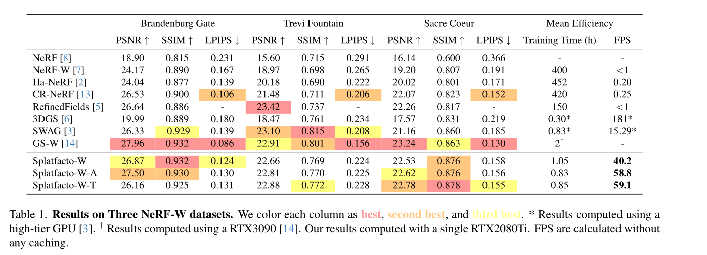
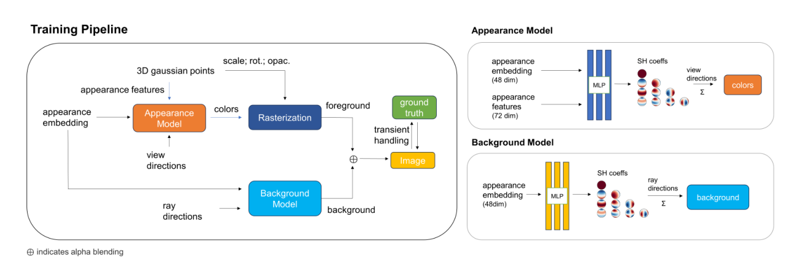

Splatfacto-W: A Nerfstudio Implementation of Gaussian Splatting for Unconstrained Photo Collections.
(制約のない写真コレクションに対するガウススプラッティングのNerfstudio実装)

===

Author:Congrong Xu1,2 , Justin Kerr 1 , Angjoo Kanazawa 1

Organization:[1 UC Berkeley, 2 ShanghaiTech University]()

URL：https://doi.org/10.48550/arXiv.2407.12306
GitHub：https://github.com/KevinXu02/splatfacto-w

(まとめ：Hisashi Takagi）

---

## どんなもの？

+ Splatfacto-Wの提案: 3D Gaussian Splattingを拡張したSplatfacto-Wを提案し、野外で撮影された不規則な画像コレクションに対して、高品質でリアルタイムな新しいビューの生成を実現。従来のNeRFベースの手法に比べて、トレーニング速度が150倍速く、PSNR（ピーク信号対雑音比）が5.3 dB向上。
+ Latent Appearance Modeling: 各Gaussianポイントに外観特徴を割り当てることで、参照画像のバリエーションに適応する。これにより、リアルタイムでの描画速度を維持しつつ、色の予測を効率的に行うことが可能。
+ Transient Object Handling: 最適化プロセス中に一時的なオブジェクトを効率的にマスクする手法を導入し、一貫性のあるシーン特徴への集中を促進。これにより、2Dプリトレーニングモデルに依存せず、ノイズや一時的なオブジェクトを除去。
+ Background Modeling: 球面調和関数を使用した背景モデルを導入し、空や背景要素の一貫性を向上。これにより、屋外シーンにおける背景の一貫性と精度が改善され、従来の3D Gaussian Splattingにおける課題を克服。
+ 実験結果とパフォーマンス: 提案手法は、PSNRやSSIM、LPIPSなどの一般的なレンダリング指標で高い性能を示し、リアルタイムレンダリングを40 fps以上で達成。RTX 2080Ti GPU上でのトレーニングが可能であり、家庭用コンピュータでも実行可能。

## 背景

3Dガウス・スプラッティングについて

※3D Gaussian Splattingについて調べてみた
https://qiita.com/harutine/items/e5bed074067dad429285?utm_source=stock_summary_mail&utm_medium=email&utm_term=jyuan0128&utm_content=3D%20Gaussian%20Splatting%E3%81%AB%E3%81%A4%E3%81%84%E3%81%A6%E8%AA%BF%E3%81%B9%E3%81%A6%E3%81%BF%E3%81%9F&utm_campaign=stock_summary_mail_2024-06-29#%E8%AB%96%E6%96%87

（Nerfstudioについて）
https://github.com/nerfstudio-project/nerfstudio

+ 課題の概要: 自然環境で撮影された画像コレクションからの新規ビュー生成は、光の変動や一時的なオブジェクトの存在によってシーン再構成が難しくなる。
+ 従来手法の限界: Neural Radiance Fields (NeRFs) などの従来手法は、画像ごとに異なる外観特徴を取り込むことでこれらの問題に対処してきたが、トレーニングやレンダリング速度が遅い。
+ 3D Gaussian Splatting (3DGS): 3DGSは、トレーニングの高速化とリアルタイムレンダリングが可能な手法として注目されていますが、自然環境での画像コレクションに対応するのは難しい。
+ 論文の目的: 本論文では、これらの課題に対処するため、Splatfacto-Wという手法を提案し、3DGSの利点を活かしながら、高品質かつリアルタイムな新規ビュー生成を実現する。

## どうやって有効だと検証した？

+ 定量評価: Peak Signal-to-Noise Ratio (PSNR)、Structural Similarity Index Measure (SSIM)、Learned Perceptual Image Patch Similarity (LPIPS)といった一般的なレンダリング指標を用いて、複数のデータセットで性能を評価。
+ 比較実験: 提案手法Splatfacto-Wを、既存のNeRFや3D Gaussian Splatting（3DGS）、他の関連手法（SWAG、GS-Wなど）と比較し、性能の向上を確認。
+ 実時間レンダリング性能: 提案手法がリアルタイムでのレンダリングを達成できるか、フレームレート（FPS）を測定し、40 FPS以上の実時間レンダリング性能を達成。
+ 背景モデリングの効果: 背景モデリングがシーンの一貫性と精度を向上させるかどうかを、視覚的な結果および定量的な指標で検証。
+ 計算効率: トレーニング速度とGPUメモリ使用量を測定し、RTX 2080Ti GPU上での効率的なトレーニングが可能かどうかを確認。

(table 性能評価)

評価指標について（再掲）

+ ピーク信号対雑音比 (PSNR)
+ 構造類似性指標 (SSIM)
+ 学習型知覚画像パッチ類似度 (LPIPS)

※ピーク信号対雑音比 (PSNR)
PSNRは、デジタル画像の品質を評価するための尺度で、再構成された画像の品質をオリジナル画像と比較して評価します。

※SSIMは、画像の構造的情報を保持する能力を評価するために使用されます。これは、人間の視覚特性を模倣するように設計されており、以下の要素を考慮します：
輝度 (luminance)
コントラスト (contrast)
構造 (structure)

※学習型知覚画像パッチ類似度 (LPIPS)
LPIPSは、ニューラルネットワークを用いて画像の知覚的な違いを評価する指標です。これは、画像のパッチを用いて、人間の視覚に基づいた知覚的な類似度を計算します。

---

## 技術や手法の肝は？

+ Latent Appearance Modeling: 各Gaussianポイントに外観特徴を割り当て、画像ごとの外観変動に対応することで、リアルタイムレンダリングの速度を維持しつつ高品質な描画を実現。
+ Transient Object Handling: 一時的なオブジェクトを効率的にマスクする手法を採用し、シーンの一貫性を高めるため、ノイズや不要なオブジェクトを除去。
+ Background Modeling: 球面調和関数を使用した背景モデリングを導入し、屋外シーンでの背景や空の表現を改善。これにより、多視点からの一貫性を維持し、背景の精度を向上。
+ 高速なトレーニングとレンダリング: 従来のNeRFベースの手法と比べて、トレーニング速度が飛躍的に向上し、リアルタイムでのレンダリングを実現。
+ Nerfstudioとの統合: Splatfacto-Wは、Nerfstudioというフレームワークに統合されており、実際のアプリケーションや研究開発において容易に使用可能。

（モデルの説明）
+ まず、アピアランス・モデルを使って各ガウシアンの色を予測する。
+ 次にこれらのガウシアンをラスタライズして、前景オブジェクトを生成する。
+ 前景オブジェクトを生成する。
+ 一方、背景モデルは、光線方向から背景を予測する。
+ 前景と背景はアルファブレンディングを使って合成され、最終画像が生成される。
+ この最終画像は、マスクされたグランドトゥルース画像と比較され、
+ 次にロバストマスクを通して処理され、モデルパラメータが更新されます。

## 議論はある？

+ 課題の指摘: 提案手法は特定のライティング条件（影や日光の強い反射など）での収束が遅いという問題がある。また、球面調和関数に基づく背景モデルは、低周波数の背景には適しているが、雲などの高周波数の背景表現には限界がある。
+ 改善の可能性: 提案手法の限界を克服するために、追加のニューラルアーキテクチャやネットワークコンポーネントを導入することで、背景モデリングや一時的な現象の精度をさらに向上させることが検討されている。
+ 今後の展望: 今後の研究として、特定のライティング条件や高周波数の背景表現に対処する方法を探求し、モデルのさらなる改善を目指す。

（感想）
+ 背景のレンダリングとモデルのレンダリングの組み合わせは斬新な手法
+ 通常の手法よりも自然な表示が可能になる（特に外界の写真など）
+ 環境の変化がリアルタイムに反映される（昼、夜など）のは素晴らしい
+ とはいえ得意・不得意がある（雲や霧は苦手そう）

---

## 先行研究と比べて何がすごい？

+ リアルタイムレンダリング性能: 提案手法Splatfacto-Wは、3D Gaussian Splatting (3DGS) の高速レンダリング能力を維持しながら、より高品質なビュー合成をリアルタイムで実現しています。
+ 高画質: Splatfacto-Wは、他の手法と比較して、PSNR（ピーク信号対雑音比）やSSIM（構造類似度指数）のような画質指標で優れた結果を達成しています。
+ 効率的なトレーニング: 従来のNeRFベースの手法に比べて、トレーニング速度が飛躍的に向上し、トレーニングに必要な計算リソースが削減されています。
+ 背景モデリングの改善: 球面調和関数を用いた背景モデリングにより、視点間の一貫性と背景の精度が向上し、従来の手法で見られた背景の問題を解決しています。
+ 一時的なオブジェクトの処理: 効率的な一時オブジェクト処理手法を導入し、シーンの一貫性を向上させ、従来の手法で問題となっていたノイズや不整合を軽減しています。

---

## 次に読むべき論文は？

とりあえず、実装を色々試し中
+ ステレオグラム？　視差のある画像を２つ生成する手法
+ ４D ガウシアンもあるらしい
+ UnityやUEへの実装も進行中　メタバースへ持ってこれる？

  
+ [Awesome 3D Gaussian Splatting Resources](https://github.com/MrNeRF/awesome-3D-gaussian-splatting)
 

