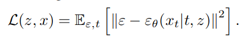
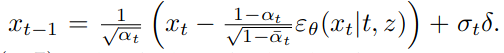
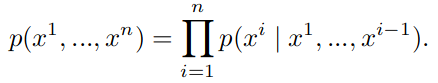
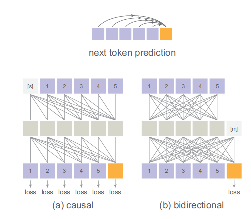
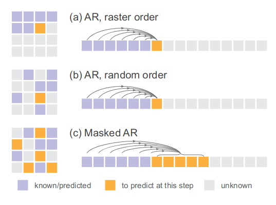
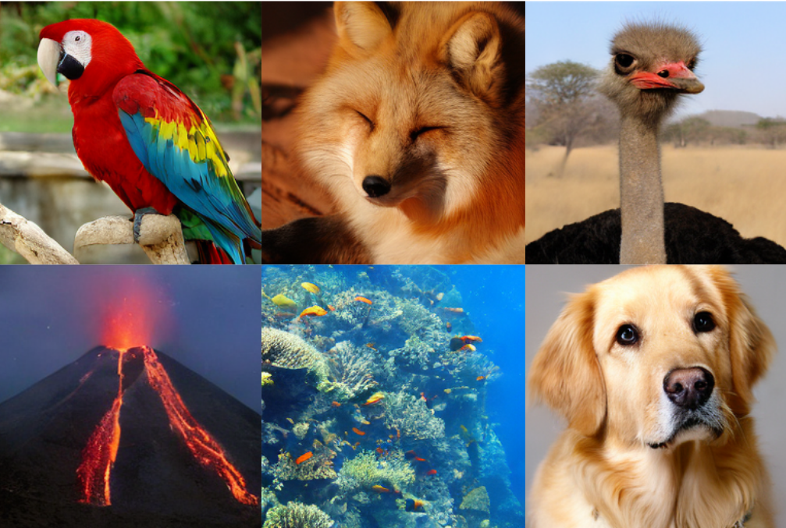

Autoregressive Image Generation without Vector Quantization
======

Tianhong Li, Yonglong Tian, He Li, Mingyang Deng, Kaiming He

1. MIT CSAIL
2. Google DeepMind
3. Tsinghua University

https://arxiv.org/abs/2406.11838

@cohama

## どんなもの

- 自己回帰モデルによる画像生成
- 自然言語の世界では LLM のように自己回帰モデルによる生成がデファクトになっている
  - 自己回帰モデルとは i-1 までのトークン列から i 番目のトークンを予測するモデル
- 自然言語でもそうだがこの方法は主に離散値 (カテゴリカルな値) がおもに利用される
- 画像のような連続値はこれまでは「どう離散化するか」という方向で研究がされてきた
- 離散値でなく連続値をそのまま扱う自己回帰モデルを考えた

## 先行研究と比べて何がすごい?

- 画像系でも自己回帰モデルによる生成はすでに行われてきた。その代表的なものは VQ-VAE2 など。(過去にこの研究会でも読まれた https://github.com/mlnagoya/surveys/blob/master/20200416_reports/vq_vae_2/20200412.md)
  - VQ-VAE は画像の潜在表現を量子化し、離散値のトークンとして処理する。
- 連続値を扱う自己回帰モデルとしては GIVT もある。こちらは確率分布として混合ガウスモデルを用いるが、あらかじめ決められた数しか混合できないため表現できる確率分布に制約がある
- 提案手法は拡散過程を利用することで自由な分布を表現できる

## 技術や手法の肝は?

### 離散値の場合の自己回帰モデル

- 値 x をトークナイザーに通すことで 0 か K-1 までの値 k に変換する。
- モデルが D 次元の離散値の値を出力し (z)、それを出力層が K 個の分類器 W に通す。最後に Softmax をかける
- `p(x|z) = Softmax(Wz)`

### 拡散モデル

- 連続値を扱うために拡散モデルを使う。ただし、通常は全ピクセル (または全トークン) が対象になるのに対し、自己回帰モデルに適用する場合は個別のトークンについてのみ考える
- 式は通常の拡散モデルと同じっぽい？
  - 
  - 

- これによりニューラルネットで表現される分布からサンプリングできる `x0 ~ p(x|z)`

- 自己回帰モデルに応用するので実際には自分より前のトークンが事前条件に入る形になる

  -

- ここで使うデノイジングのネットワークは3層程度の MLP と非常に小さい

### Bidirectional attention

- LLM では Causal Attention が用いられる。過去のトークンとは Attention を取るが、未来に対しては Attention を取らない、というもの。
- 実は MAE (Masked Auto Encoder) のように過去未来双方向に Attention をとっても自己回帰モデルとして扱うことが可能
  - 
  - マスクトークン [m] を中間層にいれる。損失はこの1つしか計算されないが代わりにトークン間の相互作用がよりリッチになる。一度に複数トークン生成も用意

### Autoregressive models in random orders

- これも MAE にならってトークンの順番をランダムに並び替える (ただし位置エンコーディングは維持する)
- 

## どうやって有効だと検証した？

## 議論はある?

* 自己回帰モデルが離散値に限らない強力なツールであることを示唆している
* 画像生成以外にも連続値を扱う様々な応用が期待される

## 次に読むべき論文
- MAGE (Tianhong Li, Huiwen Chang, Shlok Mishra, Han Zhang, Dina Katabi, and Dilip Krishnan. MAGE: Masked generative encoder to unify representation learning and image synthesis. In CVPR, 2023.)
- DiT (William Peebles and Saining Xie. Scalable diffusion models with Transformers. In ICCV, 2023.)
- GIVT (Michael Tschannen, Cian Eastwood, and Fabian Mentzer. GIVT: Generative infinite-vocabulary Transformers. arXiv:2312.02116, 2023.)

